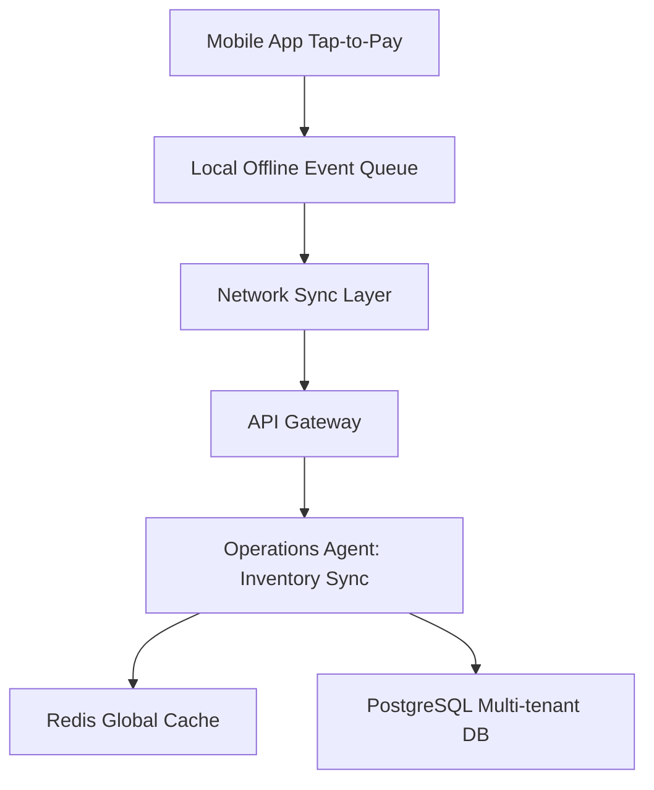

# [architecture] Omnichannel Tap-to-Pay and Inventory Sync Engine

## Problem Statement
Small business owners like Priya (boutique owner) and Fatima (food cart) sell products both in-person and online. Currently, the local terminal sessions (tap-to-pay) and global multi-tenant inventory ledger are disconnected. When a product is sold offline, the online store isn't immediately updated, leading to overselling and inventory confusion.

## Research Report
- **Competitor Analysis:** Shopify offers robust multi-channel syncing but relies heavily on expensive POS hardware and custom apps. Wix relies on third-party apps which break offline workflows.
- **OHC Opportunity:** OHC can differentiate by natively unifying local tap-to-pay events with the global inventory cache, using background AI agents to resolve state conflicts.

## Design Doc
### Architecture Diagram (Mermaid)

### Mobile UX Flow (375px First)
1. **Checkout Screen:** Large numeric keypad and a full-width "Tap to Pay" button.
2. **Success Screen:** A simple checkmark with "Inventory Updated" toast notification.
3. **Offline Mode:** If offline, the toast reads "Saved offline. Syncing when connected."

### AI Agent Integration
- **Operations Agent:** Listens to webhook/sync events from the tap-to-pay module and dynamically adjusts stock levels, resolving conflicts asynchronously.

## Implementation Prompt
Implement the backend sync endpoints and local event queue sync logic. The system must accept batched POS transaction events from the mobile client, deduplicate them using idempotency keys, and decrement inventory levels in the global PostgreSQL database. All operations must ensure row-level tenant isolation.

## Priority
P0

## Estimated Scope
Large
