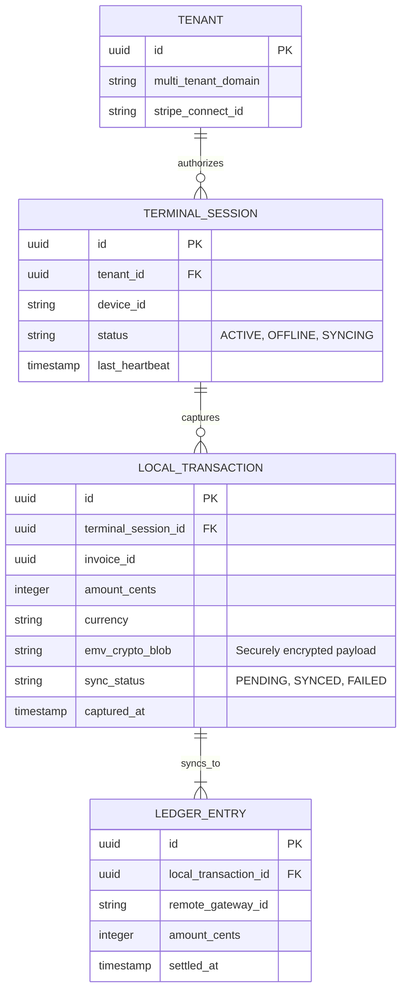

# [Architecture] Omnichannel Tap-to-Pay Terminal SDK

## Title
Implement Omnichannel Tap-to-Pay Terminal SDK for Mobile-First Offline POS

## Problem Statement
Small business owners—especially those operating in mobile, pop-up, or field service environments like Carlos (handyman) and Fatima (food cart)—frequently operate in areas with poor or no internet connectivity. Relying solely on cloud-dependent payment gateways means lost sales when the network drops. They need a resilient, zero-hardware solution that turns their existing mobile device into an offline-capable tap-to-pay terminal. Competitor systems (like Shopify POS or Stripe Terminal) often require purchasing physical card readers or struggle to synchronize transactions captured completely offline without complex manual reconciliations. OHC needs a native, mobile-first Tap-to-Pay SDK that seamlessly captures payments offline and synchronizes transparently with the multi-tenant ledger once connectivity is restored, abstracting away the complexities of local caching and eventual consistency from the merchant.

## Research Report
### Competitor Systems Audit
- **Shopify POS:** Offers offline cash transactions but requires dedicated hardware (WisePad 3 or similar) for secure card transactions. The setup is cumbersome for pure mobile operators like handymen who just want to use their Android phone to take a quick card tap.
- **Square:** The pioneer in mobile payments, offering strong offline mode. However, their ecosystem is closed, and extracting data to a unified hybrid system (like OHC) is complex. Their UI often feels cluttered with features irrelevant to micro-merchants.
- **Stripe Terminal:** Provides an excellent API and Tap to Pay on iPhone/Android, but leaves the heavy lifting of offline state management, local transaction caching, and multi-tenant reconciliation entirely to the developer.

### Target Persona Validation
- **Carlos (Handyman, 42):** Needs to take payments in basements or remote job sites with zero cell service. Wants a single app on his Android phone to quote, bill, and tap-to-pay.
- **Priya (Boutique Owner, 35):** Takes her inventory to local pop-up markets. Needs to quickly process sales via Tap to Pay on her phone without worrying about a bulky card reader or a dropped 5G connection causing a double charge.

### OHC Advantage & Architectural Gap
By integrating an Omnichannel Tap-to-Pay Terminal SDK directly into the Tauri v2 mobile client and pairing it with our NATS Hybrid Event Mesh (JetStream), OHC can provide an offline-first payment experience. The device acts as a decentralized terminal leaf node. Transactions are securely cached locally (using PowerSync/SQLite) and automatically published to the centralized Universal Ledger once network connectivity is re-established. This provides the Zero-Trust security and high reliability needed for critical payment flows, all invisibly managed by AI operations agents.

## Design Doc

### Business Journey Mapping
1. **Acquisition & Onboarding:** Carlos downloads the OHC Tauri mobile app. He enables "Tap to Pay" with one tap, agreeing to the embedded Stripe/Adyen terms via an AI-assisted plain language prompt. No hardware to order.
2. **Activation:** At a job site with no signal, Carlos finishes a repair. He opens the app, creates an invoice, and selects "Tap to Pay." The customer taps their card on Carlos's Android device. The payment is cryptographically signed and stored locally. The app immediately shows a "Payment Successful (Syncing...)" screen.
3. **Retention & Revenue:** When Carlos drives back to cell range, the NATS JetStream client syncs the transaction to the cloud ledger. The AI Finance Agent verifies the transaction, updates the invoice status, and sends the customer an SMS receipt automatically.

### Mobile-First UX Flow (375px Viewport)
1. **Invoice View:** A clean, macOS-glass style card showing the total amount. A prominent, pulsating primary button: "Tap to Pay".
2. **Payment Ready State:** Screen dims with a highly visible NFC icon. Text: "Hold card near the top of phone." (Must pass the grandmother test—no confusing tech jargon).
3. **Processing (Offline):** A subtle spinner with "Securing Payment locally...".
4. **Success State:** A massive green checkmark. Text: "Payment Saved. Receipt will be sent when online." A small persistent banner at the bottom indicates sync status (`Syncing 1 offline payment`).

### Data Model & Invariants

### Key Design Decisions
- **Zero Trust & Security:** Multi-tenant isolation is enforced. The EMV crypto blob captured by the NFC module is completely opaque to the mobile client and is only decryptable by the remote payment gateway (e.g., Stripe).
- **Offline Caching:** Utilize the existing standalone local SQLite DB (managed by PowerSync) to store `LOCAL_TRANSACTION` records.
- **Event-Driven Reconciliation:** The synchronization relies on the NATS Hybrid Event Mesh. The mobile app publishes a `Transaction.Captured` event to a local JetStream subject. When connected, JetStream replicates this to the cloud, triggering the AI Finance Agent to process the gateway authorization.

## Implementation Prompt
"Implement the `TapToPaySDK` integration within the Tauri mobile client (`src/ui/tauri/`) and the corresponding cloud reconciliation service (`src/server/services/billing/`).
1. Build the frontend Tauri plugin interface to bridge native iOS/Android NFC tap-to-pay capabilities.
2. Design the mobile UX components (375px viewport) matching the macOS translucent glass system for the payment flow.
3. Implement the `LocalTransaction` SQLite table using PowerSync for offline durability.
4. Create the NATS JetStream event publisher to push `Transaction.Captured` events when online.
5. Ensure strict multi-tenant authorization (`tenant_id`) when the cloud service receives the sync event and forwards the crypto blob to the payment provider. Do not prescribe specific external gateway APIs, but assume a generic interface capable of accepting encrypted EMV payloads."

## Priority
P0

## Estimated Scope
Large
