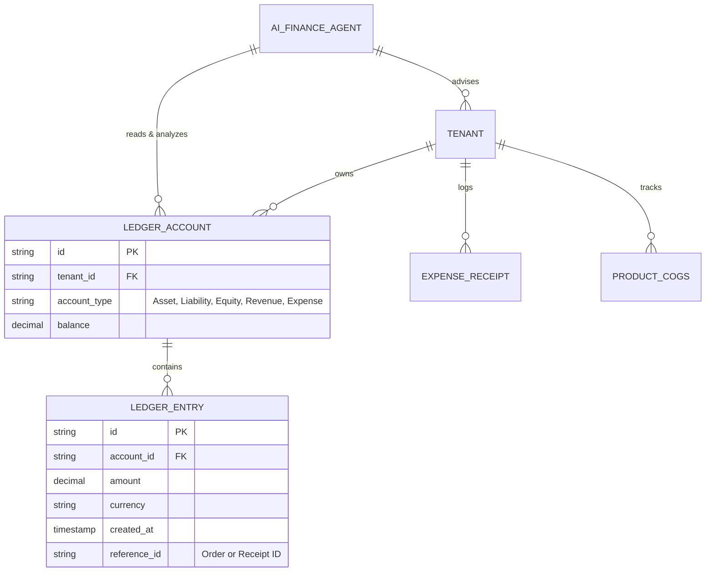
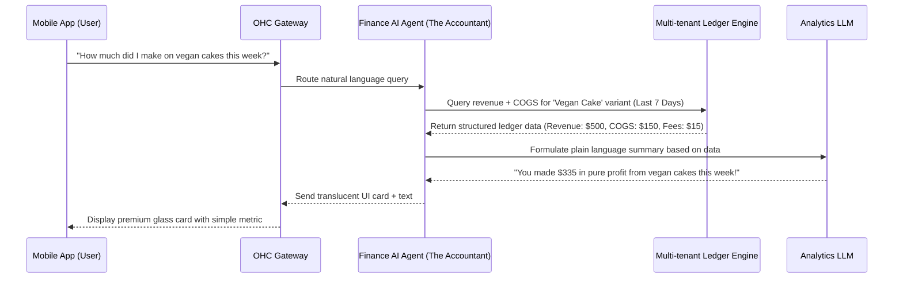

# Architectural Design: Autonomous Plain-Language Financial Intelligence & Real-Time Profit Engine

## Title
Architectural Design: Autonomous Plain-Language Financial Intelligence & Real-Time Profit Engine

## Problem Statement
Small business owners (our core personas like Maya, Carlos, Priya) suffer from "Financial Fog." Traditional platforms (Shopify, Wix, Squarespace) report top-line revenue but completely ignore true profit, Cash Flow, COGS (Cost of Goods Sold), and off-platform expenses (like ingredients or mileage). Owners are forced to export CSVs to Excel or pay for expensive third-party apps just to answer a basic question: "Did I actually make money this week?" We need an invisible, multi-tenant financial engine that translates strict, double-entry ledger data into simple, actionable plain language without exposing the user to accounting jargon (GAAP, EBITDA, P&L).

## Research Report
- **Competitor Analysis**:
  - *Shopify*: Basic revenue reports out-of-the-box. True profit requires apps like Lifetimely ($30-$100/mo) or entering COGS manually per variant. Does not track off-platform expenses easily.
  - *Wix/Squarespace*: Limited to basic sales analytics. No built-in cash flow forecasting.
  - *QuickBooks*: Too complex. Full of jargon (Chart of Accounts, Reconciliation) that alienates non-accountants.
- **SMB Pain Point Matrix**: "Financial Fog" is ranked #9 in our audit, but it is the #1 reason for small business failure (cash flow mismanagement).
- **Core Insights**: Business owners don't want a dashboard of charts; they want a financial advisor in their pocket. They want to ask, "Can I afford to buy a new stand mixer this month?" and get a simple "Yes, your cash flow is positive and you have $800 set aside for equipment."

## Design Doc

### Architecture Diagram

### Key Design Decisions
1. **Double-Entry Ledger Base**: The underlying data model MUST be a strict, immutable double-entry ledger to guarantee financial accuracy and Zero-Trust isolation per tenant.
2. **AI Translation Layer**: The AI Finance Agent sits strictly on top of the ledger. It has read-only access to generate insights. It never modifies the ledger directly without a strict, traceable transaction block.
3. **Plain Language First**: No accounting jargon. Metrics are translated to "Safe to Spend", "Money In", "Money Out", and "Taxes to Save".

### Mobile UX Flow (375px First)
1. **Home Dashboard Card**: A simple, translucent glass card at the top of the Home tab displaying "Safe to Spend: $X" and a sparkline of the last 7 days.
2. **Chat Interface**: Tapping the card opens a chat UI where the user can talk to "The Accountant".
3. **Receipt Scanner Integration**: A floating action button allows instant camera access to snap a photo of an ingredient receipt (e.g., flour from Costco). The AI automatically categorizes it and deducts it from the "Safe to Spend" metric.
4. **Offline Capability**: The app caches the last known ledger state and pending transactions. Receipts snapped offline are queued and processed when the connection is restored.

### Multi-Tenant & Security Integrity (Zero Trust)
- **Tenant Isolation**: Every ledger query must include the `tenant_id`. SPIFFE/SPIRE identities ensure that the Finance Agent can only assume a role scoped to the exact requesting tenant.
- **Immutability**: Ledger entries are append-only. Corrections require a reversing entry, ensuring complete auditability.

## Implementation Prompt
**To the Implementer Agent**:
Your task is to build the Plain Language Financial Intelligence Engine for OneHumanCorp.
**Outcome**: A backend service and mobile-first API that allows a non-technical business owner to see their true profit (Revenue - COGS - Platform Fees - Expenses) in simple terms, and ask natural language questions about their financial health.
**CUJ (Critical User Journey)**:
1. Maya snaps a picture of a $40 grocery receipt for cake supplies.
2. The system logs this as an expense against her COGS.
3. Maya opens her OHC app and asks, "What's my real profit this week?"
4. The system calculates revenue from processed orders, subtracts the $40 receipt and payment fees, and replies with a friendly, accurate plain-language summary.
**Acceptance Criteria**:
- Must implement an immutable, multi-tenant ledger structure.
- Must expose an endpoint for natural language financial queries.
- Must return data structured for a mobile-first UI (375px), avoiding complex tables.
- Must guarantee tenant data isolation at the query level.
- Do not prescribe the specific database (e.g., Postgres, DynamoDB); choose the best tool for an immutable ledger.

## Priority
P0

## Estimated Scope
Large
