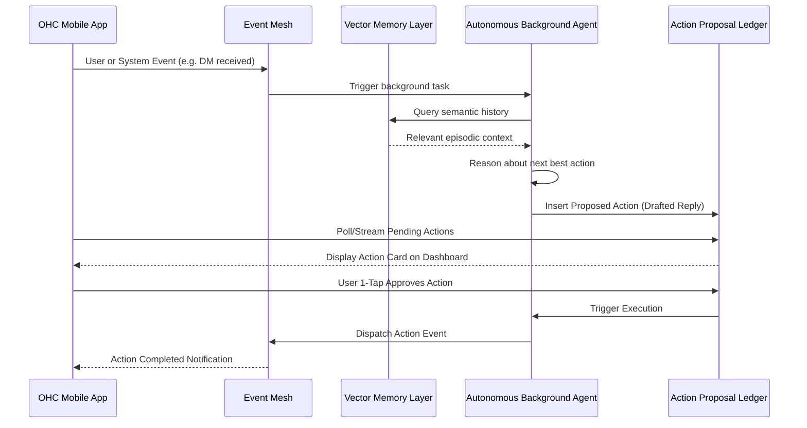

# [architecture] Proactive Autonomous Memory Engine

## Title
Proactive Autonomous Memory Engine & Action Ledger

## Problem Statement
Small business owners like Maya (baker) and Carlos (handyman) struggle to proactively act on business data and historical context because they lack a dedicated operations manager. They are constantly reacting to messages, managing disjointed workflows across apps, and trying to remember previous interactions. Their AI agents are largely reactive to immediate chat prompts or explicit triggers. They need an invisible, proactive Memory Engine and Operations Mesh where AI agents run autonomously in the background, continuously analyzing historical data (vector memory), detecting anomalies or opportunities, and drafting actions (e.g., following up on an unpaid invoice, suggesting inventory restock, auto-replying to DMs with historical context) for 1-tap approval.

## Research Report
Current SMB platforms limit AI to reactive chatbot features:
*   **Shopify Sidekick:** Only responds to direct user queries in a chat interface. It does not run continuously in the background to analyze store events or proactively trigger operational workflows.
*   **Wix/Squarespace AI:** Focused on content generation (text, images) during site setup, but lacks long-term episodic memory or autonomous background task execution.
*   **OHC's Opportunity:** By introducing a "Proactive Autonomous Memory Engine," OHC can transition AI from a reactive tool to an active "Operations Manager." This engine will process a continuous event stream (Event Mesh), store context in a vector memory layer, and run periodic background jobs (AI Agents) that proactively draft actions for the business owner, dramatically reducing cognitive load.

## Design Doc

### Business Journey Mapping (Maya the Baker)
1.  **Background Sensing:** Maya receives a DM from a previous customer, "Can I get the same cake as last year for my daughter's birthday?"
2.  **Autonomous Memory Retrieval:** The background `Customer Success Agent` detects the message, queries the Vector Memory Layer for the customer's previous order history, and retrieves the specific cake details (Vegan Chocolate, 8-inch).
3.  **Proactive Action Drafting:** The `Sales Agent` coordinates with the `Operations Agent` to check inventory and calendar capacity. It drafts a reply and a prepopulated quote/deposit link.
4.  **1-Tap Approval:** Maya receives a rich lock-screen notification: "Drafted reply to Sarah: 'Yes! Vegan Chocolate 8-inch. $75 deposit.' [Send & Request $75] [Edit]".
5.  **Execution & Learning:** Maya taps "Send". The system executes the action and updates the customer's vector profile with this new interaction, strengthening future memory.

### Architecture Framework

*   **Event Mesh:** A central nervous system capturing all tenant events (inquiries, payments, inventory changes).
*   **Vector Memory Layer:** Episodic memory storage for customers, products, and historical business context.
*   **Background Autonomous Agents:** Workers running that consume events, query memory, and use the LLM Provider interface to reason about required actions.
*   **Action Proposal Ledger:** A structured storage area for drafted actions awaiting owner approval.

### Mobile UX Flow
*   **The "Inbox of Actions":** A unified 375px feed showing proactive AI suggestions prioritized by urgency.
*   **Glassmorphic Action Cards:** Cards featuring blurred backgrounds (`backdrop-filter: blur(20px)`), clear typography (Outfit/Inter), and prominent 1-tap "Approve" or "Dismiss" buttons.
*   **Push Notifications:** Rich notifications allowing execution directly from the OS lock screen.

## Implementation Prompt
Implement the Proactive Autonomous Memory Engine and Action Proposal Ledger.
1. Define the storage schemas for agent memory vectors and proposed actions with strict tenant isolation.
2. Create a background worker loop that simulates an agent observing an event, retrieving context from memory, and creating a pending proposed action.
3. Develop a secure API endpoint to fetch and approve proposed actions.
4. Ensure all new components are fully covered by unit tests (100% coverage) and integrate with the multi-tenant architecture. Verify the capability through a Playwright E2E test simulating a business owner approving an AI-drafted action from their dashboard. No specific LLM vendor APIs should be hardcoded; use the existing provider abstraction.

### Architecture Diagram

**Priority:** P1
**Estimated Scope:** Large
