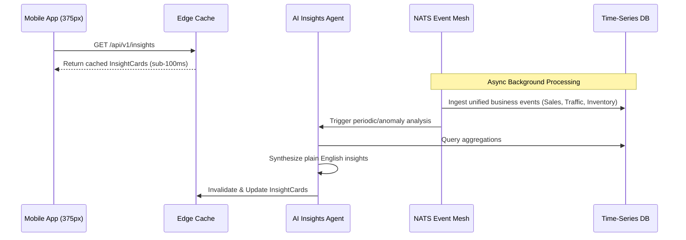

# [Architecture] Real-Time AI Mobile Analytics & Insights Engine

## Title
Real-Time AI Mobile Analytics & Insights Engine

## Problem Statement
Small business owners like Priya (Boutique owner) and Maya (Baker) need to understand the health of their business daily. Currently, traditional commerce platforms (like Shopify or Square) present complex dashboards full of graphs, charts, and metrics (LTV, CAC, Bounce Rate) designed for desktop viewports and data analysts. This violates our "grandmother test". Our personas run their entire business from their mobile devices while on the move. When Priya checks her phone, she doesn't want to decipher a bar chart; she wants a plain-English, immediately actionable insight like: "You sold 3 more dresses this week than last week, but inventory for medium sizes is running low. Want me to order more?"

We lack a centralized, mobile-first analytics mesh that captures real-time telemetry across the unified business (sales, bookings, inventory, social DMs) and uses AI to distill that into simple, proactive, "Translucent Glass" insight cards on the 375px dashboard.

## Research Report

### Competitive Analysis
| Platform | Analytics Capabilities | Strengths | Weaknesses (The OHC Opportunity) |
|---|---|---|---|
| Shopify | Shopify Analytics | Deep, customizable reports, lots of filters. | Very desktop-focused. Overwhelming for non-technical users. Requires manual interpretation of data. |
| Square | Square Dashboard | Good POS sales tracking. | Splintered across different apps. Static graphs. Doesn't combine external signals (social media) easily. |
| Wix | Analytics & Reports | Traffic and sales correlation. | Web-first, slow loading times on mobile. Reactive, not proactive. |
| **OHC (Target)** | **AI Mobile Insights** | **Zero-configuration, plain English insights, proactive AI recommendations, 100% mobile.** | **Requires high-performance stream processing and strict multi-tenant isolation.** |

### Key Architectural Findings
To achieve this, OHC cannot simply poll a SQL database and render a chart. We need an event-driven telemetry stream that ingests unified events (a sale, a booking, a page view, a new Instagram follower) into a scalable time-series datastore or OLAP cube. An AI Insights Agent must asynchronously process this stream, identify patterns or anomalies, and synthesize natural language summaries, which are then cached at the edge for instant display on the mobile app.

## Design Doc

### Architecture Diagram
```mermaid
erDiagram
    MERCHANT ||--o{ OHC_WORKSPACE : owns
    OHC_WORKSPACE ||--o{ UNIFIED_EVENT : generates

    UNIFIED_EVENT }|--|| EVENT_MESH : streams to
    EVENT_MESH ||--o{ TIME_SERIES_DB : persists
    EVENT_MESH ||--o{ AI_INSIGHTS_AGENT : triggers

    AI_INSIGHTS_AGENT }|--|| TIME_SERIES_DB : queries
    AI_INSIGHTS_AGENT ||--o{ INSIGHT_CARD : generates

    INSIGHT_CARD }|--|| EDGE_CACHE : stored in
    EDGE_CACHE ||--o{ MOBILE_CLIENT : serves (sub-100ms)

    MERCHANT {
        string id
        string persona
    }
    UNIFIED_EVENT {
        string eventId
        string type
        timestamp occurredAt
        json payload
    }
    INSIGHT_CARD {
        string cardId
        string plainEnglishText
        string recommendedAction
        string status
    }
```



### Mobile UX Flow (375px First)
1. **The Morning Briefing**: When Priya opens the OHC app, she isn't greeted by a wall of charts. She sees a beautiful, macOS-style Translucent Glass card at the top of her dashboard.
2. **Plain English Card**: The card reads: "Good morning! You've had a strong week. Your custom cake page views are up 20% from Instagram. I suggest turning on the 'Automated DM Follow-up' agent to capture those leads."
3. **One-Tap Action**: A single button below the text: "Turn On Agent".
4. **Historical Swipe**: Swiping the card reveals the previous day's insights. There are NO raw numbers unless she explicitly taps "Advanced Data".

### Performance & Offline Targets
- **Sub-100ms Load Time**: Insight cards must be pre-calculated and cached at the edge. The mobile app should instantly render the insight upon opening, even on 3G networks.
- **Offline Resilience**: If the device is offline, it displays the last cached insight card with a subtle "Last updated X hours ago" indicator.
- **Payload Size**: The API response for insights must be under 5KB (pure JSON text, no heavy charting libraries).

### Zero Trust & Security (Multi-Tenant Isolation)
- **Data Isolation**: Telemetry data in the Time-Series DB must be strictly partitioned by `tenant_id`.
- **SPIFFE/SPIRE Identity**: The AI Insights Agent must authenticate using workload identity (SPIFFE) to access the OLAP database, enforcing row-level security so one merchant's agent cannot access another merchant's data.

## Implementation Prompt
Implement the Real-Time AI Mobile Analytics & Insights Engine. The system must ingest unified business events into a time-series or analytical datastore. Create an asynchronous AI Insights Agent that periodically analyzes this data to generate plain-English, actionable "Insight Cards" tailored to the merchant's business context. These cards must be edge-cached and served to the mobile client in under 100ms. Ensure the UI components follow the "grandmother test" and use the macOS-style Translucent Glass design tokens. Do not prescribe specific database schemas, API endpoints, or exact function signatures. Focus on ensuring strict multi-tenant isolation and edge-caching for optimal mobile performance.

## Priority
P1

## Estimated Scope
Large
