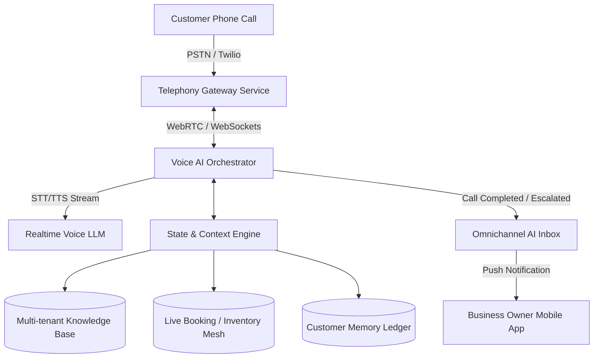

# Realtime AI Voice Receptionist Engine

## Title
Architectural Gap: Realtime AI Voice Receptionist for Phone Calls

## Problem Statement
Small business owners like Carlos (Handyman) and Fatima (Food Cart) are often working with their hands, driving, or serving customers. They cannot answer every phone call. Missed calls mean lost revenue, frustrated customers, and a feeling of always being "on duty." Existing platforms like Shopify or Wix do not offer native phone answering services. We need an autonomous AI Voice Receptionist that answers a dedicated business phone number, understands context, books appointments, takes orders, and routes urgent issues dynamically, all while sounding natural.

## Research Report
**Competitive Analysis:**
- **Shopify / Wix / Squarespace:** Focus entirely on web, chat, and email channels. Voice is completely missing. They rely on third-party integrations (like Twilio or custom VoIP providers) which require significant technical setup and integration, violating the OHC zero-configuration mandate.
- **Standalone AI Voice Products (Bland AI, Vapi, Retell):** Extremely powerful, but require developers to stitch together webhooks, prompt context, and telephony setups. They are not turnkey for a baker or a handyman.
- **Traditional Answering Services:** Expensive ($200+/month) and disconnected from the business's real-time inventory and calendar.

**Findings:**
- Over 60% of consumers still prefer to call local service businesses (handymen, salons, restaurants) to verify availability or ask specific questions before booking.
- Small businesses miss approximately 30-40% of their calls during peak hours.
- A built-in, zero-config AI voice agent that shares the same state/memory as the web storefront and omnichannel inbox provides an unparalleled moat for OneHumanCorp.

## Design Doc

### Architecture Diagram

### Mobile UX Flow (375px)
1. **Onboarding / Activation Screen:** A glass-morphic card with a simple toggle: "Enable AI Receptionist." Next to it, a generated local phone number (e.g., "(555) 123-4567").
2. **Personality & Rules Configuration:**
   - Slider for Voice Tone (Friendly, Professional, Energetic).
   - Simple toggle cards: "Allow AI to book appointments?", "Allow AI to take orders?", "Forward to my phone if caller is angry?".
   - *Advanced Settings* hidden behind a tap for power users.
3. **Call Log / Inbox View:**
   - A unified inbox where missed calls are transcribed and summarized.
   - Example UI list item: "Missed Call: John Doe. AI booked a plumbing estimate for Tuesday at 2 PM. [Play Recording] [Read Transcript]"
4. **Active Call Banner:** A subtle dynamic island or top-app banner when the AI is currently talking to a customer, with a "Take Over" button.

### AI Agent Integration Points
- **Operations & CS Department:** Handles the actual conversation, leveraging memory of the customer's previous interactions.
- **Finance Department:** If a customer asks for a quote over the phone, the Voice AI defers to the Quoting Engine to instantly SMS a customized quote link right after the call.
- **Context/Memory Engine:** Voice interactions instantly update the universal customer CRM profile, so if the customer texts later, the text agent knows what was discussed on the phone.

### Performance & Security Targets
- **Latency:** Sub-500ms voice response latency. We must use streaming STT/TTS and edge-optimized LLM inference to ensure conversational fluidity.
- **Zero-Trust:** Audio streams and transcripts must be isolated per tenant. PII must be redacted automatically based on the organization's configuration.

## Implementation Prompt
**Role:** Implementer Agent
**Task:** Build the `Telephony Gateway Service` and `Voice AI Orchestrator` to enable the Realtime AI Voice Receptionist Engine.
**Acceptance Criteria:**
1. A small business owner can claim a dedicated phone number via a single tap in the mobile UI.
2. Inbound calls to that number are answered by a conversational AI agent that has access to the business's real-time knowledge base and booking/inventory state.
3. The AI agent can successfully guide a user through a primary conversion action (e.g., booking a time slot or taking a food order).
4. After the call, a structured summary and transcript are injected into the Omnichannel AI Inbox, triggering a mobile push notification if an action was taken.
5. Provide a test suite demonstrating sub-second response times on a mocked WebRTC connection.
**Constraint:** Do not prescribe the exact telecom provider (Twilio vs. Plivo) or the exact LLM/TTS engine, but design the interface to make swapping these out trivial.

## Priority
`P0` (Critical differentiator)

## Estimated Scope
Large
