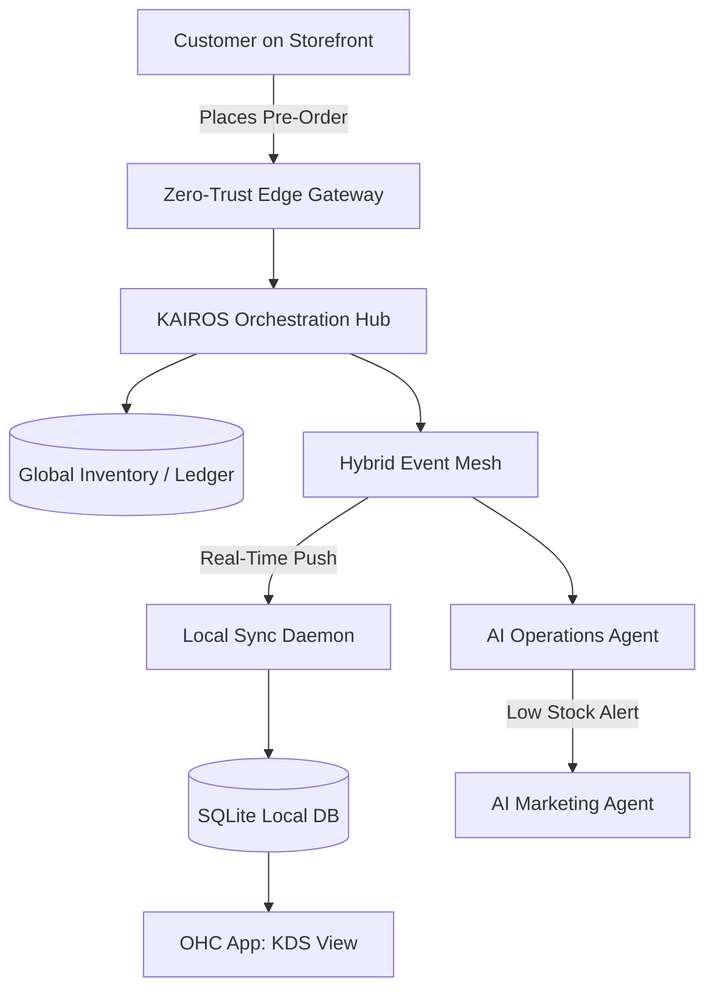

# Title: Real-Time Multilingual KDS & Pre-Order Engine

## Problem Statement
Fatima (Food Cart Operator, 50) operates a busy halal food cart and takes pre-orders. She struggles with existing platforms because they rely heavily on complex English interfaces, require a constant high-speed internet connection, and fail to provide immediate, loud mobile notifications in noisy environments. When the lunch rush hits, cellular networks get congested, and she cannot afford to miss an order or spend time navigating clunky menus to mark an item as "sold out." Existing systems don't seamlessly bridge the gap between a customer's online pre-order and Fatima's low-end Android device operating as a Kitchen Display System (KDS) in a chaotic, multi-lingual environment.

## Research Report
*   **Competitor Analysis**:
    *   **Square KDS**: Robust but requires dedicated iPad hardware and constant internet. The UI is rigid and English-centric.
    *   **Shopify POS**: Not optimized for quick-service food pre-orders. Lacks native multi-language toggle for staff-facing UI vs customer-facing UI.
    *   **Wix Restaurants**: Heavy web-based interface that performs poorly on low-end Android devices and offline environments.
*   **The OHC Differentiator**: OHC must provide a zero-hardware KDS that turns any low-end smartphone into a real-time, multilingual pre-order receiver with offline resilience and native-feeling performance.

## Design Doc

### High-Level Architecture

### Key Design Decisions & Invariants
*   **Zero Trust & Security**: All edge devices (Fatima's phone) must authenticate via SPIFFE/SPIRE. Tenant isolation ensures Fatima's orders are cryptographically segregated from other businesses.
*   **Offline-First & Local DB**: Pre-orders are pushed via the Hybrid Event Mesh to a local SQLite database (SIPDB) on the phone. This ensures the KDS UI responds instantly (FID < 100ms) even if the network drops during the lunch rush.
*   **Multilingual UI Layer**: The app supports instant UI translation. The customer orders in English, but the KDS displays the order and UI controls in Arabic, managed locally without a round-trip to the cloud.
*   **AI Agent Coordination**: The Operations Agent monitors the event mesh. If Fatima marks an item "Sold Out" locally, it synchronizes with the cloud, updating the storefront immediately and notifying the Marketing Agent to suggest a "Sold Out" social media post.

### Mobile UX Flow (375px First)
1.  **Lock Screen**: Fatima receives a loud, distinctive native push notification: "New Pre-Order: 2x Chicken Over Rice."
2.  **KDS View (Arabic + English)**: High-contrast, large touch targets (≥ 60x60px for core actions). The screen displays a queue of active orders.
3.  **Action**: Fatima taps a massive green "Preparing" button. The status syncs via the Sync Daemon to update the customer's tracking link.
4.  **Sold-Out Toggle**: A single toggle next to the item photo on the main screen instantly marks it as sold out across the platform.

### Performance & Offline Targets
*   **LCP**: < 1.0s on 3G networks.
*   **FID**: < 100ms (instant UI feedback via Optimistic Updates).
*   **Bundle Size**: < 300KB for KDS core components.

## Implementation Prompt
**Objective**: Implement the KDS Pre-Order Engine focusing on offline resilience and multilingual support.

**User Journey (CUJ) & Acceptance Criteria**:
1.  **Pre-Order Reception**: When a customer places an order online, the event must be delivered to the local device database via the Hybrid Event Mesh in < 500ms.
2.  **Optimistic UI**: When the user taps "Preparing" or marks an item "Sold Out", the UI must update instantly, queuing the state change in the local DB for background synchronization.
3.  **Multilingual Display**: The system must support rendering the KDS interface in Arabic (RTL) while the underlying data payload retains its original schema.
4.  **Security**: Ensure the background sync respects Zero-Trust boundaries using tenant-isolated authentication.

**Constraints**:
Do not prescribe specific ORMs or state management libraries. The focus is on the synchronization bridging, responsive UI targets, and ensuring the "grandmother test" is passed by hiding all synchronization complexities behind simple, massive buttons.

## Priority
`P0`

## Estimated Scope
Large