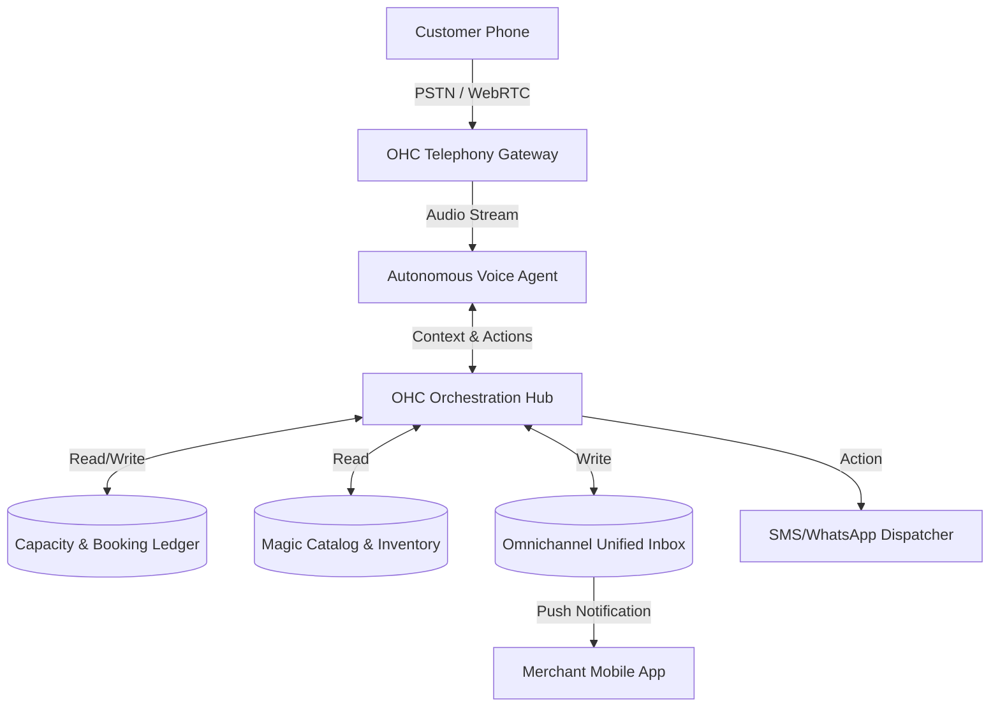

# [architecture]_realtime_voice_ai_receptionist

## Title
Autonomous Real-time Voice Receptionist Engine

## Problem Statement
Small business owners physically performing their work—like Carlos (a handyman on a roof) or Fatima (a food cart owner in the middle of a lunch rush)—cannot stop to answer phone calls. Every missed call is a lost lead, a missed booking, or an ignored pre-order.

Currently, they rely on basic voicemails, which customers hate and rarely leave, or they attempt to call back hours later when the lead has already found a competitor. They need a zero-config, native AI receptionist that answers the phone with a human-like, localized voice, understands the business's context (pricing, inventory, availability), handles the transaction (books an appointment, takes a deposit, or logs an order), and updates the owner's dashboard instantly. They cannot wire up Twilio webhooks, write conversation flows, or configure LLM prompts.

## Research Report
**Market Alternatives:**
*   **Traditional Voicemail/Answering Services:** High friction for customers (no instant answers), or high cost ($200+/mo for a human answering service).
*   **Twilio/Bland AI/Vapi/Retell:** Incredible underlying telephony and real-time voice infrastructure, but these are raw developer tools. A baker cannot integrate them.
*   **Squarespace/Wix:** Rely on web-based forms. If a customer prefers to call, the business is completely blind.

**The OneHumanCorp (OHC) Advantage:**
By integrating a Real-time Voice Agent natively into the OHC platform, the agent already has zero-latency access to the universal capacity ledger, the localized invoice engine, and the magic catalog. When a customer calls, the Voice Agent knows what's in stock, what slots are open on the calendar, and can trigger a 1-tap checkout link via SMS while still on the phone.

## Design Doc

### Architecture Diagram

### UI Wireframes & Mobile UX Flow (375px)

**Screen 1: The "Voice AI" Setup (Zero Config)**
*   A clean, translucent card interface matching the macOS-style design language.
*   A single giant toggle: "AI Receptionist: OFF / ON"
*   **Persona Selection:**
    *   "Choose a voice:" (Friendly Assistant, Professional Desk, Casual & Local)
    *   "Language focus:" (English, Spanish, Arabic, Bilingual)
*   **Instruction Card:** A plain-text box pre-filled based on the business type. E.g., "Answer questions about the menu, take halal pre-orders, and tell them we close at 5 PM."

**Screen 2: Active Call Dashboard (Live view)**
*   When a call comes in and the AI answers, a live, beautiful sound-wave animation appears on the dashboard.
*   **Live Transcript:** The merchant can see the conversation transcribed in real-time as a chat bubble view.
*   **Action Button:** A large "Take Over Call" button allows the merchant to seamlessly jump in if they are available.

**Screen 3: Post-Call Summary Card**
*   Appears in the Unified Inbox.
*   "Call from +1 (555) 123-4567 at 12:30 PM."
*   **AI Summary:** "Customer asked about vegan cakes. I confirmed we have them, quoted $45, and sent a deposit link to their phone via SMS. Deposit was paid."
*   **Outcome Tags:** [Sale Closed] [New Customer]

### AI Agent Integration Points
*   **Telephony AI:** Handles sub-500ms latency speech-to-text, LLM generation, and text-to-speech.
*   **Operations Agent:** Interprets the output from the call to execute ledger updates (booking a slot, reserving inventory).
*   **CS Agent:** Synthesizes the conversation into a 2-sentence summary and injects it into the Unified Inbox.

### Key Design Decisions
*   **Zero Prompts:** The merchant never writes a system prompt. The system generates the AI persona implicitly from the business's existing catalog and settings.
*   **Multimodal Handoff:** The Voice Agent cannot take a credit card number verbally (PCI compliance risk). It must gracefully say, "I'm sending a secure checkout link to your phone right now," and trigger the SMS gateway.
*   **Strict Tenancy Isolation:** Voice memory and call logs must be completely isolated per tenant. The AI cannot accidentally leak pricing from Merchant A to Merchant B's caller.

## Implementation Prompt
**To the Implementer:**
Design the core service boundaries and data models to support an Autonomous Voice Receptionist for OHC. You must build the scaffolding that links a simulated incoming PSTN event to a Voice Agent processing loop, which then interacts with our internal Invoicing and Capacity ledgers.

The end-user outcome is that Maya (the baker) can toggle "On" the Voice Receptionist, a customer can call, ask a question, and receive an SMS payment link, all without Maya picking up the phone.
*   Design the data entities for `CallSession`, `LiveTranscript`, and `AgentHandoffEvent`.
*   Ensure the UX assumes a 375px viewport with a live transcription feed.
*   Do not prescribe the specific TTS/STT vendor (e.g., ElevenLabs, Deepgram), but design the interface to be provider-agnostic.

## Priority
P1

## Estimated Scope
Large
