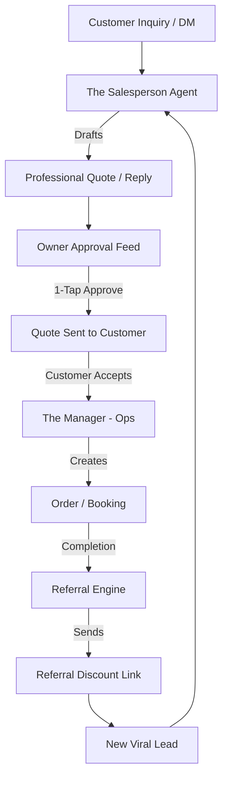

# Architecture Brief: Sales & Acquisition ("The Salesperson")

## Title
OHC "Instant Engagement": Autonomous Lead Conversion & Referral Engine

## Problem Statement
Small business owners (Carlos, Maya, Priya) often lose leads because they are busy working when an inquiry arrives. Carlos might be on a ladder when a customer calls or DMs for a quote; by the time he responds 4 hours later, the customer has booked someone else. OHC must provide "Instant Engagement"—an AI salesperson that autonomously engages leads, generates quotes, and drives a viral referral loop to grow the business.

## Research Report
- **Market State**: Lead management tools (HubSpot, Salesforce) are built for B2B sales teams, not a solo handyman or baker. They are reactive and require manual data entry.
- **The Gap**: Most SMB platforms treat referrals as an afterthought (a simple link) rather than a proactive growth engine.
- **Strategy**: The Salesperson agent acts as an always-on sales assistant that never sleeps, handles the "first touch," and incentivizes existing customers to become promoters.

## Design Doc

### "Instant Engagement" & Viral Loop Strategy
1.  **Autonomous Lead Response**: When a customer inquires via the storefront contact form or connected social channels (Instagram DM), The Salesperson analyzes the request and immediately drafts a contextual response or a quote.
2.  **Smart Quote Generation**: Uses business metadata (prices, service types) to generate a formal quote. If the user accepts, it triggers The Manager (Ops) to create a booking or order.
3.  **Incentivized Referral Engine**: Every successful order triggers a "Happy Customer" flow. The Salesperson asks for a review and provides a unique discount code for the customer to share with friends.
4.  **Lead Follow-up**: If a quote is sent but not accepted within 24 hours, The Salesperson drafts a gentle follow-up ("Still interested in those vegan cupcakes?").

### High-Level Architecture (Mermaid.js)

### Department Coordination
- **Sales -> Manager**: When a quote is accepted (`tenant.quote.accepted`), The Salesperson notifies The Manager to lock in the inventory/time slot.
- **Manager -> Sales**: When an order is fulfilled (`tenant.order.completed`), The Manager triggers The Salesperson to start the referral/review flow.

### Mobile UX Flow
- **Sales Feed**: A "Leads" tab showing active conversations. New leads are flagged with "AI Drafted Response—Tap to Send".
- **Referral Dashboard**: Shows "Total Revenue from Referrals" to motivate the business owner.

## Implementation Prompt
**To Implementer Agent:**
Implement the "Instant Engagement" engine for The Salesperson department. The system must process customer inquiries from various channels and autonomously draft contextual responses or formal quotes based on the business profile. Implement a 1-tap approval workflow for the owner to review and dispatch these drafts. Additionally, build a referral tracking system that automates the generation of discount codes and review requests upon order completion. The Salesperson must coordinate with the Operations department to trigger order creation when a quote is accepted by a customer.

## Priority
P1

## Estimated Scope
Large
