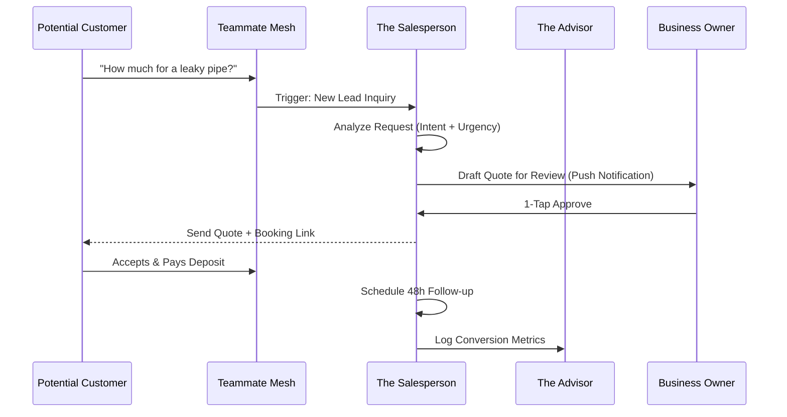

# Architecture Brief: Sales & Acquisition ("The Salesperson")

## Title
OHC "The Salesperson": Autonomous Lead Conversion & Referral Engine

## Problem Statement
Small business owners like Carlos (Handyman) and Leo (Music Tutor) often lose potential customers because they are busy working when a lead comes in. Responding to a quote request 4 hours late can mean the customer has already hired someone else. They need an AI agent that can instantly engage leads, generate professional quotes, and turn happy customers into a referral sales force.

## Research Report
- **Competitive Landscape**: Traditional CRMs like Salesforce or HubSpot are overkill and too expensive for solopreneurs. Tools like Joist or HoneyBook help with quotes but still require manual effort to initiate and follow up.
- **Conversion Friction**: 50% of sales go to the vendor who responds first.
- **Viral Growth**: Referral programs are often too technical to set up. OHC can automate the generation of unique referral links and track the "Viral Coefficient" per tenant.

## Design Doc

### High-Level Architecture (Mermaid.js)

### Mobile UX Flow (375px First)
1.  **Lead Alert**: High-priority push notification: "New Lead from Sarah: Leaky Pipe. Draft quote ready."
2.  **Quote Review**: 1-screen summary of the quote. "Estimated: $150. Includes: Parts & Labor."
3.  **Referral Dashboard**: "Your top 3 referrers this month. Send them a $10 thank-you discount?" (1-tap).

### AI Agent Integration Points
- **Sales + Operations**: Check calendar availability before promising a booking slot in a quote.
- **Sales + Accountant**: Generate an invoice automatically once a quote is accepted.
- **Sales + Ambassador**: Handoff to Customer Success for post-purchase support after a successful sale.

## Implementation Prompt
**To Implementer Agent:**
Implement the "The Salesperson" department logic. Build the lead intake handler that parses natural language inquiries from the "Teammate Mesh" and generates a structured quote draft. Implement the "Follow-up Queue" which allows the agent to check in on unaccepted quotes after 24 and 48 hours. Create the referral tracking system that generates and associates unique `referral_ids` with customers, enabling the "Promoter" to distribute these via social/email.

## Priority
P1

## Estimated Scope
Medium
