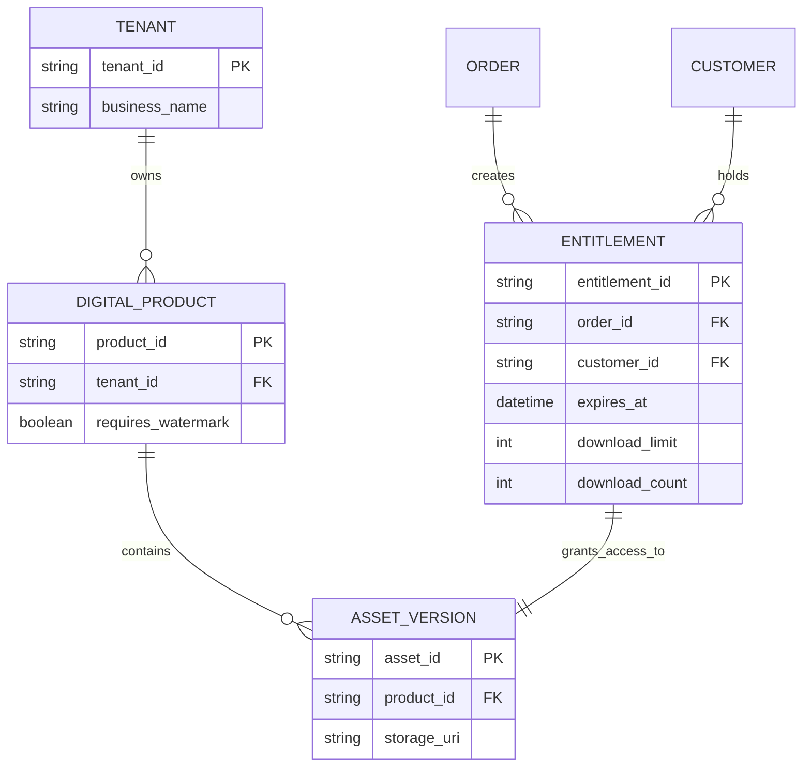
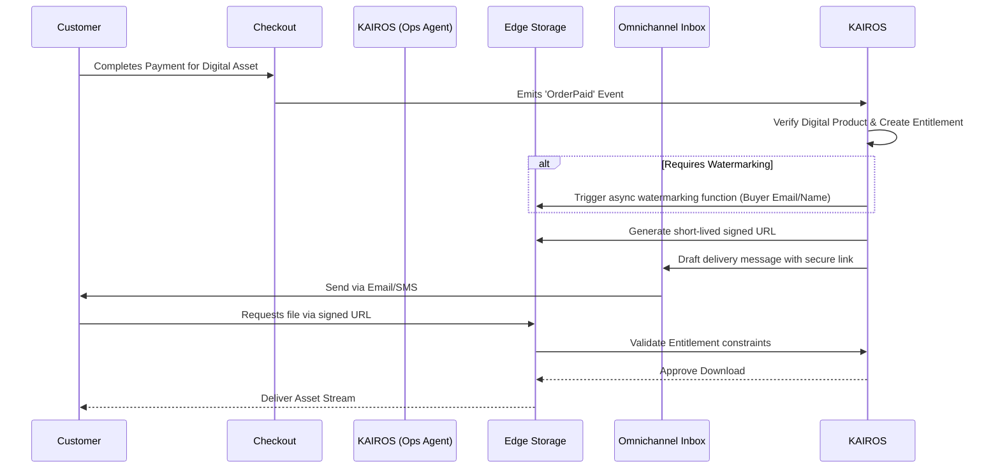

# [Architecture] Secure Digital Product Delivery & Entitlement Engine

## Title
Architect Secure Digital Product Delivery & Entitlement Engine

## Problem Statement
Creators and service providers (like Leo the music tutor, who sells sheet music and online courses) currently struggle with delivering digital goods. They are forced to piece together disjointed tools—using Shopify with complex 3rd-party download apps, or directing customers away to platforms like Gumroad, which breaks the unified brand experience. They need a zero-config, native way to sell, watermark, and securely deliver digital files directly to their customers via email and SMS, without ever worrying about unauthorized sharing or expired links.

## Research Report
*   **User Pain Point:** Delivering digital files securely and managing access (entitlements) is too technical. Users fear piracy but lack the skills to implement DRM or signed URLs.
*   **Competitor Analysis:**
    *   **Shopify:** Requires installing apps like "Digital Downloads." This adds extra monthly costs and forces the business owner to manage another disjointed interface.
    *   **Wix/Squarespace:** Basic file delivery exists, but lacks advanced protection (like dynamic watermarking) and relies heavily on email attachments which often fail due to size limits.
    *   **Gumroad:** Excellent single-purpose tool, but forces the business owner to maintain a separate storefront from their main business (e.g., Leo's physical booking site vs. his digital goods site).
*   **OHC Advantage:** By natively integrating digital entitlements into the global inventory ledger and utilizing the AI Operations Agent, OHC can automatically process the order, dynamically watermark the file with the buyer's details, generate a Zero-Trust signed URL, and dispatch it via the Omnichannel AI Inbox—all invisibly to the business owner.

## Design Doc

### High-Level Architecture & Entitlement Flow
When a digital product is purchased, the system must securely grant access, optionally watermark the asset, and deliver a time-limited or access-limited signed URL.

### Mobile UX Flow (375px First)
1.  **Product Creation:** In the conversational editor, Leo says, "Add my new Guitar Basics PDF for $15."
2.  **AI Extraction:** The AI creates the product, categorizes it as 'Digital', and prompts: "Upload the PDF here."
3.  **Security Toggle:** The AI asks, "Do you want me to automatically stamp the buyer's email on the PDF to prevent sharing?" (Yes/No toggle card).
4.  **Zero Maintenance:** Once uploaded, Leo never touches it again. The dashboard activity feed simply reports: "Sold 3 Guitar Basics PDFs today. Links were sent securely."

### AI Agent Integration
*   **Operations Agent:** Monitors the event mesh for digital purchases. It handles the heavy lifting of calling the watermarking service, generating cryptographic signed URLs, and creating the entitlement record.
*   **Customer Success (CS) Agent:** If a customer replies to the delivery email saying, "My link expired!" or "I can't open this on my phone," the CS agent autonomously verifies the purchase history, generates a fresh signed URL, and replies immediately without bothering the business owner.

### Key Design Decisions
*   **Zero-Trust Edge Delivery:** Assets are stored in private cloud buckets. Delivery is strictly via signed, time-limited URLs generated at the edge.
*   **Separation of Asset and Entitlement:** The `DIGITAL_PRODUCT` represents the listing. The `ENTITLEMENT` represents the buyer's right to access it. This allows for revoking access or supporting subscription-based access (e.g., course materials) in the future.
*   **Asynchronous Watermarking:** Modifying PDFs or images must not block the checkout flow. It happens asynchronously via a background queue.

## Implementation Prompt
Implement the Secure Digital Product Delivery Engine. The system must support creating digital products, securely storing the underlying assets, and generating unique `Entitlement` records upon purchase. When an entitlement is created, the system should generate a secure, signed URL for download and trigger the Omnichannel Inbox to deliver it to the customer. Include support for an asynchronous watermarking step for supported file types (e.g., PDF) before generating the final download link. Do not prescribe specific database schemas, API endpoints, or storage bucket configurations. Focus on the core domain logic, event handling, and ensuring the CS Agent can autonomously regenerate expired links.

## Priority
P1

## Estimated Scope
Medium