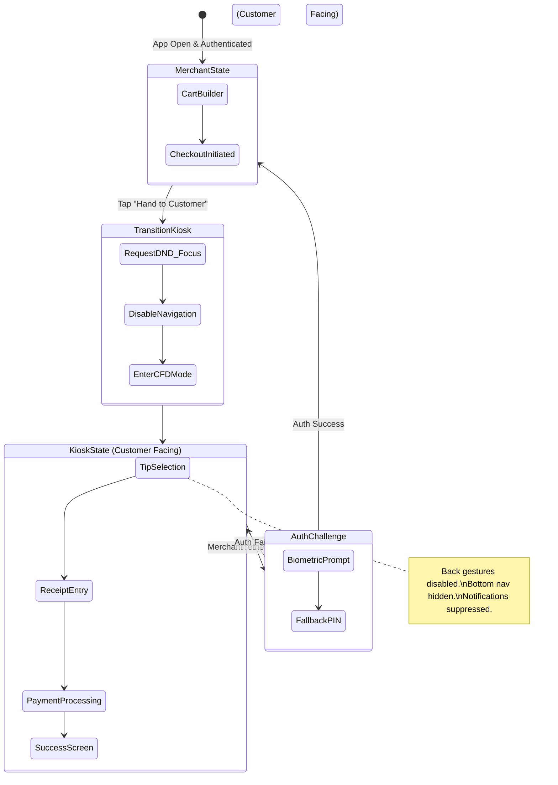

# Title: [Architecture] Secure Mobile Kiosk & Customer-Facing Display (CFD) Engine

## Problem Statement
Small business owners like Fatima (Food Cart operator) and Priya (Boutique owner) operate primarily from their personal smartphones. When taking in-person payments, particularly for situations requiring a tip selection, custom order confirmation, or email entry for a digital receipt, the merchant must physically hand their unlocked device to the customer.

This creates immense friction and risk:
*   **Privacy Violations:** The customer is holding an unlocked device that contains the merchant's personal photos, notifications, revenue dashboards, and direct messages from other customers.
*   **Accidental Actions:** A stray swipe by the customer could inadvertently delete an order, navigate away from the payment screen, or trigger a destructive action.
*   **Hardware Costs:** Competitors (like Square or traditional POS systems) "solve" this by forcing the merchant to buy a separate, expensive, dedicated hardware screen (a Customer Facing Display).

Our non-technical personas need a software-only, "Zero-Trust" solution. They need OHC to instantly, securely, and seamlessly transform their personal device into a locked-down Customer-Facing Display (Kiosk Mode) during checkout, suppressing all notifications and preventing navigation until the merchant re-authenticates.

## Research Report
*   **Current Architecture Limits:** The current OHC mobile app allows navigation throughout the app without a secondary auth boundary during the checkout flow. OS-level notifications (SMS, Instagram, email) still overlay on the screen during a transaction.
*   **Competitor Analysis:**
    *   *Square / Toast:* Rely heavily on secondary hardware screens (CFDs). Their mobile apps offer basic tipping screens but lack robust OS-level lockdown features, leaving notifications visible.
    *   *Apple Guided Access / Android App Pinning:* OS-level features exist, but they are incredibly difficult for a non-technical user like Fatima to configure and toggle on/off dynamically for a single 30-second transaction.
*   **Discovery:** OHC must implement an application-level "Kiosk Mode" state machine. When a transaction reaches the customer-input phase (tipping/receipt), the UI transitions to Kiosk State. This state uses the OS's native "Focus/Do Not Disturb" APIs (if permitted) to suppress notifications, locks navigation (disabling back buttons/swipe gestures), and requires Biometric Authentication (FaceID/TouchID) to return to the Merchant State.

## Design Doc

### Architecture Diagram

### UI Wireframes & Mobile UX Flow (375px)
*   **Merchant View (Pre-handover):**
    *   Fatima rings up a $15 Halal Platter.
    *   Instead of just showing the total, she taps a prominent, high-contrast button labeled **"Hand to Customer"** (with an icon of a hand holding a phone).
    *   *Animation:* The screen elegantly flips 180 degrees (virtual 3D flip animation using Glassmorphism tokens) to visually indicate a massive state change.
*   **Customer View (Kiosk Mode - 375px):**
    *   **Strict Bounds:** The bottom navigation bar disappears. Swiping from the left edge (back gesture) is intercepted and ignored.
    *   **UI Layout:**
        *   Top: Clear, large total ($15.00).
        *   Middle: Giant, easily tappable Tip percentage buttons (15%, 20%, 25%, Custom). Passes the Grandmother test—huge touch targets.
        *   Bottom: "Tap to Pay" icon pulsing.
    *   **Notification Shield:** If the app has Focus/DND permissions, incoming SMS/WhatsApp messages are silently queued and not displayed as banners.
*   **Return to Merchant View:**
    *   After payment success, a discreet "Return to Dashboard" lock icon appears in the corner.
    *   Tapping it instantly triggers FaceID/Biometrics.
    *   *Animation:* The screen flips back, restoring the bottom nav and Merchant State.

### AI Integration Points
*   **Operations Agent (The Vigilant Manager):** Monitors the frequency of failed biometric unlocks during Kiosk mode. If multiple failures occur, the agent logs a security event and flags the session in the Activity Feed, protecting against a customer trying to access the merchant's data.
*   **Customer Success Agent:** If the customer enters their email for a receipt while in Kiosk Mode, this agent immediately links that email to the transaction ID and securely routes it to the CRM mesh, maintaining strict multi-tenant isolation.

### Key Design Decisions
1.  **Software Over Hardware:** Eliminate the need for Maya or Fatima to buy a $200 external display.
2.  **Biometric-Driven:** Passwords are too slow for an active food cart line. Re-entry to the Merchant State *must* use native FaceID/Fingerprint for sub-second unlocking.
3.  **Application-Level Sandbox:** We cannot fully override the OS, but we can intercept all navigation actions within the Tauri container to create a "walled garden" during checkout.

## Implementation Prompt
**To the Implementer Swarm:**
Implement the Customer-Facing Display (CFD) Kiosk state machine for the mobile checkout flow.

1.  Create a strict global state boundary between `MerchantMode` and `KioskMode`.
2.  When transitioning to `KioskMode`, you must hide all global navigation elements (bottom tabs, hamburger menus) and intercept/prevent standard back-navigation gestures.
3.  Design the 375px Kiosk UI (Tip Selection -> Receipt Entry) using the platform's premium Glassmorphism design tokens and large touch targets. Ensure the UI visually signals the "secure" state to the customer (e.g., simplified branding, no internal jargon).
4.  Integrate the device's native Biometric Authentication API to handle the transition back to `MerchantMode`. Provide a graceful fallback to a PIN if biometrics fail or are unavailable.
5.  *(Stretch/Platform specific)* If possible on the target mobile framework, request temporary "Do Not Disturb" or "Focus" permissions to suppress incoming push notifications while the Kiosk state is active.

**Do not prescribe** the underlying SQL tables for storing the transactions or the specific API endpoints for processing the payment. Focus entirely on the robust client-side state machine, the Zero-Trust security boundary, and the flawless mobile UI execution.

**Priority:** P1 (High)
**Estimated Scope:** Medium
