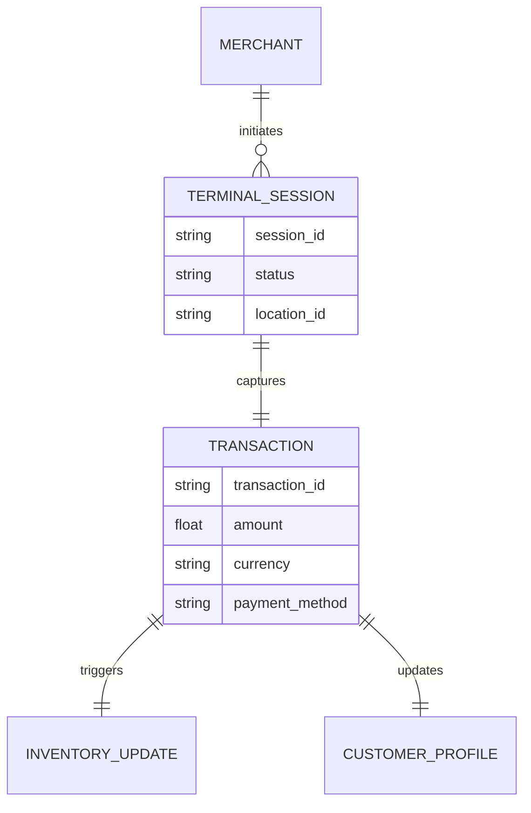

# Title: Tap-to-Pay Integration for In-Person Retail

**Priority**: P0
**Estimated Scope**: Large

## Problem Statement
Priya, a 35-year-old boutique owner, sells clothing both in-store and online. Currently, she relies on disconnected systems to manage her online storefront and physical sales. When a customer walks into her boutique and wants to buy a dress, Priya has to use a separate physical card reader or terminal, manually deduct the item from her online inventory, and reconcile her daily sales later. She needs a seamless way to accept payments directly on her mobile phone using "Tap to Pay" functionality, automatically syncing the in-person transaction with her OneHumanCorp (OHC) online inventory, daily analytics, and customer email newsletter. She expects to launch the app on her phone, tap "Charge", and let the customer tap their credit card on her device—all within seconds, without needing additional hardware.

## Research Report
The current small business ecosystem heavily favors integrated omnichannel solutions:
- **Shopify**: Offers an industry-leading POS app with Tap to Pay on iPhone and Android. It directly integrates with the merchant's unified inventory and unified customer profiles.
- **Square / Wix / GoDaddy**: All have released Tap to Pay on mobile as a default feature, recognizing that modern physical businesses no longer want clunky, dedicated hardware.
- **Our Gap**: OneHumanCorp's current architecture heavily focuses on digital storefronts, bookings, and remote interactions. We currently lack a mobile-native SDK integration (e.g., Stripe Terminal SDK) and the corresponding backend multi-tenant architecture to support secure, localized, in-person payments. This limits our ability to fully capture merchants like Priya who have both physical and digital footprints.

## Design Doc

### Architecture Diagram

### UI Wireframes & Screen Flow (375px Viewport)
1. **Dashboard:** A clean, translucent glass module displaying daily sales with a prominent, high-contrast "Take Payment" action button.
2. **Keypad Screen:** A large, easy-to-tap numeric keypad taking up the bottom half of the screen. The top half shows the total amount.
3. **Tap to Pay Overlay:** A native OS overlay prompting the customer to tap their card to the top of the merchant's phone.
4. **Success Screen:** A celebratory animation confirming payment, with quick-action buttons to "Email Receipt" or "Add to Newsletter".

### Mobile UX Flow
- **Step 1:** Priya opens the OHC mobile app.
- **Step 2:** She taps the primary floating action button: "Take Payment".
- **Step 3:** She enters the amount or selects an item from her inventory list.
- **Step 4:** The app invokes the native Tap to Pay interface.
- **Step 5:** The customer taps their card. The transaction processes in under 3 seconds.
- **Step 6:** Inventory is automatically decremented, and the transaction is recorded in the central ledger.

### AI Agent Integration Points
- **Operations Agent:** Monitors inventory levels. If a tap-to-pay transaction drops inventory below a threshold, the agent alerts Priya to restock.
- **Finance Agent:** Automatically reconciles daily physical sales with digital sales, preparing a unified daily report.
- **Marketing Agent:** If a customer opts into an email receipt, the agent drafts a personalized welcome email thanking them for visiting the physical store and offering an online discount code for their next purchase.

### Key Design Decisions
- **Mobile-First Tap to Pay:** We will leverage native mobile OS capabilities (like Apple's Tap to Pay on iPhone or Android's equivalent via our underlying payment processor's SDK) to avoid requiring merchants to purchase external hardware.
- **Unified Inventory:** In-person and online sales must share the exact same database ledger to prevent overselling.
- **Zero Trust & Security:** Card data must never touch our backend directly. The transaction must be tokenized on the edge device, with the token safely transmitted to our payment provider (e.g., Stripe) using strict multi-tenant isolation.

## Implementation Prompt
Design and implement the Tap-to-Pay feature set for OneHumanCorp. Your goal is to deliver an end-to-end user journey for a merchant selling physical goods in-person. The merchant must be able to open the app, enter a charge amount, and process a contactless payment directly on their mobile device.

**Acceptance Criteria:**
- Create the necessary backend data models to securely manage terminal sessions and link them to the unified transaction ledger.
- Ensure strict multi-tenant isolation so physical sales data is securely segregated by organization.
- Implement the UI components for the "Take Payment" flow, ensuring a premium, "grandmother-tested" experience on a 375px mobile screen. Use translucent glass materials and clean typography.
- Wire up events to the internal AI Mesh so that the Operations and Finance departments are notified of successful physical transactions in real-time.
- Ensure the feature performs optimally over cellular networks with appropriate loading states and offline resilience where possible.
