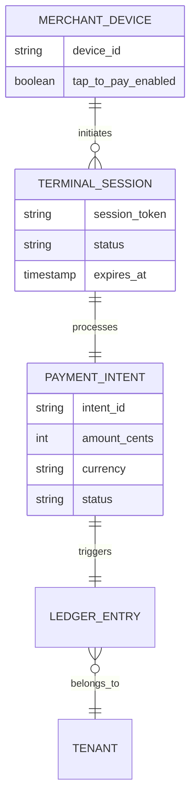

# 📱 Tap-to-Pay Mobile POS Architecture

## Title
Native Tap-to-Pay Mobile Point of Sale (POS) Capabilities

## Problem Statement
Small business owners like Priya (Boutique Owner) and Fatima (Food Cart Operator) need to accept in-person payments securely without relying on bulky, expensive third-party card readers or external apps. They need their mobile phone to act directly as a secure payment terminal (Tap-to-Pay), completely integrated with their inventory and sales data on OneHumanCorp, but without the confusing technical setup of integrating external SDKs or paying hidden gateway fees.

## Research Report
- **Strategy**: Leverage native OS Tap-to-Pay capabilities (e.g., Apple Tap to Pay on iPhone, Google Pay API for Android) directly bridged into OHC's secure edge mobile architecture.
- **Target Persona**: Priya (Boutique Owner), Fatima (Food Cart Operator)
- **Competitive Analysis**:
  - *Shopify*: Requires external POS hardware or specific Shopify POS app installations which separate online and offline logic.
  - *Square*: Excellent integrated hardware, but forces users into their entire ecosystem with high fees.
  - *Stripe Terminal*: Great API, but complex to implement for non-developers.
- **Advantages**: Truly zero-hardware setup. Turns the merchant's existing smartphone into a point-of-sale terminal instantly. Radical simplicity achieved.
- **Risks**: Requires strict compliance with PCI/EMV certification constraints on mobile. Handling unreliable offline environments securely.

## Design Doc

### Architecture Diagram

### 375px UI Wireframes
- **Screen 1: Cart/Order View** - Clean list of items (e.g., "1x Vegan Cake"). Large primary button at the bottom: "Charge $45.00".
- **Screen 2: Tap to Pay Modal** - Translucent Glass overlay. A subtle pulsing animation instructing the user: "Hold customer's card or phone here" with a standard NFC icon.
- **Screen 3: Success Screen** - A fluid green checkmark animation. Options to "Text Receipt" or "Email Receipt".

### Mobile UX Flow
1. Merchant adds items to the cart or enters a custom amount directly on their mobile device.
2. Merchant taps "Charge".
3. OHC app invokes the native OS Tap-to-Pay interface (hiding all technical bridging).
4. Customer taps their card/device.
5. Secure processing completes. AI agent immediately updates inventory and accounting.

### AI Agent Integration Points
- **Finance Agent**: Automatically reconciles the offline Tap-to-Pay transaction with the daily ledger and updates the daily briefing.
- **Operations Agent**: Instantly decrements physical inventory if specific items were sold, and alerts if stock is low.

### Key Design Decisions
- **Unified Identity**: The Tap-to-Pay terminal session shares the exact same secure identity and multi-tenant isolation context as the cloud API, ensuring no data leakage between tenants.
- **Offline Resilience**: Payment intents are securely cached on-device and queued for ledger synchronization if the device momentarily loses connectivity, ensuring no lost sales in low-signal areas.

## Implementation Prompt
Implement the native bridging and secure terminal session management for Tap-to-Pay on mobile devices. Create the necessary backend secure token generation to authorize a device as a POS terminal. The user must be able to add items to a cart and initiate a charge that brings up the native Tap-to-Pay interface. Ensure strict multi-tenant Row Level Security (RLS) is applied to all terminal sessions and payment intents. Do not design specific database columns or API endpoints; focus on the secure interaction between the mobile client and the payment processor bridging.
- **Acceptance Criteria**: Merchant can initiate a payment intent on their phone. Native Tap-to-Pay interface appears. On success, the backend ledger is securely updated and isolated by tenant.
- **Priority**: P0
- **Estimated Scope**: Large
