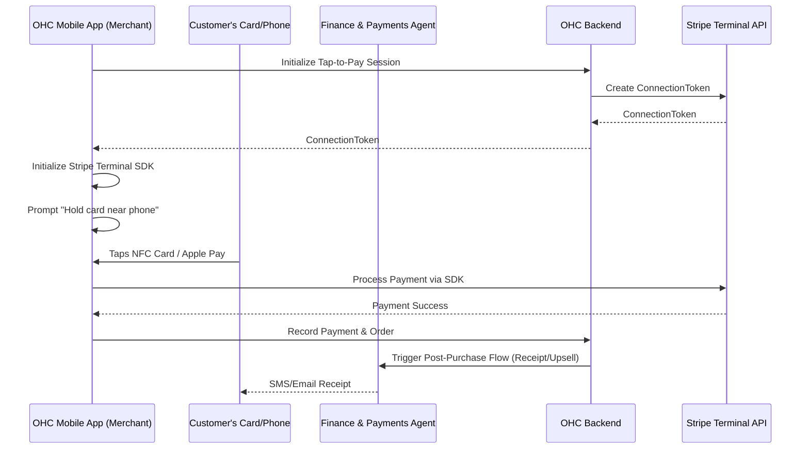

# 📱 Tap-to-Pay Mobile Terminal Architecture

## Title
Native In-Person Tap-to-Pay Mobile Terminal Integration

## Problem Statement
Small business owners like Priya (Boutique Owner) and Fatima (Food Cart Operator) sell physical goods in person. Currently, they either have to rely on expensive, separate POS hardware (like Square terminals) or manually enter credit card details. They need a simple, native way to accept contactless payments (Apple Pay, Google Pay, Tap-to-Pay cards) directly on their smartphones without needing any extra hardware dongles, maintaining the Radical Simplicity of the OneHumanCorp platform.

## Research Report
- **Findings**: Modern smartphones (iOS and Android) support NFC-based Tap-to-Pay functionalities natively. Stripe Terminal offers SDKs for this, allowing the merchant's phone to act as the payment reader.
- **Competitive Analysis**:
  - **Shopify**: Offers Tap to Pay on iPhone/Android via their POS app. Very robust but requires adopting their entire complex POS ecosystem.
  - **Square**: The incumbent. Excellent hardware, but users hate paying for dongles and dealing with battery issues. Their Tap-to-Pay on phone is catching up.
  - **Wix/Squarespace**: Limited native tap-to-pay without relying on third-party apps like Stripe Dashboard.
- **Data/References**: NFC Tap-to-Pay adoption is growing massively. Eliminating hardware drastically reduces the time-to-first-sale for merchants.

## Design Doc

### Architecture Diagram (Mermaid.js)

### UI Wireframes & Screen Flow (375px first)
1. **Checkout Screen (375px)**: Large, thumb-friendly numeric keypad for entering amount, or an itemized cart view. A prominent floating action button (FAB) at the bottom: "Charge $XX.XX".
2. **Payment Method Selection**: A bottom sheet modal offering "Tap to Pay", "Cash", or "Send Invoice".
3. **Tap-to-Pay Active Screen**: The OS-level NFC prompt overlays the screen. A pulsating NFC icon with the text: "Hold card or phone to the back of this device."
4. **Success Screen**: A satisfying green checkmark animation. Options to "Text Receipt" or "Email Receipt".

### Mobile UX Flow
- The merchant inputs the sale amount or selects products from the catalog.
- The merchant selects "Tap to Pay".
- The smartphone activates its NFC reader.
- The customer taps their contactless card or smartphone (Apple/Google Pay) against the merchant's phone.
- The payment is securely processed via Stripe Terminal.
- The merchant is instantly shown the success screen and can send a digital receipt.

### AI Agent Integration Points
- **Finance & Payments Agent**: Automatically reconciles the tap-to-pay transaction with the daily ledger and updates the daily sales report.
- **Customer Success Agent**: Can automatically text a digital receipt to the customer if their phone number is entered, and later send a follow-up discount code or review request.
- **Operations Agent**: Immediately deducts purchased physical items from the global inventory count.

### Key Design Decisions and Why
- **No External Hardware**: Relying entirely on the smartphone's NFC chip ensures zero upfront cost for the merchant, perfectly aligning with the "zero to live business in under 10 minutes" goal.
- **Native OS Prompts**: Using Apple/Google's native tap-to-pay UI builds immediate trust with the customer, as it looks identical to standard Apple/Google Pay flows.
- **Offline-Resilient Architecture**: The system must gracefully handle poor cellular connectivity (common in food carts/markets) by caching the transaction intent and processing it when the connection is restored, if supported by the payment processor.

## Implementation Prompt
Implement the Stripe Terminal SDK to support Tap-to-Pay directly within the OHC mobile application. Create a checkout flow where the merchant can build a cart or enter an amount, initialize the Tap-to-Pay session, and process the NFC payment. Ensure the order is saved to the database and inventory is updated upon success. Connect this to the Finance & Payments Agent for daily reconciliation.
- **User-Facing Outcome**: The merchant can accept contactless card payments using only their smartphone, and send digital receipts.
- **Acceptance Criteria**: Merchant can charge an amount, the OS NFC prompt appears, a test card tap processes successfully, the order is recorded, and the digital receipt option is shown.
- **Priority**: P0
- **Estimated Scope**: Large
