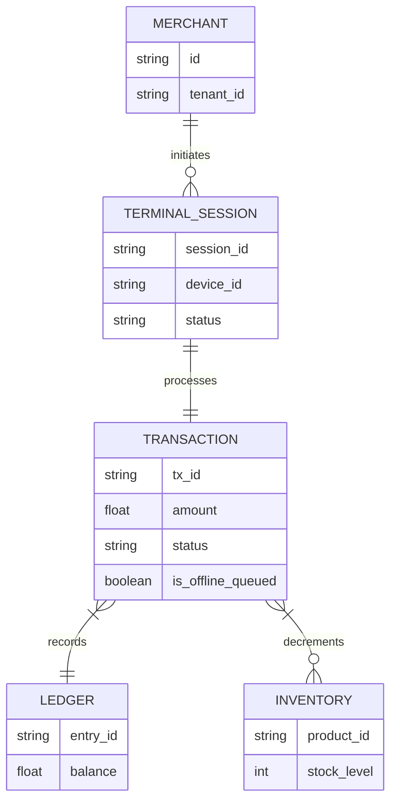
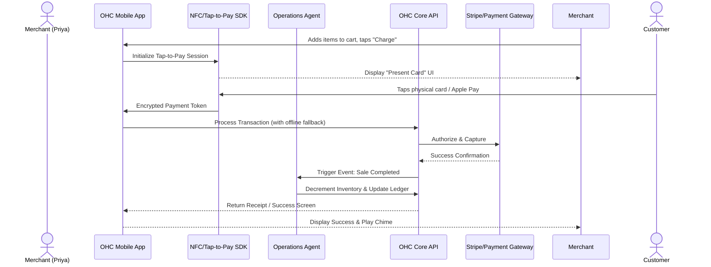

# [Architecture] Hardware-Free Tap-to-Pay POS Integration

## Problem Statement

Small business owners who operate in person—like Priya the boutique owner or Fatima the food cart operator—need a frictionless way to accept in-person payments without purchasing, pairing, and maintaining expensive external POS hardware (e.g., Square readers or dedicated terminals). Currently, OHC lacks a native, seamless in-person POS capability that connects directly to the unified OHC mobile app. The "Setup Complexity" of legacy hardware POS solutions creates significant friction and fails the "grandmother test." We need an integrated, zero-hardware solution utilizing native mobile NFC (Tap-to-Pay on iPhone/Android) to unify their online and offline sales, inventory, and ledger in real-time.

## Research Report

### Context and Market Analysis
In-person sales remain a vital revenue channel for many SMBs. Traditional solutions require external bluetooth or physical plug-in card readers.
- **Shopify:** Requires external POS hardware or specific Tap-to-Pay iOS/Android apps that are often separate from the primary management app, causing fragmentation.
- **Square:** Known for their hardware, but shifts to Tap-to-Pay require their specific ecosystem which may lock users out of a unified platform.
- **Wix/Squarespace:** Point of Sale capabilities exist but often rely heavily on third-party hardware integrations (like Stripe Terminal external readers), causing setup complexity.
- **Stripe Terminal:** Offers Tap-to-Pay SDKs that allow merchants to accept payments directly on their mobile devices using NFC without extra hardware. This is the ideal technology enabler for OHC.

By directly embedding Tap-to-Pay via Stripe Terminal SDKs into the primary OHC app, we can completely bypass external hardware. This positions OHC in the "Leapfrog Zone" (High Autonomy, Radical Simplicity), allowing a merchant to open the app, enter an amount, and instantly have a customer tap their card on the merchant's phone.

### Key Learnings
1. **Hardware is Friction:** External readers battery dies, lose bluetooth pairing, or break.
2. **Unified Data is Critical:** Inventory, sales, and analytics must reflect in-person sales instantly alongside online sales.
3. **Offline Resilience:** Food carts or pop-up shops (e.g., Fatima) may have spotty cellular connections; the POS flow must gracefully handle low connectivity.

## Design Doc

### Key Design Decisions
- **Zero-Hardware Approach:** Fully leverage Apple Tap to Pay on iPhone and Android native NFC Tap-to-Pay. No bluetooth readers.
- **Unified Ledger & Inventory:** In-person transactions must directly mutate the same core Ledger and Inventory entities as online sales to prevent double-selling.
- **Offline Mode & Queueing:** Implement an offline-capable transaction queue. If the network is unavailable, transactions are queued locally securely and synced when connectivity is restored, ensuring no lost sales in spotty environments.
- **Zero Trust Security:** Enforce strict multi-tenant isolation at the terminal session level using SPIFFE/SPIRE-backed identities to guarantee one merchant cannot access another's transactions.

### Architecture Diagram (Mermaid.js)

### Mobile-First UX Flow (375px)
Every screen follows the macOS-style Translucent Glass materials combined with clean Ubiquiti UniFi modular dashboard card layouts.
1. **POS Dashboard:** A highly legible screen with quick-add preset amounts, a barcode scanner button, and a visual cart list.
2. **Checkout Modal:** A bottom-sheet that slides up summarizing the total, with a massive, high-contrast "Tap to Pay" primary action button.
3. **NFC Interaction:** The native OS Tap-to-Pay modal takes over the screen momentarily, displaying a clear NFC icon and prompt.
4. **Success Screen:** A simple checkmark with a pleasant audio chime. Offers one-tap buttons to "Email Receipt", "SMS Receipt", or "New Sale". No jargon.

### AI Agent Integration Points
- **Operations Agent:** Intercepts the "Sale Completed" event. Automatically decrements inventory. If inventory drops below a threshold, silently queues a reorder task or alerts the merchant in their plain language daily briefing.
- **Finance Agent:** Instantly reconciles the transaction in the ledger and prepares real-time daily revenue analytics without the merchant needing to run reports.
- **Marketing Agent:** If a digital receipt is sent, optionally appends an AI-generated personalized referral code or upcoming sale notice based on the purchased items.

## Implementation Prompt
**Prompt for Implementer Agent:**
Implement the hardware-free Tap-to-Pay Point of Sale module for the OHC mobile application. The user journey should allow a merchant (e.g., Priya or Fatima) to open the app, ring up items, and directly accept a customer's contactless card payment using the device's native NFC capabilities.
Ensure the UX strictly follows the mobile-first (375px) Translucent Glass / modular card design system, passing the "grandmother test."
Design the backend coordination to seamlessly decrement shared inventory, log to the unified ledger, and securely trigger background AI agents for operations and finance updates.
You must design a secure, multi-tenant resilient system capable of handling intermittent offline states gracefully without losing transaction data. Choose the appropriate SDKs and backend endpoints to fulfill this capability without prescribing specific function signatures here.

## Priority
P0

## Estimated Scope
Large
