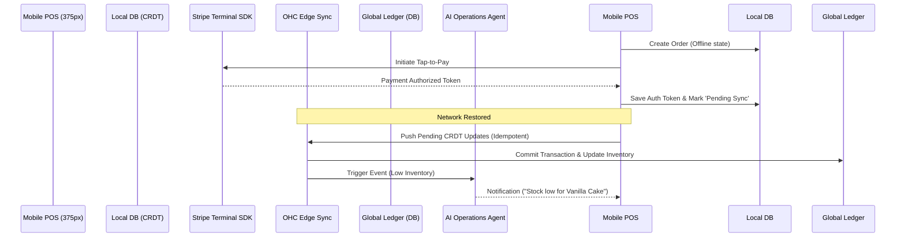

# 📱 Tap-to-Pay & POS Terminal Sync Architecture

## Title
Offline-First Tap-to-Pay & Mobile POS Synchronization for In-Person Sales

## Problem Statement
Small business owners like Priya (boutique owner) and Fatima (food cart operator) need to accept in-person payments quickly and reliably. Currently, if they lose cell service at a farmer's market or during a rush, they cannot process transactions. They need an offline-capable, zero-friction Tap-to-Pay solution on their mobile devices (Android/iOS) that automatically syncs inventory and ledger data to the cloud as soon as connectivity is restored, all without navigating complex developer settings or third-party POS integrations.

## Research Report
- **Competitor Analysis**:
  - Shopify POS offers offline capabilities but requires dedicated hardware for full feature sets.
  - Square excels at mobile-first but charges high fees and traps users in their ecosystem.
  - Stripe Terminal provides Tap-to-Pay on iPhone/Android via native SDKs without extra hardware.
- **Strategic Direction**: Implement Stripe Terminal's Tap-to-Pay SDK natively within the OHC mobile wrapper (or progressive web app with hardware access).
- **Core Needs**: Idempotent offline payment queuing, conflict-free replicated data types (CRDT) for inventory sync (preventing double-selling an item sold offline vs. online), and secure tokenized transaction storage.

## Design Doc

### Architecture Diagram

### UI Wireframes (375px Mobile-First)
- **Screen 1: Checkout View**
  - Clean, Ubiquiti UniFi modular dashboard card style.
  - Large, touch-friendly product tiles.
  - Sticky bottom bar: "Total: $14.50" with a prominent "Tap to Pay" button.
- **Screen 2: Tap-to-Pay Modal**
  - Translucent Glass material overlay.
  - Simple animation showing a card tapping a phone.
  - Text: "Hold card or phone to back of device."
- **Screen 3: Success & Sync Status**
  - Green checkmark.
  - Small, discrete offline indicator: "Saved locally. Syncing..." (turns to "Synced" when online).
- **Grandmother Test**:
  - All developer/engineering terminology (APIs, Webhooks, CRDTs, K8s, Stripe SDK) must be completely hidden. The UI should only use plain language. Advanced sync statuses can be toggled via an "Advanced Settings" switch.

### AI Integration Points
- **Finance AI Agent**: Automatically reconciles batched offline transactions with the daily ledger and flags anomalies invisibly.
- **Operations AI Agent**: Listens to inventory decrement events. If a popular item (e.g., Halal Chicken over Rice) sells out rapidly during an offline rush, it queues a 1-Tap approval to update the digital storefront to "Sold Out".

### Key Design Decisions
- **Offline-First LWW (Last-Write-Wins)**: We will use a local SQLite/CRDT layer on the device to queue transactions and inventory changes to handle temporary network loss.
- **No Extra Hardware**: Relies exclusively on device NFC capabilities (Tap to Pay on iPhone/Android) to maintain the Radical Simplicity ethos.
- **Idempotency**: All payment mutations must be strictly idempotent with zero tolerance for double-charging. Payment webhooks must mandate comprehensive audit logging and cryptographic signature verification.
- **Multi-Tenant Isolation**: Must enforce strict isolation at the storage level via PostgreSQL Row Level Security (RLS). Application-only tenant isolation checks are strictly prohibited.

## Implementation Prompt
Implement the backend synchronization endpoint and data models for the offline-first Tap-to-Pay feature. Provide the secure, idempotent API that the mobile client will call to sync offline-authorized payment tokens and inventory decrements. Do not dictate specific database schemas or API routes; design the system to handle idempotency securely and enforce PostgreSQL RLS for multi-tenancy.

## Priority
P0

## Estimated Scope
Large
