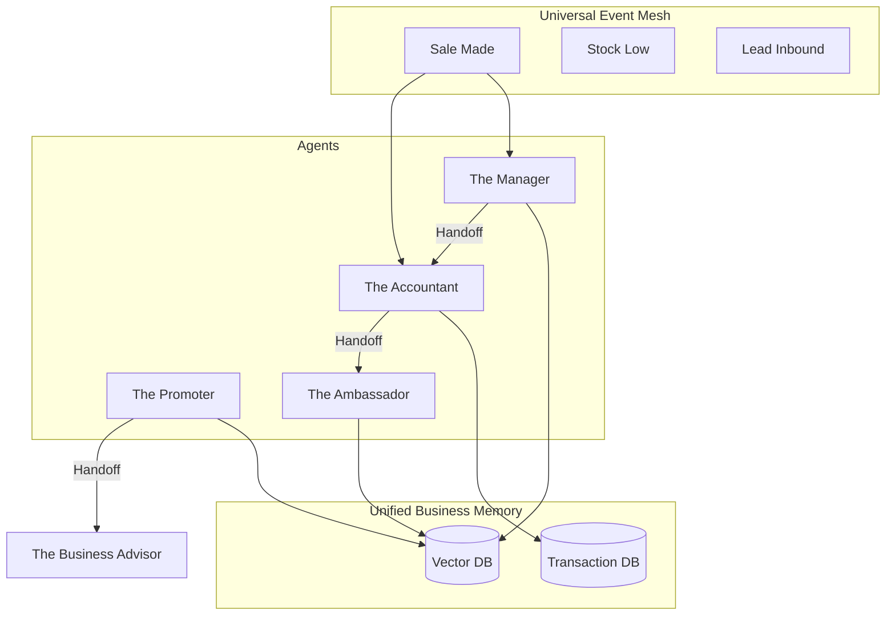

# Teammate Mesh Vision: The Future of Autonomous Agent Orchestration

## 1. Introduction: From "Tools" to a "Living Org"
OneHumanCorp's long-term technical moat is the **Teammate Mesh**. This is not a collection of APIs, but a decentralized swarm of specialized agents that share a unified memory and event-driven communication layer. This document defines the architectural vision for how these agents collaborate without human micromanagement.

---

## 2. The Agent Departments (The Living Org Chart)

### 2.1 The Operations Department (The Manager)
- **Primary Goal**: Efficiency and Reliability.
- **Core Loop**: Monitors Inventory -> Senses Sales Velocity -> Triggers Restock/Fulfillment.
- **Handoff Trigger**: When stock is low, it pings **The Accountant** to verify budget for restock.

### 2.2 The Growth Department (The Promoter)
- **Primary Goal**: Visibility and Reach.
- **Core Loop**: Monitors Market Trends -> Scans GEO Performance -> Generates Social/Ad Content.
- **Handoff Trigger**: When a new campaign is successful, it pings **The Advisor** with "Strategy Success" data.

### 2.3 The Customer Success Department (The Ambassador)
- **Primary Goal**: Conversion and Retention.
- **Core Loop**: Watches Inboxes -> Cross-references Business Memory -> Drafts Empathetic Replies.
- **Handoff Trigger**: When a customer asks for a discount, it pings **The Accountant** for a dynamic coupon code.

### 2.4 The Finance Department (The Accountant)
- **Primary Goal**: Profitability and Compliance.
- **Core Loop**: Reconciles Payments -> Monitors Subscriptions -> Flags Tax Obligations.
- **Handoff Trigger**: When a payment fails, it pings **The Ambassador** for a "Soft Recovery" outreach.

---

## 3. Communication Protocol: "Handoff Events"

Agents do not "call" each other. They publish **Intent Events** to the mesh.

### Example: The "Sold Out" Event Chain
1. **The Manager** detects `product.stock == 0`.
2. **Intent Published**: `intent.operations.restock_required`.
3. **The Accountant** subscribes, checks `org.balance`, and replies: `approval.finance.restock_budget_ok`.
4. **The Promoter** subscribes, pauses active ads for that product, and drafts a "Back Soon" post.
5. **The User** sees one consolidated action in the feed: *"Product X is sold out. I've secured budget for restock and paused your ads. Tap to confirm restock order."*

---

## 4. Unified Business Memory (The Collective Brain)

A shared RAG (Retrieval-Augmented Generation) layer ensures that all agents have the same "truth."

| Memory Type | Description | Agent Access |
| :--- | :--- | :--- |
| **The Vibe** | Tone of voice, brand values, visual style. | All |
| **The Ledger** | Sales history, costs, customer LTV. | Accountant, Advisor |
| **The Catalog** | Product specs, inventory, availability. | Manager, Ambassador |
| **The Market** | Competitor pricing, GEO trends, local events. | Promoter, Advisor |

---

## 5. The "Oracle" Layer (The Business Advisor)

The Advisor is the only agent that looks at the *entire* mesh. It uses multi-agent summarization to generate the **Daily Plain-Language Briefing**.

### Briefing Structure
- **The "High"**: *"Your vegan cookies are trending in East Austin!"*
- **The "Low"**: *"Your shipping costs increased by 12% this week."*
- **The "Move"**: *"If we shift $50 from Google Ads to Instagram DMs, we could recover 5 more sales."*

---

## 6. Mermaid Architecture: The Teammate Mesh

---

## 7. Strategic Moat: The "Agent Sovereignty" Gate
As we move to "Hybrid" (Cloud + Standalone), the mesh ensures data sovereignty. The user can choose which agents run "locally" (on their device) and which run in the cloud for high-compute tasks, with the mesh handling the sync invisibly.
