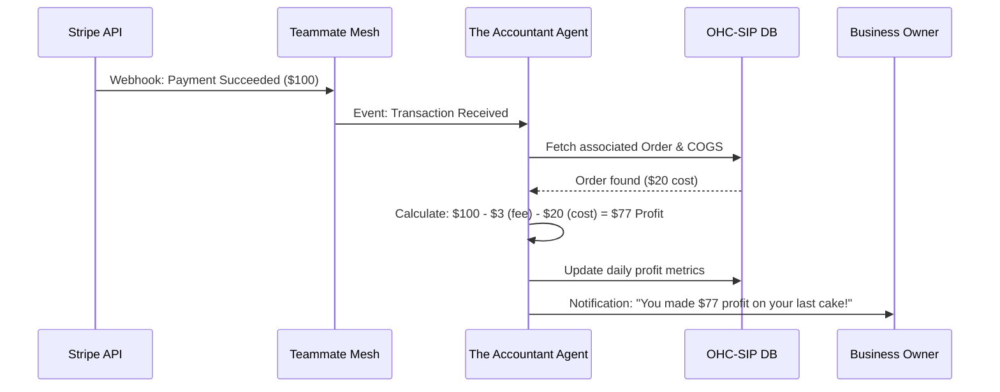

# Architecture Brief: The Accountant (Finance & Payments)

## Title
OHC AI Agent: "The Accountant" — Financial Clarity & Automated Payments

## Problem Statement
"Financial Fog" (35% pain point) is a major cause of SMB failure. Owners like Maya and Carlos see money coming in via Stripe or Venmo but struggle to understand their true profit after fees, shipping, and material costs. They lack the time to manage recurring billing for subscriptions (Leo) or deposits for bookings (Carlos).

## Research Report
- **The "Spreadsheet Trap"**: Most SMBs rely on manual spreadsheets to calculate profit, leading to errors and outdated data.
- **Payment Fragmentation**: Money is often spread across multiple gateways (Stripe, PayPal, Mercado Pago), making a unified view difficult.
- **Tax Dread**: Gathering documentation for tax season is a high-stress, low-value activity for non-technical founders.

## Design Doc

### Functional Boundaries
"The Accountant" acts as the business's virtual CFO, handling:
1.  **Unified Ledger**: Aggregating transactions from all payment gateways into a plain-language dashboard.
2.  **Profitability Analysis**: Automatically calculating net profit by subtracting known costs (Stripe fees, shipping labels, COGS entered by the user).
3.  **Automated Billing**: Managing subscription renewals, deposit collections, and quote-to-invoice transitions.
4.  **Tax Prep**: Organizing transactions into tax-ready categories and generating simple export reports.

### Architecture Diagram (Mermaid.js)

### Mobile UX Flow (375px First)
- **"The Money" Tab**: A clean, glassmorphic view of Revenue vs. Profit.
- **1-Tap Reconciliation**: If a cost is unknown, "The Accountant" asks: "How much did materials for this order cost?" with a simple numeric keypad.

## Implementation Prompt
**To Implementer Agent:**
Implement "The Accountant" agent department. Build the integration layer for Stripe and Mercado Pago webhooks that maps external transactions to internal `ORDER` and `BOOKING` entities. Implement the "Profitability Engine" that calculates net margins in real-time. Create the "Financial Briefing" UI component for the mobile dashboard that displays daily/weekly profit in plain language. Ensure all data is strictly isolated per `tenant_id` using PostgreSQL RLS.

## Priority
P0 (Core Value Prop)

## Estimated Scope
Large
