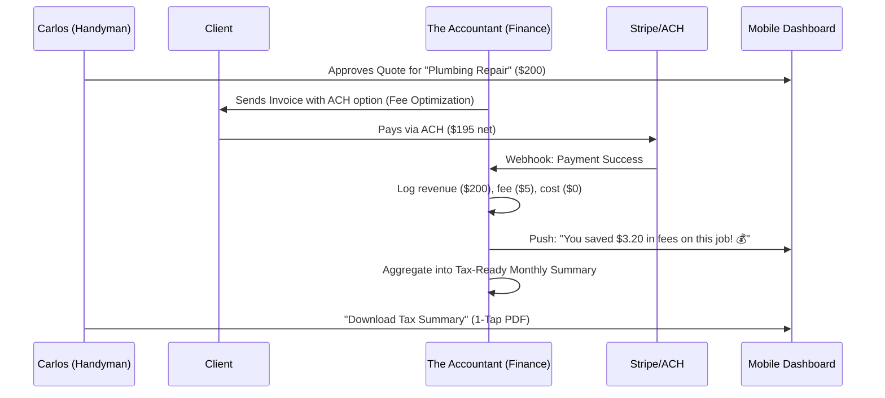

# Architecture Brief: The Accountant (Finance & Payments)

## Title
OHC "The Accountant": Invisible Financial Management & Plain-Language Briefings

## Problem Statement
Small business owners like Carlos (Handyman) and Priya (Boutique Owner) suffer from "Financial Fog." They see money coming in via Stripe or Venmo but struggle to understand their real profit after transaction fees, platform costs, and taxes. Exporting data to spreadsheets is a major friction point. Carlos needs to know if a $150 plumbing job is actually profitable, and Priya needs a tax-ready summary without hiring an expensive CPA.

## Research Report
- **Market Gap**: Financial tools for SMBs are either too basic (bank app) or too complex (QuickBooks). There is no "middle ground" that provides proactive, plain-language financial advice directly from the transaction flow.
- **Transaction Friction**: Platform fees and "Cost Creep" are top pain points. OHC's unique "Transaction Fee Optimization" (ACH for >$50) is a major differentiator that needs to be surfaced to the user as "Money Saved."
- **Positioning**: "The Accountant" isn't just a ledger; it's a strategist that helps owners manage cash flow and prepare for tax season entirely from their phone.

## Design Doc

### Key Design Decisions & Rationale
1. **Plain-Language Summarization**: Financial data is never presented as a table first.
   - *Rationale*: Tables cause cognitive load for non-technical users. Narratives ("You made $X, profit is $Y") are immediately actionable.
2. **Native Fee Optimization**: The system automatically selects the cheapest payment rail (ACH vs. Card).
   - *Rationale*: SMB owners are often unaware of how much they lose to fees. Automating this provides instant tangible value.
3. **Receipt-to-Ledger Automation**: Users can take a photo of a receipt, and the AI categorizes it.
   - *Rationale*: Manual expense entry is the #1 reason for financial data fragmentation.

### Quote-to-Tax-Summary Flow (Mermaid.js)

### Mobile UX Flow (375px First)
1. **The Briefing Feed**: A daily "Good morning, Carlos" card summarizing yesterday's sales and net profit.
2. **The "Snap-and-Save"**: A prominent camera button for instant receipt capture.
3. **The Savings Badge**: A persistent "Total Fees Saved" counter on the finance tab.

### UI Wireframe Description
- **Screen 1 (Home)**: Top-level card with "Current Balance" and a text-based "Weekly Briefing" (e.g., "Great week! You're up 15%").
- **Screen 2 (Transactions)**: A vertical list of large cards, each showing the Customer Name, Amount, and a "Fee Optimized" badge if applicable.
- **Screen 3 (Tax Center)**: A simple progress bar showing "Ready for Tax Season" and a "Generate PDF" button.

### AI Agent Integration
- **Memory & Context**: "The Accountant" uses historical revenue data to forecast next month's sales, stored in the business's financial context.
- **Approval Mechanism**: Refunds and high-value payouts are `Draft-for-Review`.
- **Budgeting & Throttling**: Financial report generation is limited based on the SaaS tier (e.g., 1 per week for Free).

## Implementation Prompt
**To Implementer Agent:**
Implement "The Accountant" department engine. Create a `FinanceService` that integrates with Stripe webhooks to track real-time revenue and transaction fees. Implement the "ACH Routing" logic described in `COST_BLUEPRINT.md` to optimize for fees. Build the "Financial Briefing" generator: an AI service that takes a week's worth of transaction data and outputs a 3-sentence plain-language summary for the mobile dashboard (375px). Create a mobile-first `TaxSummary` view that allows users to export their monthly data as a formatted PDF in one tap.

## Priority
P0

## Estimated Scope
Large
