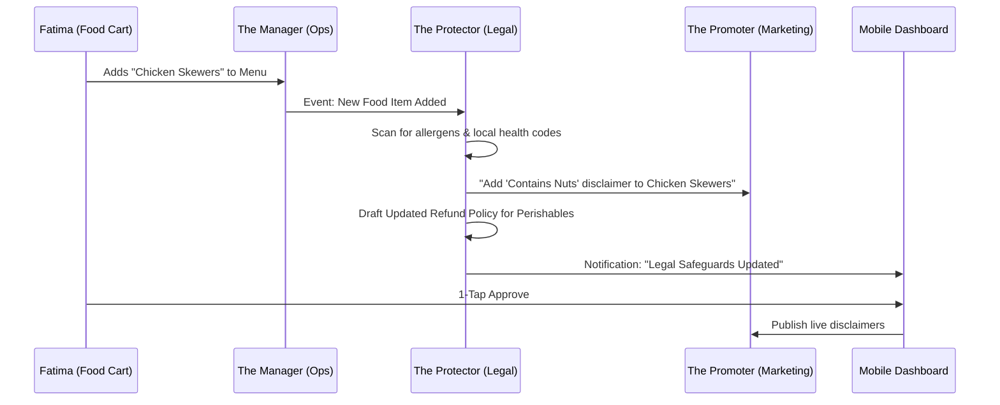

# Architecture Brief: The Protector (Legal & Compliance)

## Title
OHC "The Protector": Autonomous Compliance & Legal Safeguards for SMBs

## Problem Statement
Small business owners like Fatima (food cart) and Maya (baker) operate in a legal gray area because professional legal counsel is too expensive and DIY templates are confusing. They often lack proper Terms of Service, Privacy Policies, or health/safety disclaimers, leaving them vulnerable to liability. Fatima also struggles to track business license expirations and local health permit renewals on her mobile device.

## Research Report
- **Market Gap**: Small business legal services are either expensive (LegalZoom) or fragmented (random template generators). There is no "invisible" legal department that monitors business events and updates policies automatically.
- **Compliance Fatigue**: 48% of SMB owners cite "Technical Jargon" and "Legal Complexity" as major stress factors.
- **OHC Advantage**: By integrating "The Protector" directly into the business lifecycle, OHC can automate the generation of hyper-local, industry-specific safeguards (e.g., "Allergy Warnings" for bakers, "Liability Waivers" for handymen) without the owner needing to prompt for them.

## Design Doc

### Key Design Decisions & Rationale
1. **Event-Driven Policy Generation**: Instead of a one-time setup, policies are treated as "living documents."
   - *Rationale*: A baker who starts shipping across state lines has different legal requirements than one doing local pickup.
2. **Draft-for-Review Approval**: All legal documents MUST be approved by the user.
   - *Rationale*: Legal liability cannot be fully automated; the owner must "own" the policy.
3. **Hyper-Local Contextualization**: Uses the business's `location` and `category` to pull specific health/safety disclaimers.
   - *Rationale*: Generic ToS doesn't protect a food cart operator from specific local health code violations.

### Autonomous Compliance Flow (Mermaid.js)

### Mobile UX Flow (375px First)
1. **The Pulse Notification**: A non-intrusive banner on the dashboard: "⚠️ 2 items need safety disclaimers."
2. **The Review Screen**: A side-by-side view (Old vs. New) of the policy change in plain language.
3. **1-Tap Approval**: A large "Approve & Publish" button (44x44px).

### UI Wireframe Description
- **Screen 1 (Dashboard)**: A "Legal Health" widget showing a green checkmark or a yellow warning icon.
- **Screen 2 (Policy Review)**: Glassmorphism card containing the auto-generated text with highlighted changes.
- **Screen 3 (License Tracker)**: A simple vertical list of cards (License Name, Expiry Date, Status Badge).

### AI Agent Integration
- **Memory & Context**: "The Protector" retrieves business history from `autodream_memories` to ensure policies reflect actual business practices (e.g., "You haven't issued a refund in 6 months; your policy is working").
- **Approval Mechanism**: High-risk actions (ToS updates) are always `Draft-for-Review`.
- **Budgeting & Throttling**: Legal scans are capped at 5 per day for Free users to prevent API exhaustion.

## Implementation Prompt
**To Implementer Agent:**
Implement the "The Protector" department logic. Create a `LegalService` that monitors the Teammate Mesh for `BusinessLaunched` and `ProductAdded` events. When triggered, the agent must use a library of vetted templates to generate a JSON-structured legal profile (ToS, Privacy, Disclaimers) scoped to the business type. Build the "1-Tap Approval" UI in the mobile dashboard (375px) where users can review and publish these safeguards. Implement the `LicenseTracker` feature: a mobile-first list for storing expiration dates for permits, with a background worker that emits `LicenseExpiring` events 30 days before the deadline.

## Priority
P1

## Estimated Scope
Medium
