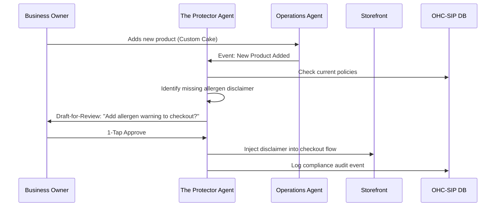

# Architecture Brief: The Protector (Legal & Compliance)

## Title
OHC AI Agent: "The Protector" — Seamless Legal & Compliance for SMBs

## Problem Statement
Small business owners (Maya, Carlos, Fatima) often neglect legal protections because they are expensive, complex, and intimidating. They often copy-paste generic terms of service that don't protect them or violate GDPR/CCPA by accident. Fatigue from trying to understand "legalese" leads to high liability risks.

## Research Report
- **The "Policy Gap"**: 70% of micro-businesses operate without custom terms of service or privacy policies.
- **Competitor Landscape**: Shopify/Wix provide generic templates, but they aren't "alive." They don't update when a business adds a new product type (e.g., selling digital goods vs. physical).
- **GDPR Complexity**: Handling "Right to be Forgotten" or "Data Access Requests" is a technical nightmare for a non-technical user like Priya.

## Design Doc

### Functional Boundaries
"The Protector" acts as the business's internal legal clerk, handling:
1.  **Dynamic Policies**: Generating and updating Terms of Service and Privacy Policies that reflect the *actual* business operations.
2.  **Compliance Guardrails**: Ensuring data collection (email signups, cookies) adheres to regional laws (GDPR, CCPA).
3.  **Liability Shield**: Drafting liability disclaimers for specific services (e.g., Carlos's plumbing work, Maya's food allergen warnings).
4.  **Contract Automation**: Generating simple, legally-sound contracts for bookings or high-value orders.

### Architecture Diagram (Mermaid.js)

### Agent Coordination & Approval
- **Draft-for-Review (High Risk)**: All external-facing legal documents (contracts, terms) require 1-tap owner approval.
- **Auto-Execute (Low Risk)**: Internal compliance logging and cookie banner configuration.

## Implementation Prompt
**To Implementer Agent:**
Implement "The Protector" agent department. Create the event listeners for `ProductCreated` and `BusinessConfigUpdated` to trigger policy reviews. Build a library of "Legal Smart Blocks" (Terms, Privacy, Disclaimers) that can be dynamically injected into the Storefront Builder. Implement the "GDPR Request" workflow where a customer can request their data via the storefront, triggering "The Protector" to gather all relevant PII from the `tenant_id` and draft a response for the owner. Ensure all UI elements use the OHC Premium Design System (Glassmorphism, Outfit/Inter).

## Priority
P2

## Estimated Scope
Medium
