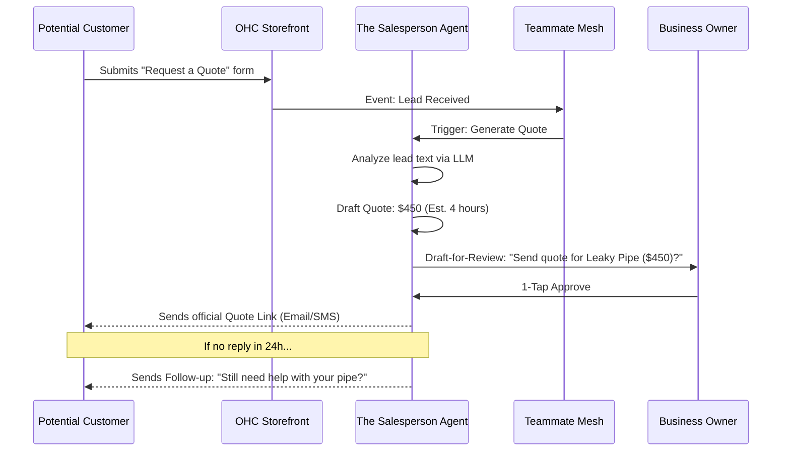

# Architecture Brief: The Salesperson (Sales & Acquisition)

## Title
OHC AI Agent: "The Salesperson" — Automated Lead Conversion & Upselling

## Problem Statement
Small business owners (Carlos, Leo, Priya) lose potential revenue because they can't respond to inquiries fast enough or forget to follow up with past customers. Carlos might be on a job when a lead asks for a quote, and by the time he replies, the customer has hired someone else.

## Research Report
- **Lead Decay**: The odds of converting a lead drop by 10x if the response takes longer than 5 minutes.
- **Repeat Business**: It is 5x cheaper to keep an existing customer than to acquire a new one, yet most SMBs lack any CRM or re-engagement strategy.
- **Upsell Opportunity**: Customers are often willing to pay for "extras" (e.g., Leo's lesson materials, Maya's delivery service) if offered at the right time.

## Design Doc

### Functional Boundaries
"The Salesperson" acts as the business's proactive growth agent, handling:
1.  **Instant Quote Drafting**: Generating professional quotes based on customer descriptions (using LLMs to estimate scope).
2.  **Lead Follow-up**: Sending automated, personalized "Are you still interested?" messages to stale inquiries.
3.  **Abandoned Cart Recovery**: Identifying abandoned checkouts and drafting incentive offers (e.g., "10% off if you finish your order now").
4.  **Smart Upselling**: Suggesting relevant add-ons during the checkout flow or post-purchase (e.g., "Would you like a matching card with your cake?").

### Architecture Diagram (Mermaid.js)

### Mobile UX Flow (375px First)
- **"Growth" Feed**: A dedicated section showing "Ready to Convert" leads.
- **Quote Preview**: A beautiful, glassmorphic card showing the drafted quote details with an "Approve" button.

## Implementation Prompt
**To Implementer Agent:**
Implement "The Salesperson" agent department. Create the "Quote Engine" that uses business metadata and customer input to draft pricing and scope. Build the "Lead Tracker" state machine that monitors inquiry age and triggers follow-up actions. Implement the "Abandoned Cart" listener on the storefront. Ensure all communications are drafted for owner review by default. UI must adhere to the OHC Premium Design System.

## Priority
P1

## Estimated Scope
Medium
