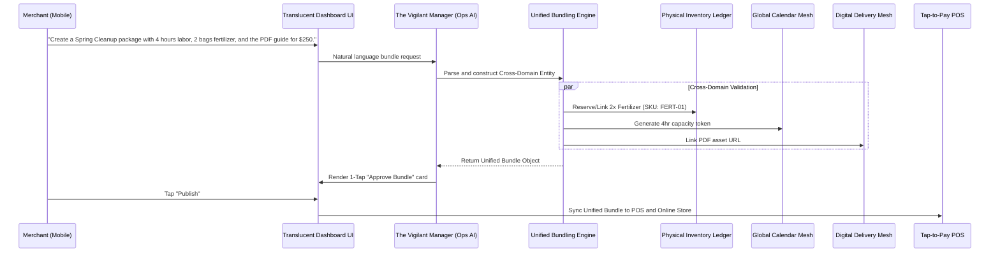
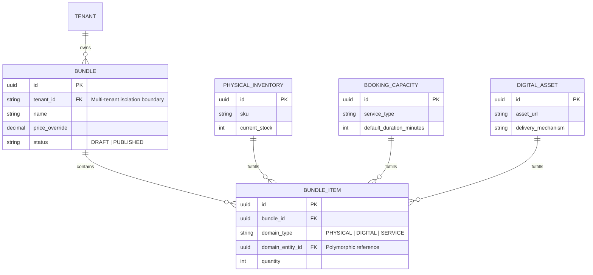

# [Architecture] Unified Cross-Domain Service and Product Bundling Engine

## 1. Title
**Unified Cross-Domain Service and Product Bundling Engine**

## 2. Problem Statement
For OneHumanCorp (OHC)’s core personas—especially **Carlos (handyman)**, **Leo (music tutor)**, and **Priya (boutique owner)**—selling a single type of item is easy, but selling a *business outcome* is historically fraught with friction.
Currently, if Carlos wants to sell a "Spring Cleanup Package" that includes 4 hours of labor (Service/Booking) plus 2 bags of specialized fertilizer (Physical Inventory) and a seasonal maintenance PDF guide (Digital Download), he must juggle three different systems or rely on expensive, disjointed 3rd-party apps. Similarly, Leo cannot easily sell a bundle of "10 Guitar Lessons + Custom Sheet Music + A physical set of strings" without manually hacking inventory and calendar tools together.
These small business owners do not think in terms of "SKUs" versus "Time Slots." They think in terms of holistic packages. Requiring them to manually orchestrate multi-domain inventory creates massive setup friction and frequently results in broken customer experiences, directly violating our mandate of "zero-friction" operations.

## 3. Research Report
### Competitive Landscape
*   **Shopify:** Excels at physical goods. However, natively bundling physical goods with digital downloads or time-based services requires clunky workarounds or expensive recurring 3rd-party app subscriptions (e.g., Bold Bundles + a booking app).
*   **Wix:** Better native booking, but "Packages" are primarily restricted to service sessions (e.g., a 5-pack of yoga classes), not hybrid bundles mixing tangible goods and time.
*   **Calendly / Acuity:** Purely time-based. No support for robust physical inventory management or fulfillment workflows as part of the booking transaction.
*   **Squarespace:** Requires users to create separate product types. Selling a physical item as an add-on to a service booking flow is highly manual.

### Market Data
*   Over 40% of service-based businesses report losing upsell revenue because their booking flow cannot easily attach required physical items.
*   Small business owners consistently cite "integration hell" (trying to make calendar apps talk to inventory apps) as a top-3 technical frustration.

### Opportunity
We have the opportunity to architect a truly **Unified Composibility Engine**. By abstracting "inventory" to a high-level entity that transparently handles physical stock, calendar availability, and digital asset rights, OHC can allow merchants to create limitless hybrid bundles with a single conversational prompt. This seamlessly supports high-margin upsells and differentiates OHC as the first platform where cross-domain sales are a native, first-class citizen.

## 4. Design Doc

### Architecture Diagrams (Mermaid.js)

#### System Architecture & Flow

#### Entity-Relationship Diagram (ERD)

### UI Wireframes (375px Mobile-First) & Mobile UX Flow
**Screen 1: The AI Composer (Conversational Input)**
*   Clean, full-screen chat interface using our macOS-style Translucent Glass materials.
*   Input area: "What do you want to offer your customers?"
*   Example pills: `[Bundle a Service + Product]`, `[Create a Subscription Box]`
*   User speaks or types: "Make a beginner guitar package: 5 one-hour lessons, my practice PDF, and a capo."

**Screen 2: Bundle Assembly & Verification (The "Magic" Moment)**
*   A skeleton loading state with playful text: *"Checking calendar capacity... Locating physical items..."*
*   Transitions into a unified card view:
    *   **Bundle Name:** "Beginner Guitar Master Package" (Auto-generated)
    *   **Price:** $350 (Suggested based on individual item prices)
    *   **Includes:**
        *   🗓️ 5x 60-min Lesson Credits
        *   📦 1x Acoustic Capo (Stock: 12 left)
        *   📄 1x Practice Routines PDF
*   Primary Action: `[ Publish Package ]`

**Screen 3: Customer View (Storefront / POS)**
*   A single cohesive product listing. When the customer buys, the system automatically sends the PDF, decrements the physical stock, and issues 5 booking credits to the customer's email.

### Key Design Decisions and Why
*   **Unified Entity Model:** We are introducing a higher-order `Bundle` entity that acts as an orchestrator, maintaining strict foreign keys to `PhysicalInventory`, `BookingCapacity`, and `DigitalAsset` tables. This allows the individual sub-systems (like shipping fulfillment or calendar scheduling) to operate normally while the `Bundle` handles the transactional atomic unit.
*   **Conversational Creation:** Traditional forms for hybrid bundles are notoriously complex (requiring nested menus for variants, time slots, and file uploads). By forcing creation through the AI agent, we eliminate the UI complexity entirely.
*   **Zero-Trust Isolation:** When the Engine queries `Ledger_Inv` or `Ledger_Cal`, it does so via the multi-tenant context boundary, ensuring the AI agent can only compose bundles using the specific organization's isolated data.

## 5. Implementation Prompt
**To the Implementer:**
Your task is to build the "Unified Cross-Domain Bundling Engine". The Core User Journey (CUJ) requires a merchant using a mobile device (375px viewport) to create a hybrid package—combining a time-based service, a physical product, and a digital download—into a single purchasable item via a conversational AI interface.

**Acceptance Criteria:**
*   **Mobile Parity & Design:** The UI must adhere to the macOS-style translucent glass and UniFi modular card design system, fully optimized for a 375px width.
*   **Cross-Domain Atomicity:** Purchasing the bundle must successfully execute actions across three distinct domains without failure: decrement physical stock, issue a calendar booking credit/token, and securely deliver the digital file.
*   **Grandmother Test:** A non-technical user must be able to create this complex hybrid bundle simply by describing it in plain English, without navigating complex configuration forms. The AI must infer the connections.
*   **Multi-Tenancy & Security:** The underlying data architecture must strictly enforce tenant isolation. A bundle must never accidentally link to another tenant's inventory or calendar.
*   **Offline/POS Sync:** The published bundle must immediately sync to the Tap-to-Pay POS system as a distinct selectable item, functioning offline where possible (e.g., queuing the inventory decrement until reconnected).

*(Note: Do not hardcode specific database schemas or API endpoints. Design the data layer to support robust multi-domain composition and ensure the AI orchestration is decoupled via background tasks where latency is a concern.)*

## 6. Priority
`P1` (High)

## 7. Estimated Scope
Large
