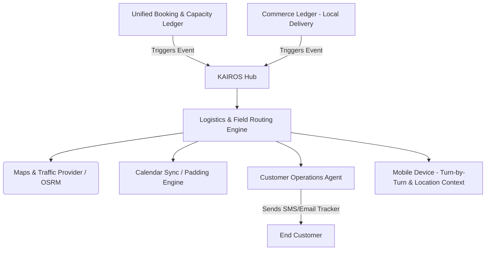

# Title: Unified Local Logistics & Field Routing Engine

## Problem Statement
Carlos (Handyman, 42) and Maya (Baker, 28) struggle with coordinating their physical presence across multiple locations. Carlos often runs late because his scheduling tool doesn't account for real-time traffic between jobs across town, leading to frustrated customers and manual "I'm running 15 mins late" text messages while driving. Maya makes local weekend cake deliveries, manually plotting routes in Google Maps and texting each customer when she is "5 stops away." Existing field service management (FSM) tools are overly complex, requiring dedicated dispatcher roles or enterprise-level setups. They need a system that invisibly optimizes their daily route, pads their calendar with accurate travel times, and automatically sends real-time ETA tracking links to their customers without them having to lift a finger or switch apps.

## Research Report
*   **Competitor Analysis**:
    *   **Housecall Pro / Jobber**: Powerful but extremely complex and expensive. Built for multi-truck fleets with dispatchers, not solo entrepreneurs. Overwhelming onboarding.
    *   **Shopify Local Delivery**: Very basic. Offers a "local delivery" radius but lacks intelligent multi-stop route optimization and dynamic ETA communication out-of-the-box.
    *   **Routific / Circuit**: Excellent routing, but they are standalone apps. The user has to manually export orders/bookings from their platform and import them into the routing app.
*   **The OHC Differentiator**: OHC will provide a "Zero-Touch Logistics" engine. It natively integrates with the Booking & Unified Capacity Ledger. When Carlos accepts a booking, the system automatically checks travel time from his previous appointment and pads his calendar. When Maya starts her delivery run, the system orders the stops optimally and agents handle all customer communication (ETAs, delays) autonomously.

## Design Doc

### High-Level Architecture

### Mobile UX Flow (375px First)
1.  **The "Daily Run" View**: On launching the app, if there are field appointments or deliveries, the home screen transforms into a "Run Mode" card.
2.  **Run Mode Card**:
    *   Clean, macOS-style translucent card.
    *   Large "Start My Route" primary action button.
    *   Summary: "5 stops, estimated 2h 15m total."
3.  **Active Stop Screen**:
    *   Big bold address.
    *   "Navigate" button (opens native maps).
    *   "Arrived" / "Completed" swipe-to-complete slider (to prevent accidental taps).
    *   "Customer Context" snippet generated by AI (e.g., "Beware of dog in backyard").
4.  **Advanced Settings (Hidden)**: Buffer times between jobs, preferred starting/ending locations, maximum driving distance.

### AI Agent Integration Points
*   **Customer Support Agent (CS)**: Monitors the user's real-time location. If the user is stuck in traffic and will be >10 minutes late, the CS Agent autonomously texts the next customer: "Hi there! Carlos is stuck in a bit of traffic but is on his way. New ETA is 2:15 PM."
*   **Operations Agent (Ops)**: Proactively suggests route optimizations. E.g., "Maya, you have two deliveries in Northwood today. If you leave at 10 AM instead of 11 AM, you'll avoid the bridge closure."

### Key Design Decisions
*   **Invisible Calendar Padding**: The system will natively block out travel time on the user's calendar based on real-time routing estimates, preventing overlapping bookings without the user configuring manual buffers.
*   **Mobile-First "Drive Mode"**: The UI must be highly visible, utilizing large typography and swipe gestures for safety and ease of use in transit.
*   **Zero-Trust Location Sharing**: Granular location data is stored ephemerally. Customers receive a live tracking link that expires the moment the job/delivery is marked complete. Multi-tenant boundaries strictly isolate routing data.

## Implementation Prompt
**Objective**: Implement the underlying Logistics & Field Routing Event Consumer and Mobile UI components for "Run Mode".
**User Journey**: As a local business owner (like Carlos or Maya), I want my daily appointments and deliveries to be automatically ordered into the most efficient route. When I start my route, my customers should receive an automated ETA text, and my calendar should accurately reflect my travel time between stops so I am not double-booked.
**Acceptance Criteria**:
1. Create the backend event consumer that listens for new local deliveries/field bookings and interfaces with a routing provider to calculate travel time.
2. Implement the calendar padding logic to dynamically block travel time on the unified calendar.
3. Build the mobile-first "Run Mode" UI card for the home screen and the active stop view (375px optimized, using design system tokens).
4. Ensure the Customer Support Agent is hooked up to dispatch ETA updates when a route is initiated.

## Priority
P1

## Estimated Scope
Large
