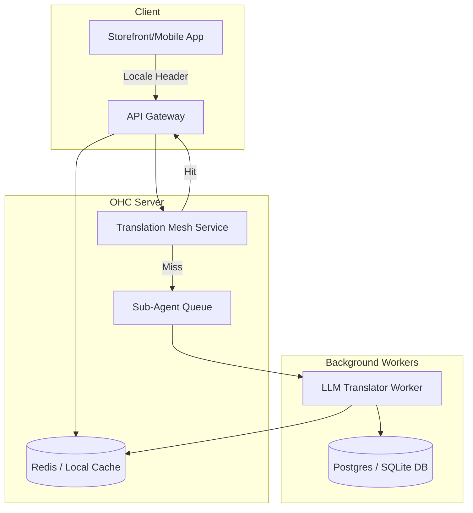

# [architecture] Unified Multilingual Hybrid Translation Mesh

## Problem Statement
Fatima, who runs a food cart and speaks limited English, needs to operate her entire business interface in Arabic while allowing customers to order in English, Spanish, or any local language. OHC currently lacks a globally consistent, real-time localized mesh that instantly translates storefronts, invoices, receipts, SMS notifications, and agent interactions without forcing the user to install a 3rd party localization plugin (which legacy competitors like Shopify and Wix require).

## Research Report
- **Competitor Analysis:** Shopify uses third-party plugins (e.g., Langify) which creates fragmented UI states and slows down page loads. Wix has a multi-lingual tool but it is manual and doesn't handle real-time conversational agent translations.
- **OHC Advantage:** With the KAIROS underlying orchestration engine and LLM providers already embedded, OHC can dynamically translate the UI, product descriptions, and chat logs at the edge or locally (via standalone offline capabilities) without external plugin bloat.
- **Market Context:** The LATAM and MENA markets represent huge growth potential. Native, zero-configuration multilingual support allows immediate deployment in non-English native contexts.

## Design Doc
### Architecture Diagram

### Mobile UX Flow (375px First)
- **Onboarding:** A clean, glassmorphism setup screen asks "What language do you prefer?" Fatima selects Arabic.
- **Storefront Generation:** The Setup Agent builds the entire product schema using standard English behind the scenes but renders Fatima's dashboard entirely in Arabic.
- **Customer Interaction:** When an English-speaking customer views the storefront, the Edge Gateway detects their locale and presents the product descriptions in English.
- **Messaging:** Fatima receives a customer DM in English. The Operations/Ambassador agent translates it to Arabic before displaying it in her Unified Inbox. She replies in Arabic, and the agent auto-translates it back to English before sending it to the customer.

### Zero Trust/Security Guarantees
- Strict tenant isolation ensures that localized product data and messaging caches do not leak between merchants.
- `tenant_id` is applied to every cached object in the translation service.

## Implementation Prompt
**Role:** Implementer Agent
**Task:** Implement the core data models and service logic for the `TranslationMesh` module.
**Outcome:**
1. Create a Postgres schema and SQLite equivalent for caching translations (`translation_cache` mapping text hashes + locale to translated strings).
2. Add a translation worker task to the Sub-Agent Queue capable of performing batch translations.
3. Implement a basic gRPC service / API endpoint that components can call to retrieve localized strings, falling back to the queue if uncached.
**Acceptance Criteria:**
- Unit test coverage MUST be 100%.
- Ensure no external data leaks between tenants.
- Follow the exact OHC standard for Postgres/SQLite hybrid database structures.

## Priority
P1

## Estimated Scope
Medium
