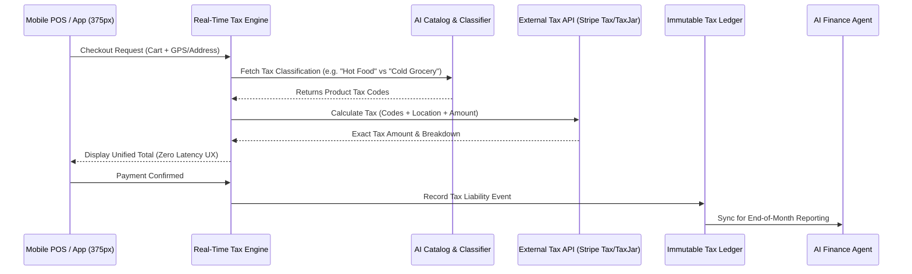

# [Architecture] Unified Real-Time AI Tax & Compliance Engine

## Title
Unified Real-Time AI Tax & Compliance Engine

## Problem Statement
Small business owners like Fatima (Food Cart operator) and Carlos (Handyman) operate across multiple jurisdictions and sell both physical goods and services. For Fatima, moving her food cart 10 blocks might cross city lines, fundamentally changing the local sales tax rate on her meals. For Carlos, labor and parts might be taxed differently depending on the state or county he's working in. Currently, configuring these complex, hyper-local tax rules is a massive cognitive burden. Business owners are forced to guess, over-collect, or risk massive penalties during an audit. They need an invisible, AI-driven compliance engine that natively understands location-based tax rules, product-type exemptions, and multi-currency conversions, calculating the exact correct amount instantly at checkout or invoicing without any manual setup.

## Research Report
*   **Current Architecture Limits**: Platforms typically rely on manual tax zone configuration (e.g., "Set NY state tax to 4%"). This falls apart for multi-jurisdiction mobile businesses (food trucks, service providers).
*   **Competitor Analysis**:
    *   *Shopify*: Offers Shopify Tax, but it often requires upgrading to higher tiers for advanced liability reporting and still needs manual oversight to ensure products are correctly categorized for tax exemptions.
    *   *Wix*: Relies on third-party integrations like Avalara or TaxJar, which add extra subscription costs and setup friction for the business owner.
    *   *Stripe Tax*: Powerful API, but still requires the platform to correctly classify products and map them to Stripe's tax codes.
*   **Discovery**: OHC needs a native, real-time Tax & Compliance Engine that leverages the device's location (for in-person POS) or the buyer's address (for online) combined with the AI's understanding of the catalog to automatically classify items and calculate exact tax liabilities. It must be a zero-config experience.

## Design Doc

### Architecture Diagram

### Mobile UX Flow (375px)
*   **The Zero-Config Setup**: When Fatima launches her cart in a new city, there are no "Tax Settings" to configure. The AI Agent simply asks once during onboarding: "I'll handle calculating local sales tax automatically based on your cart's location. Sound good?"
*   **Checkout Screen**: A clean, Unifi-style checkout card. The total clearly displays a single line item for "Estimated Tax (Auto-calculated)".
*   **Advanced Details Modal**: Tapping the tax line item opens a bottom sheet showing the exact breakdown (e.g., "State Tax: 4%, City Transit Tax: 0.5%"). This keeps the primary UI clean while satisfying the grandmother test.

### Key Design Decisions
*   **AI Auto-Classification**: The engine uses LLMs to automatically map unstructured product descriptions ("Vegan Cupcake") to standardized tax codes required by providers like Stripe Tax, eliminating manual categorization.
*   **Edge Caching & Fallbacks**: To support offline-first POS scenarios, the engine aggressively caches common local tax rates on the device based on the last known GPS coordinate.
*   **Immutable Liability Ledger**: Every calculated and collected tax amount is written to an immutable append-only ledger to ensure 100% auditability and protect the business owner during tax season.
*   **Zero Trust & Security**: GPS data used for tax calculation is ephemeral and strictly scoped to the transaction, preserving privacy.

### AI Agent Integration Points
*   **Finance Department**: The Finance Agent monitors the Tax Ledger. At the end of the month, it automatically generates a plain-language summary: "You've collected $450 in state sales tax. I've prepared the transfer to the state revenue portal."
*   **Legal/Compliance Department**: If the system detects a business approaching the economic nexus threshold in a new state (e.g., Priya shipping many boutique items to California), the Legal Agent proactively alerts her with instructions on how to register.

## Implementation Prompt
Implement the Unified Real-Time AI Tax & Compliance Engine. The system must intercept all checkout and invoicing requests, query the AI Catalog for product tax classifications, and calculate the exact hyper-local tax amount based on the buyer's address or the POS GPS location. Integrate seamlessly with a tax provider API (e.g., Stripe Tax) but abstract this away from the user. Implement the Immutable Tax Ledger to securely record all tax liabilities per tenant. Ensure strict multi-tenant isolation and graceful offline fallbacks using edge-cached rates. The user experience must involve absolute zero manual tax rate configuration.

## Priority
P0

## Estimated Scope
Large
