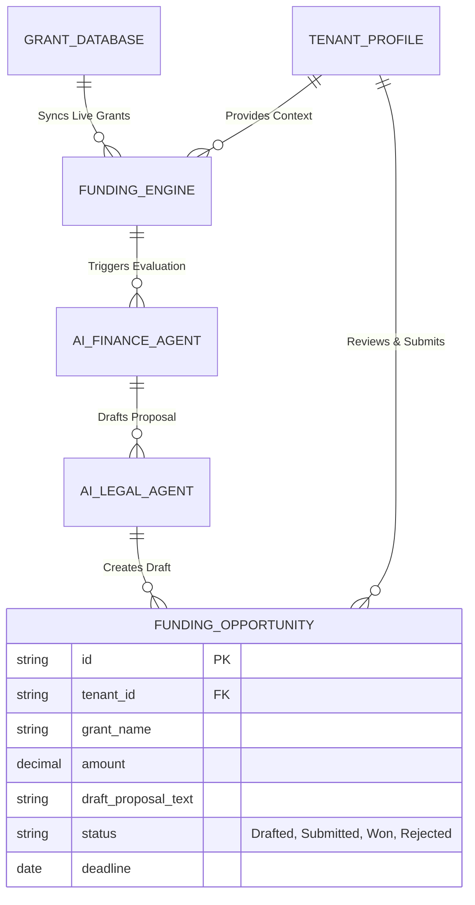
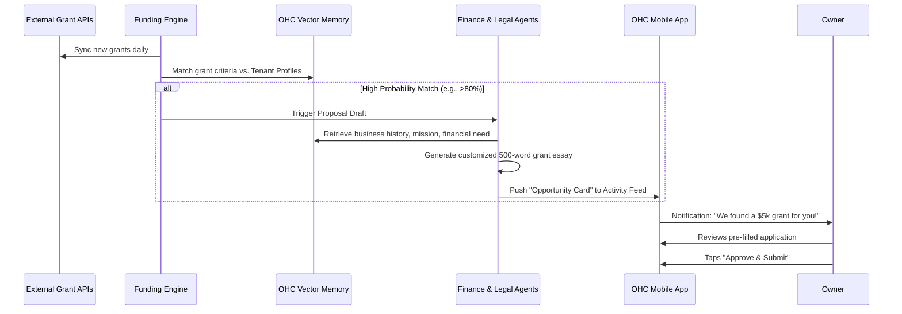

# [Architecture] Universal Autonomous Grant and Funding Engine

## Title
Architect and Implement Universal Autonomous Grant and Funding Engine

## Problem Statement
Small business owners like Maya (baker), Carlos (handyman), and Priya (boutique owner) constantly struggle with cash flow and scaling capital. There are billions of dollars in local, state, federal, and private small business grants available annually (especially for minority-owned or female-owned businesses). However, finding these grants, checking eligibility, and writing complex proposals is practically a full-time job. Most non-technical SMB owners don't have the time or expertise to apply, leaving free capital on the table. They need an invisible financial assistant that proactively finds free money they qualify for and does the heavy lifting of applying.

## Research Report
**Findings & Competitive Analysis:**
- **Current Platforms (Shopify Capital, Stripe Capital):** These provide revenue-based loans and cash advances, but they are *loans* that must be repaid (often with high fees). They do not help businesses secure *free* grant money.
- **Grant Aggregators (Grants.gov, HelloAlice):** These require manual searching, manual profile creation, and manual essay writing.
- **The Gap in OHC:** OHC already possesses the business's entire context—revenue history, location, industry, owner demographics, and growth trajectory. By leveraging this data, the OHC AI Swarm can cross-reference live grant databases, autonomously verify eligibility, and draft highly personalized, compelling grant proposals.

## Design Doc

### Architecture Diagram

### UI Wireframes & Mobile UX Flow (375px first)
**Screen 1: The Discovery Notification**
- **Trigger:** A push notification appears on Maya's lock screen: "✨ Finance Dept: We found a $10,000 local bakery grant you qualify for. Proposal drafted."
- **Design:** Standard iOS/Android push notification.

**Screen 2: The Opportunity Card (Activity Feed)**
- **Header:** "Downtown Revitalization Grant - $10,000"
- **Body:** "You have a 92% match based on your location and revenue. The Legal Agent has drafted the required 500-word essay detailing how you will use the funds for a new oven."
- **Action Buttons:** A large, primary "Review Proposal" button.

**Screen 3: The 1-Tap Submission**
- **Content:** A sleek, glassmorphism modal showing the AI-generated essay.
- **Footer:** "By tapping Submit, OHC will automatically file this application on your behalf using your verified business details."
- **Primary Button:** Glowing "Submit Application" button.

### AI Agent Integration Points
- **The Accountant (Finance Dept):** Scans the grant databases and evaluates the business's financial metrics to ensure strict eligibility requirements are met.
- **The Protector (Legal Dept):** Crafts the actual narrative of the grant proposal, ensuring the tone is professional, persuasive, and directly addresses the specific grading rubric of the grant issuer.

### Key Design Decisions
- **Zero-Data Entry:** The owner should not have to fill out any forms. Their EIN, address, revenue, and story are already in the OHC system.
- **Strict Pre-Qualification:** The AI only presents grants where the business has a high mathematical probability of qualifying, avoiding "application fatigue."
- **Multi-Tenant Isolation:** The engine must ensure that Maya's financial data is never used as context when generating a proposal for Carlos.

## Implementation Prompt
**Context:** You are an Implementer agent. Your task is to build the Universal Autonomous Grant and Funding Engine.
**User Journey (CUJ):** The background engine syncs a new $5,000 local business grant. It matches this against a specific tenant's profile. The Legal Agent drafts the application essay. The business owner receives a push notification, reviews the drafted essay on their mobile app, and taps a single button to submit.
**Acceptance Criteria:**
1. Create the `FundingOpportunity` schema with strict tenant isolation.
2. Implement a background worker that simulates syncing external grant opportunities and matching them against tenant profiles using the Vector Memory layer.
3. Integrate the LLM provider to automatically draft a localized, context-aware grant proposal.
4. Expose an API endpoint for the mobile app to fetch and approve `FundingOpportunities`.
5. Ensure 100% unit test coverage for the matching and drafting logic.

## Priority
P1

## Estimated Scope
Large
