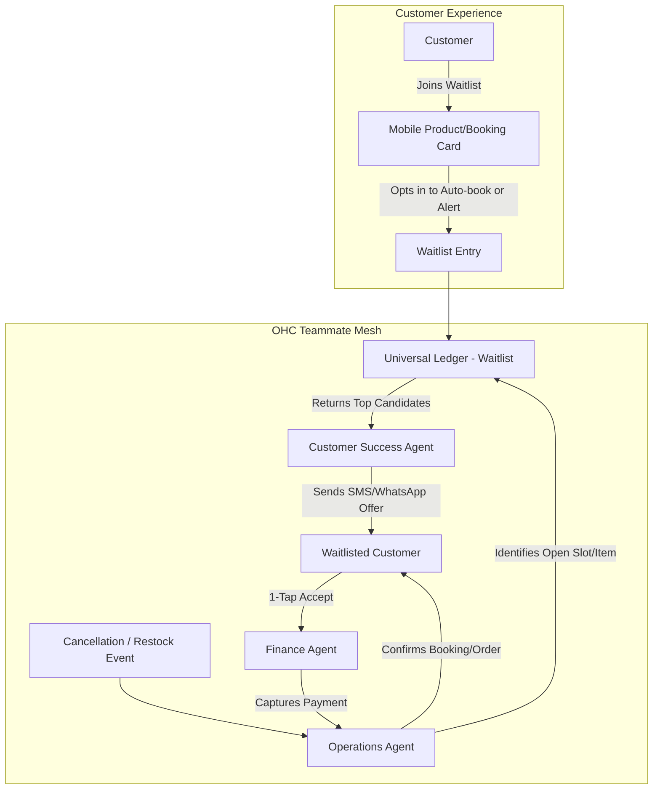

# Issue Brief: Universal Autonomous Smart Waitlist Mesh

## Title
Universal Autonomous Smart Waitlist Mesh

## Problem Statement
Small business owners frequently lose revenue due to last-minute cancellations (e.g., Leo the music tutor having a student cancel an hour before the lesson, Carlos the handyman losing a full-day job due to client illness). Conversely, eager customers are turned away when calendars or inventory (e.g., Maya's limited-edition vegan cakes) appear full. Managing a manual waitlist requires constant attention—contacting the next person in line, waiting for a response, and risking the slot remaining empty. This "revenue leakage" is a major pain point. Non-technical users need an invisible system that instantly and automatically offers cancelled slots or restocked items to the highest-intent customers on a waitlist, securing deposits immediately without any manual intervention.

## Research Report
- **Goal**: Architect a zero-touch waitlist system that operates across all business types (services, physical goods, food pre-orders) to capture overflow demand and recover lost revenue from cancellations.
- **Competitor Analysis**:
    - **Shopify**: "Back in stock" alerts exist via third-party apps (e.g., Klaviyo, Back in Stock), but they are typically passive emails requiring the customer to click and hope the item is still there. No native, agent-driven auto-booking.
    - **Wix / Squarespace**: Offer basic waitlist toggles for events or services, but lack automated cascading offers (where the system holds a slot, texts user 1, waits 10 minutes, then texts user 2) with integrated instant payment capture.
- **OHC Opportunity**: By leveraging our AI Agents, OHC can turn a waitlist into an active, intelligent queue. When Carlos's 2 PM slot opens, the *Customer Success Agent* instantly texts the waitlist, prioritizing loyal customers or those who opted for "auto-book." If the slot is claimed, the *Operations Agent* updates the calendar, and the *Finance Agent* captures the deposit—all while Carlos is busy working.

## Design Doc

### Architecture Diagram (Mermaid.js)

### UX Flow & Mobile-First Design (375px)
1. **Join Waitlist**: When an item is sold out or a time slot is full, the CTA button changes from "Book/Buy" to "Join Waitlist".
2. **Preference Selection (Bottom Sheet)**: A smooth bottom sheet slides up asking:
    - "Notify me if this becomes available"
    - "Auto-book me instantly if this opens up (requires card on file)"
3. **The Offer (SMS/Push)**: If a slot opens, the customer receives an actionable message: "Hi! Carlos has an opening today at 2 PM. Tap here to claim it before it goes to the next person: [Link] - Expires in 15 mins."
4. **1-Tap Claim**: The link opens a highly optimized, no-login-required claim page showing the item/slot and an Apple Pay/Google Pay button.

### AI Agent Integration Points
- **Operations Agent**: Monitors inventory and calendar ledgers for changes. Triggers the waitlist workflow immediately upon a cancellation or restock event.
- **Customer Success Agent**: Manages the communication queue. It handles the logic of cascading offers (e.g., offering to the first 3 people, then the next 3 if not claimed) via SMS, WhatsApp, or Email, maintaining conversational context if the user replies.
- **Finance Agent**: Handles the secure capture of funds, either by executing an auto-book on a vaulted card or securely processing the 1-Tap claim payment.

### Key Design Decisions & Invariants
- **Multi-Tenancy**: Every waitlist entry must be strictly tied to a `tenant_id` and isolated at the database level using RLS.
- **Concurrency & Race Conditions**: The system must use optimistic locking or atomic transactions when fulfilling waitlist offers to ensure an item/slot isn't double-booked if two waitlisted customers click "Claim" simultaneously.
- **Zero-Touch for the Owner**: The business owner sees a unified notification only *after* the slot is filled ("Great news! Leo, we filled your 4 PM cancellation with Sarah from the waitlist"). The complexity is entirely hidden.

## Implementation Prompt
**To Implementer Agent:**
Implement the "Smart Waitlist Mesh" capability.
1. Extend the data model to support `WaitlistEntry` records linked to specific Products, Service Slots, and Customers. Ensure strict `tenant_id` isolation.
2. Develop the background job queue logic (likely integrating with the existing NATS event mesh or a robust queue) to handle "Cancellation/Restock" events.
3. Create the automated cascading offer system: when triggered, it should select candidates, dispatch notifications (via mock SMS/email provider for now), and handle expiries (e.g., offer is valid for 15 minutes before moving to the next person).
4. Implement the 1-tap claim mobile web endpoint (optimized for 375px width) that securely processes the claim and handles concurrent claim attempts gracefully.
5. Do not prescribe the specific database schema or internal function signatures; focus on fulfilling the end-to-end user journey and ensuring robust concurrency handling.

## Priority
P1

## Estimated Scope
Medium
