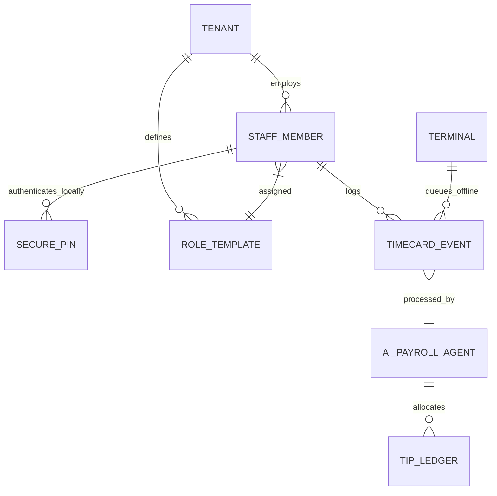
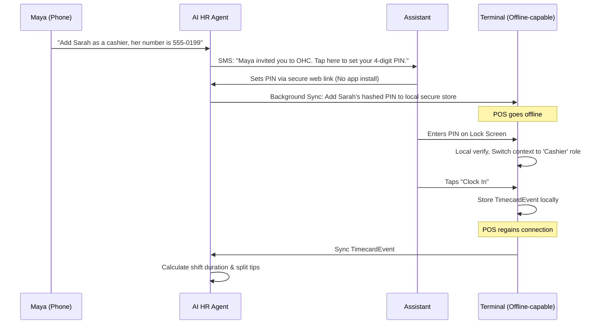

# [Architecture] Universal Autonomous Staff & Shift Management Mesh

## Problem Statement

As our small business owners grow from solo operations to hiring their first employees, they immediately hit a wall of administrative complexity. Maya (baker) just hired a part-time delivery driver and an assistant baker; she needs them to see orders but not total revenue. Fatima (food cart) has two shift workers sharing the same Android phone for POS, and needs to track who sold what and split tips fairly at the end of the day. Carlos (handyman) hired an apprentice and needs to assign him to specific jobs, track his time on site, and pay him per job. Currently, OHC assumes a single-user (founder) perspective. Competitors like Square (Square Shifts) and Shopify (Staff Accounts) offer team management, but they require complex manual setup, app downloads for staff, and manual tip calculations. OHC needs a zero-friction, offline-capable staff mesh where adding an employee is as simple as texting them a link, and the AI handles the shift reminders, permissions, and tip splitting invisibly.

## Research Report

We audited the team and staff management architectures of leading SMB platforms to understand their scaling patterns and pain points for micro-businesses.

### Competitive Analysis

| Platform | Staff Capabilities | Strengths | Weaknesses (The OHC Opportunity) |
|---|---|---|---|
| Square | Square Shifts & Payroll | Excellent POS integration, timecards | Very complex setup, requires multiple apps (Team app vs POS), manual tip pool rules |
| Shopify | Staff Accounts | Granular permissions per role | Web-first design, poor mobile POS switching experience, rigid tier limits on staff count |
| Wix | Roles & Permissions | Good for web editors | Not designed for physical in-person shift work, no tip pooling |
| Homebase | Standalone App | Deep scheduling & HR | Another tool to integrate, requires separate app download, high friction for a 1-day temp hire |
| **OHC (Target)** | **Universal Staff Mesh** | **Zero-app-install SMS onboarding, Invisible AI tip splitting, Offline-first clock-ins** | **Must abstract RBAC (Role-Based Access Control) into simple English ("Can run register")** |

### Persona Pain Points

*   **Maya:** "I want my assistant to check off custom cake orders on the iPad, but I don't want her to see my total monthly sales or bank account."
*   **Carlos:** "I need to dispatch my apprentice to a job site and see when he arrives. I don't have time to teach him a complicated app."
*   **Fatima:** "My lunch rush staff change every week. Setting them up in a system takes too long. I need them to just type a 4-digit PIN on the terminal and start ringing up falafel."

### Key Architectural Findings
Traditional RBAC (Role-Based Access Control) is too complex for SMBs. The industry standard is shifting towards ABAC (Attribute-Based Access Control) or predefined persona-based roles (e.g., "Cashier", "Manager", "Driver"). Furthermore, edge-device context (e.g., the terminal is currently in "Fatima's Food Cart" mode) must securely support multi-user fast-switching without requiring a full re-authentication with the cloud, necessitating local secure enclaves for PIN/Biometric verification.

## Design Doc

### Architecture Diagram

### UI Wireframes & Mobile UX Flow (375px First)

**Screen 1: Manager Team View (The "Grandmother Test")**
- **Top:** Clean translucent glass header: "Your Team".
- **Middle:** Large cards for each staff member showing their current status (e.g., 🟢 "Sarah - Clocked In (2h 15m)").
- **FAB (Floating Action Button):** Large "+" button. Tapping it opens a half-sheet: "Who are you hiring?" with a simple phone number input and a role selector (Cashier, Manager, Driver). No complex permission checkboxes.

**Screen 2: Staff PIN Entry (Terminal View)**
- **Full Screen:** A massive, high-contrast numpad.
- **Top:** "Enter your PIN to unlock".
- **UX:** Fast, snappy, works instantly even if the device is in airplane mode. Upon correct PIN, the UI physically "unlocks" with a smooth motion transition to the Point of Sale screen, but the "Reports" and "Settings" tabs are entirely hidden based on the locally cached role.

**Screen 3: Staff Personal Hub (Via Web Link, No App Needed)**
- Accessed via a magic link sent via SMS.
- Shows their upcoming schedule, total hours worked this week, and estimated tips earned.
- Big "Request Time Off" button.

### AI Agent Integration Points
- **AI HR Agent:** Handles the conversational onboarding ("Add Sarah as a cashier"). Monitors shift anomalies (e.g., "Sarah hasn't clocked out but the store is closed, should I clock her out?").
- **AI Payroll/Finance Agent:** Automatically ingests the `TIMECARD_EVENT` ledger, combines it with the `TIP_LEDGER` from transactions during that shift, and calculates precise tip splits (e.g., proportionally by hours worked) without the owner doing any math.

### Key Design Decisions
1. **No App Required for Staff:** Staff manage their shifts and view earnings via an SMS magic link to a Progressive Web App (PWA). This eliminates onboarding friction for high-turnover roles.
2. **Offline-First PIN Authentication:** Staff PINs and basic role configurations are synced to edge terminals. A device can be entirely offline and still allow staff to clock in, ring up orders, and clock out.
3. **Implicit Over Explicit Permissions:** Instead of showing business owners a matrix of 50 checkboxes (Can view reports, Can issue refunds), we use plain-language roles (Cashier). The AI maps these to granular technical permissions behind the scenes.

## Implementation Prompt

**Implementer Agent Task:**
Implement the foundational Staff Mesh and Offline-First Authentication module for the OHC POS terminal.

**Customer-User Journey (CUJ):**
1. The business owner navigates to the Team screen and adds a new staff member by providing only a name, phone number, and a predefined role ("Cashier").
2. The system generates a secure PIN setup link and sends it to the staff member.
3. Once the PIN is set, the POS terminal securely caches the hashed PIN and role mapping locally.
4. The staff member enters their PIN on the POS terminal. The terminal unlocks, restricting UI elements (e.g., hiding financial reports) based on the "Cashier" role, and allows them to clock in/out locally, even if disconnected from the internet.

**Acceptance Criteria:**
- Create the core `StaffMember` and `TimecardEvent` data entities with strict tenant isolation.
- Implement a secure, offline-capable local storage mechanism on the client for caching hashed staff PINs and their associated roles.
- Develop the 375px mobile UI for the Manager Team view and the Terminal PIN unlock screen using the macOS-style translucent glass design tokens.
- Ensure the POS UI dynamically adapts (hides/shows tabs) based on the active staff session's role without requiring a network request.
- Ensure all offline timecard events are queued and synced to the cloud seamlessly once connectivity is restored.
- Do not prescribe the specific database schema or backend framework; ensure the implementation meets the performance and offline constraints.

**Priority:** P1
**Estimated Scope:** Large
