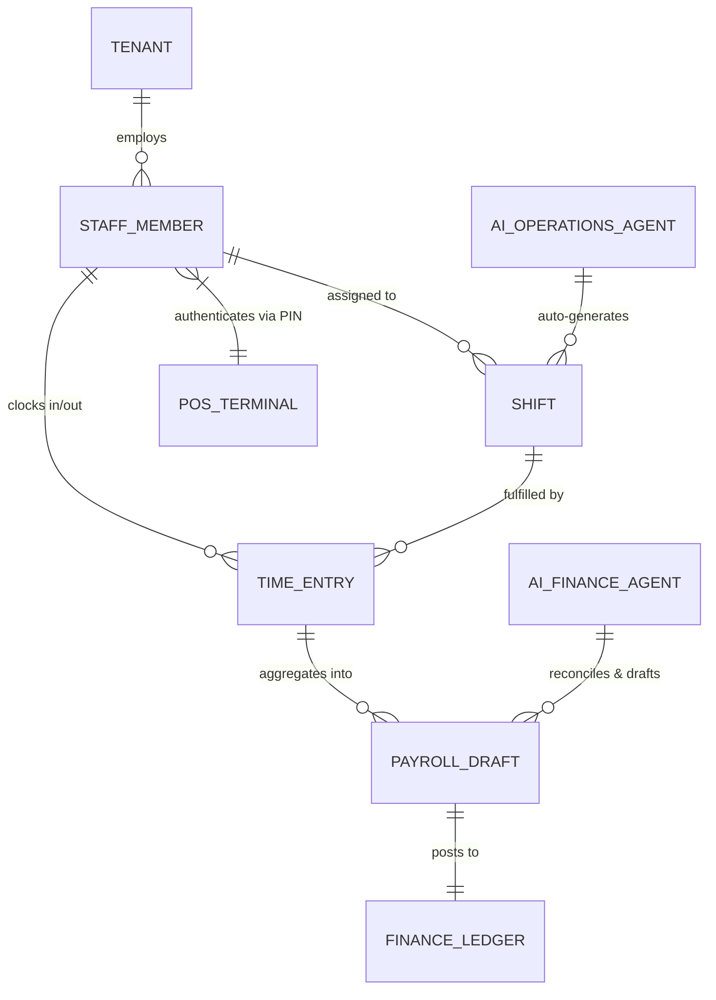

# Title: Universal Autonomous Staff Scheduling and Payroll Mesh

## Problem Statement
As small businesses grow from solopreneurs to micro-teams, non-technical owners like Carlos (Handyman) and Priya (Boutique owner) face immediate friction in staff management. Carlos needs to subcontract jobs to assistants and ensure they are dispatched correctly and paid for their time. Priya needs to schedule shop assistants for different shifts, track their hours, and calculate their pay, all while syncing with her in-store POS. The current OHC ecosystem lacks a unified, multi-tenant staff identity, scheduling, and payroll ledger, forcing owners to manually calculate hours or use disjointed third-party apps. They need an invisible, AI-driven staff engine that automatically generates optimal schedules based on busy periods, tracks clock-in/out via mobile offline-first mesh, and drafts payroll securely without requiring accounting knowledge.

## Research Report
*   **Current Architecture Limits:** OHC’s current multi-tenant architecture is highly optimized for the business owner but lacks robust IAM (Identity and Access Management) primitives for staff roles (e.g., restricted access to POS vs. Admin dashboard). There is no native scheduling entity or payroll ledger.
*   **Competitor Analysis:**
    *   *Homebase / When I Work:* Excellent standalone apps but disconnected from the core business ledger, POS, and CRM. Requires manual sync or fragile integrations.
    *   *Square Team Management:* Good integration with POS, but pricing tiers push small users to expensive plans.
    *   *Gusto:* Strong payroll but overly complex for a 2-person micro-business that just needs simple time tracking and basic ledger entries.
*   **Discovery:** OHC requires a Universal Staff Mesh deeply integrated into the Core Ledger and POS. AI Operations and Finance Departments will co-manage this: Operations handles shift scheduling (optimizing based on forecasted demand and staff availability), while Finance automatically calculates wages, handles tip splitting (integrated with offline POS), and queues payroll drafts. The system must operate offline-first (e.g., clocking in from a basement worksite).

## Design Doc

### Architecture Diagram

### Mobile-First UX Flow (375px)
*   **Owner View (Priya):**
    *   **Schedule Generation:** Tap "Generate Next Week's Schedule." The AI Operations Agent uses past sales data to forecast busy periods (e.g., Saturdays require 2 staff) and auto-drafts a schedule avoiding staff conflicts.
    *   **Payroll:** A simple UniFi-style card shows "Payroll Due: $850. Tap to Approve." The AI Finance Agent has already calculated hourly wages and split tips from the POS.
*   **Staff View (Carlos' Assistant):**
    *   **Dashboard:** A highly simplified UI showing just "Upcoming Shifts" and a massive "Clock In" button (touch target >= 80x80px) that works even in dead zones.
    *   **Offline Support:** Clock-in events are cached locally using an Isar/SQLite write-ahead log and sync to the cloud (NATS event mesh) instantly upon reconnection.

### AI Agent Integration Points
*   **Operations Agent (The Manager):** Analyzes historical POS volume to suggest optimal staffing levels. Auto-notifies staff of schedule changes via unified inbox/SMS.
*   **Finance Agent (The Accountant):** Automatically calculates gross pay based on time entries, handles tip pooling logic from the unified ledger, and drafts the final payroll summary for 1-tap owner approval.

## Implementation Prompt
**To Implementer Agent:**
Implement the Universal Autonomous Staff Scheduling and Payroll Mesh.
1. Create the backend data models (`StaffMember`, `Shift`, `TimeEntry`, `PayrollDraft`) ensuring strict row-level tenant isolation.
2. Build the API endpoints for staff clock-in/out, ensuring they support offline-first sync (similar to the offline POS sync queue).
3. Implement the logic for the AI Operations Agent to generate draft schedules based on simple rule sets (availability, max hours).
4. Implement the AI Finance Agent hook that aggregates `TimeEntry` records at the end of a pay period and generates a `PayrollDraft`.
5. Create the mobile-first (375px) Flutter UI views for Staff (Clock In/Out) and Owner (1-tap Payroll Approval) adhering to the Glassmorphism/UniFi design tokens. Ensure ZERO mock data is used; all data must flow from the new Postgres schemas.

## Priority
P1

## Estimated Scope
Large