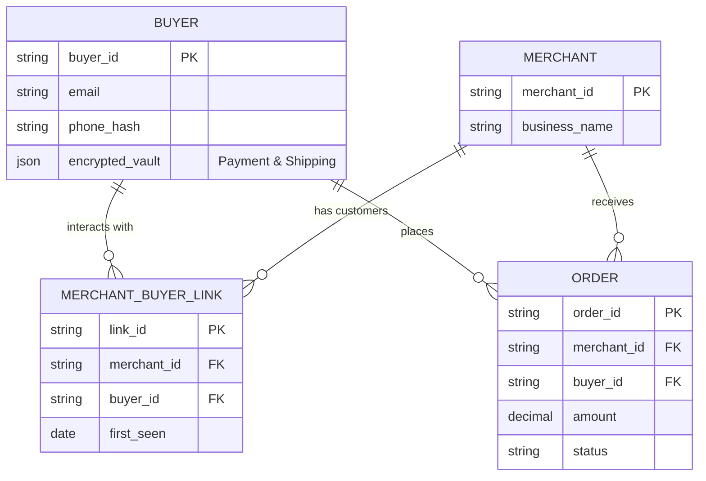
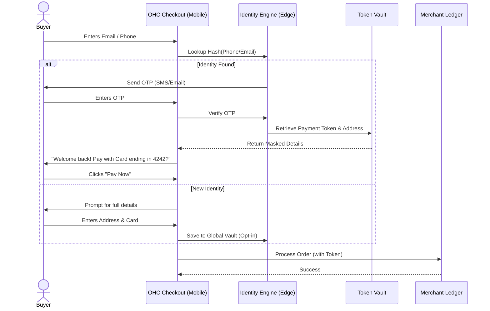

# Universal Buyer Identity & One-Click Checkout Engine (OHC Pay)

## Title
Architect and Implement Universal Buyer Identity & One-Click Checkout Engine (OHC Pay)

## Problem Statement
When a customer buys a custom cake from Maya (baker), they enter their email, shipping address, and credit card details. When that same customer later books a repair service from Carlos (handyman), they have to re-enter all of that information. For non-technical small business owners, cart abandonment is a major issue, often caused by friction at checkout. They need a system that recognizes repeat buyers *across the entire OneHumanCorp network*, enabling one-click checkout, instant booking, and deposit payments without any manual configuration required by the business owner.

## Research Report
**Findings & Competitive Analysis:**
- **Shopify (Shop Pay):** Shop Pay accounts for over 100 million buyers and increases checkout conversion by up to 50% compared to standard guest checkout. It uses email/phone verification to instantly recall saved credentials.
- **Stripe (Link):** Stripe Link auto-fills payment and shipping details for customers across any Stripe-enabled site, yielding a 7x faster checkout experience.
- **The Gap in OHC:** Currently, OneHumanCorp business owners operate as completely isolated islands from the buyer's perspective. There is no shared identity layer for buyers across tenants, meaning the network effect of millions of OHC businesses is wasted.
- **Architectural Requirement:** We need a strict multi-tenant backend that completely isolates merchant data (Maya cannot see Carlos's customers), but allows a *Buyer* to create a global identity (OHC Identity) that spans across merchants using Zero Trust and SPIFFE/SPIRE for secure identity assertion.

## Design Doc
### Architecture Diagram

### UI Wireframes & Mobile UX Flow (375px first)
**Screen 1: The Cart / Booking Summary**
- **Header:** Merchant Logo (e.g., Maya's Bakery)
- **Content:** Order summary ($45.00 Custom Vegan Cake Deposit).
- **Action:** A simple input field: "Phone Number or Email"
- **Design Token:** Clean UniFi modular card, subtle drop shadow.

**Screen 2: The Magic Recall (Glassmorphism Modal)**
- **Trigger:** User enters a recognized phone number.
- **Action:** An SMS OTP is sent. A bottom sheet slides up (macOS translucent glass material) asking for the 6-digit code.
- **Auto-fill:** iOS/Android native keyboard OTP auto-fill integration.

**Screen 3: One-Click Checkout**
- **Content:** "Welcome back, Sarah."
- **Shipping:** "123 Main St, Apt 4B" (Masked, editable).
- **Payment:** Apple Pay, Google Pay, or Card ending in •••• 4242.
- **Primary Button:** Large, high-contrast, edge-to-edge "Pay $45.00 Now" button.
- **Grandmother Test:** No billing address forms, no account creation passwords. Just OTP and a single button.

### AI Agent Integration Points
- **Operations Agent:** Monitors checkout abandonments. If a recognized buyer drops off, the agent triggers a soft WhatsApp/SMS follow-up 1 hour later: "Hey Sarah, Maya's Bakery here. Did you still want to reserve that cake?"
- **Fraud & Security Agent:** Analyzes global velocity and IP patterns across the entire OHC network. If a buyer identity attempts 5 high-value transactions across 5 different OHC merchants in 10 minutes, the agent invisible flags the transactions for step-up verification.

### Key Design Decisions
- **Passwordless Auth:** We will rely 100% on OTP (Email/SMS) and Passkeys. Passwords introduce too much friction.
- **Strict Multi-Tenant Isolation:** The Buyer Identity is a global construct, but Merchant Data remains strictly isolated. A merchant can only query the Global Vault for a specific buyer IF the buyer has actively initiated a checkout session with that merchant.
- **Edge Caching:** Buyer identity resolution must happen at the edge (sub 50ms) to ensure the checkout UI updates instantly without blocking.

## Implementation Prompt
**Context:** You are an Implementer agent. Your task is to build the Universal Buyer Identity & One-Click Checkout Engine (OHC Pay).
**User Journey (CUJ):** A buyer lands on a merchant's checkout link. They enter their phone number. The system recognizes them from a previous purchase on a *different* OHC merchant, sends an OTP, and instantly loads their saved shipping and payment token for a 1-click checkout.
**Acceptance Criteria:**
1. Implement the passwordless OTP flow for buyer identity verification.
2. Build the Global Vault interaction that securely retrieves masked payment tokens and addresses.
3. Ensure strict multi-tenant boundary checks (a merchant cannot query the global vault for arbitrary users).
4. Implement the mobile-first UI for the checkout flow (375px viewport optimized), utilizing translucent glass materials and modular cards.
5. Provide a test suite demonstrating cross-merchant identity recall and successful checkout.
**Note:** Do not use passwords. Do not prescribe specific database schemas or API endpoints; design the implementation details that satisfy these constraints.

## Priority
P0

## Estimated Scope
Large
