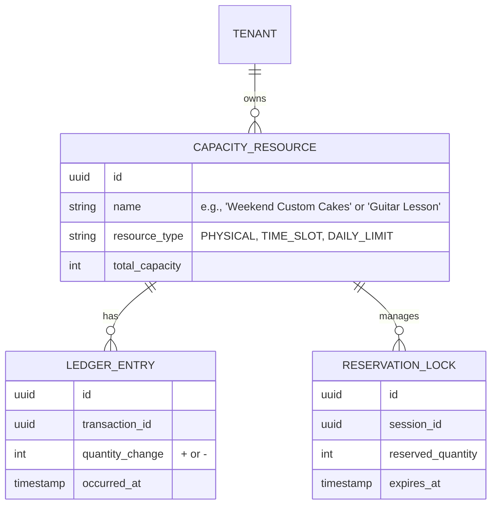

# Title: [Architecture] Universal Capacity and Inventory Ledger

## Problem Statement
Small business owners frequently operate hybrid business models that blur the lines between physical inventory, time-based services, and daily production capacity. For instance, Maya (a baker) sells physical cakes but has a limit on how many she can bake per day. Leo (a music tutor) sells 1-hour time slots. Currently, existing platforms force owners into rigid silos: they must use an "e-commerce" module for physical goods and a separate "booking" module for time slots, making it impossible to manage concurrent availability. This fragmented setup causes overselling, manual double-entry, and constant "Mobile Gaps" when trying to update availability on the go. Owners need a single, invisible system that treats all business offerings—whether an item, a time slot, or a daily limit—as manageable "capacity."

## Research Report
- **Competitor Systems Audit**:
  - **Shopify**: Excellent for physical inventory but struggles with time-based bookings or daily production limits without heavy third-party app reliance, which introduces data sync issues and "Cost Creep."
  - **Wix**: Offers both store and booking modules, but they operate as separate database entities, preventing complex hybrid models (e.g., booking a room *and* reserving a specific piece of equipment).
  - **Stripe**: Handles the payment flow seamlessly but relies on the platform to manage the state of inventory/capacity.
- **OHC Advantage**: By architecting a `Universal Capacity Ledger` that treats physical items, time slots, and daily production constraints as mathematically identical consumable units, OHC can eliminate the artificial barrier between e-commerce and services. This enables real-time, cross-channel availability syncing (e.g., across Instagram DMs and the web storefront) without fear of overselling.

## Design Doc

### Business Journey Mapping
1. **Acquisition & Onboarding**: Maya sets up her bakery. Instead of entering "inventory," she defines her "capacity": 10 custom cakes per weekend, plus a stock of 50 pre-made cookies.
2. **Activation**: A customer books a custom cake slot via Instagram DM. The AI agent immediately reserves 1 unit of weekend capacity.
3. **Retention & Revenue**: Another customer tries to buy a custom cake on the website. The system correctly shows it as "Sold Out" for that weekend, preventing Maya from overcommitting.

### Data Model & Invariants

### Key Architectural Invariants
1. **Append-Only Ledger**: Capacity changes are event-sourced and append-only to ensure absolute auditability and prevent race conditions.
2. **Multi-Tenant Isolation**: All ledger queries must enforce strict PostgreSQL RLS at the `tenant_id` level.
3. **Zero Trust & Security**: Internal microservices accessing the ledger must authenticate via SPIFFE/SPIRE.
4. **Offline-First Resilience**: Mobile point-of-sale operations must queue capacity decrements locally if offline, resolving conflicts upon reconnection.

### AI Department Coordination
- **The Operations Agent**: Monitors the `CAPACITY_RESOURCE` thresholds and automatically updates frontend storefronts (e.g., tagging an item as "Low Stock" or "Fully Booked").
- **The Salesperson Agent**: Checks `RESERVATION_LOCK` before confirming an Instagram DM order, ensuring no double-booking occurs while the customer is chatting.

### Mobile-First UX Flow (375px First)
- **Visuals**: Clean, macOS-style Translucent Glass materials (`backdrop-filter: blur(20px)`) with Ubiquiti UniFi modular dashboard cards.
- **Interaction**: A "Capacity Pulse" card shows "2 Cake Slots Left This Weekend." Tapping it reveals a simple adjuster (large +/- buttons, minimum 44x44px touch targets).
- **Zero Jargon**: No mentions of "Ledgers," "Inventory," or "SKUs." The UI simply states: "What can you offer today?"

## Implementation Prompt
**Goal**: Implement the Universal Capacity Ledger backend service to handle unified inventory and booking availability.

**Core User Journey (CUJ)**:
Two customers attempt to purchase the last available "Weekend Custom Cake" simultaneously—one via the website and one via the AI Instagram agent. The system must issue a temporary `RESERVATION_LOCK` to the first session, allowing them to complete the checkout/deposit, while the second session gracefully receives a "Sold Out" message, completely eliminating overselling.

**Acceptance Criteria**:
1. Create the base capacity resource and append-only ledger data structures.
2. Implement a concurrent reservation lock mechanism that expires if the transaction is not completed within a set timeframe.
3. Ensure all data access is strictly isolated by `tenant_id`.
4. Expose the current available capacity (total - locked - consumed) for the Operations and Salesperson agents to query in real-time.

## Priority
P0

## Estimated Scope
Large
