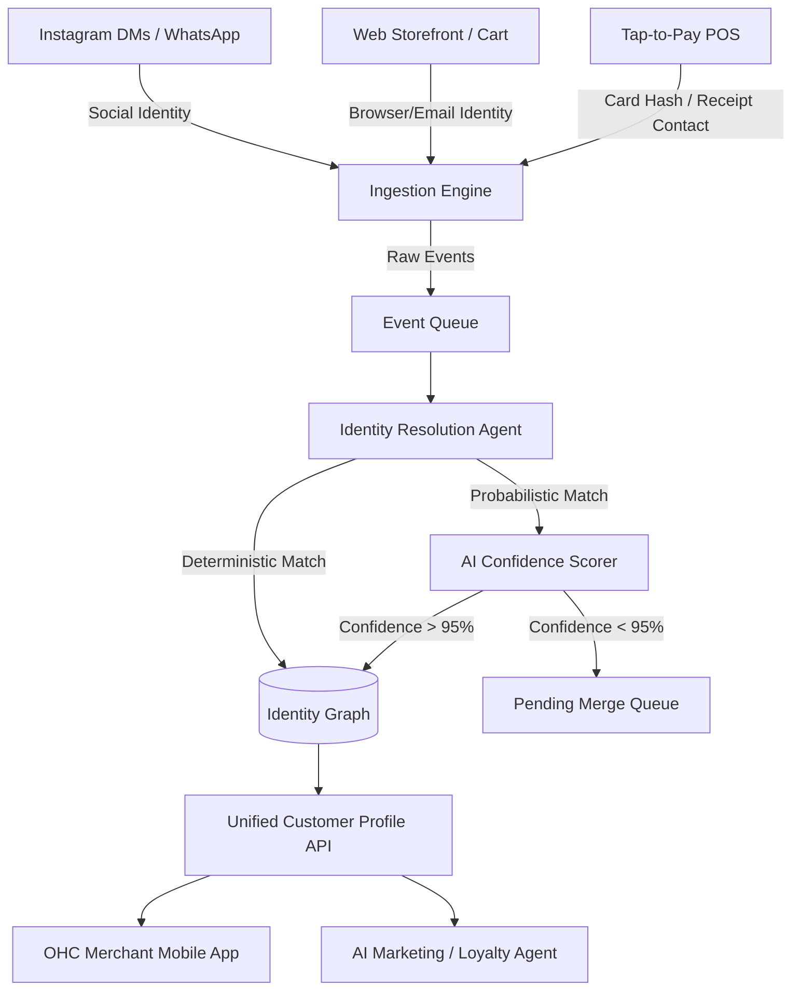

# [Architecture] Universal Cross-Channel Identity Resolution Engine

## Title
**Universal Cross-Channel Identity Resolution Engine**

## Problem Statement
Small business owners suffer from hopelessly fragmented customer data. When a customer DMs Maya on Instagram to ask about a cake, buys a smaller item later via her web storefront, and finally visits her pop-up shop to tap their card for an in-person purchase, they appear as three entirely separate individuals in Maya's system. To offer a loyalty discount or personalize her communication, Maya would need to manually piece together these interactions. For an owner handling everything on their phone, this manual CRM merging is impossible. OHC must invisibly stitch these fragmented interactions into a single, cohesive customer profile.

## Research Report
- **Competitor Landscape**:
  - **Shopify**: Solves identity well online via Shop Pay, but is heavily tied to its own wallet ecosystem and struggles to link social DMs natively to offline tap-to-pay without a heavy app ecosystem.
  - **Square**: Excels at linking offline payments to a phone number or email (via digital receipts), but lacks visibility into top-of-funnel social interactions like Instagram DMs or WhatsApp.
  - **Wix & Squarespace**: Offer basic CRM functionalities, but rely on the merchant to manually merge duplicate contacts or require the user to log into an account.
- **The Opportunity**: OHC has a unique vantage point because it natively hosts the storefront, manages the AI social agent (IG DMs, WhatsApp), and handles the tap-to-pay POS. By employing a background AI agent to evaluate deterministic signals (email, phone, card hash) and probabilistic signals (name similarity, location, interaction timing), OHC can autonomously maintain a unified Identity Graph for every customer across all merchants.

## Design Doc

### Architecture Diagram

### Mobile 375px UI Wireframes & UX Flow
1. **The Customer Profile View (375px)**:
   - **Header**: Customer Name (e.g., "Alex Chen"), Avatar, and a "Lifetime Value" badge rendered in a macOS-style Translucent Glass card.
   - **Contact Chips**: Phone number, Email, and Instagram Handle chips that launch the respective communication channels.
   - **Unified Timeline (Activity Feed)**: A vertically scrolling, unified history card:
     - *Today, 10:00 AM*: Tapped card in person ($12.00)
     - *Yesterday, 4:30 PM*: Automated AI reply on Instagram DM ("Yes, we have vegan options!")
     - *Last Week*: Purchased online ($45.00)
2. **UX Flow for Probabilistic Merging**:
   - The AI operates entirely invisibly. The merchant (e.g., Maya) never sees a "Merge Contacts" screen unless confidence is perfectly borderline.
   - If AI requests a manual merge (rare edge case), it appears as a simple "1-Tap Action" card on the merchant's daily dashboard: *"Is @alex_bakes the same Alex who bought a cake yesterday? [Yes] [No]"*.

### AI Agent Integration Points
- **Customer Success (CS) Department**: Uses the Identity Graph to maintain context. If Alex complains on WhatsApp about a web order, the AI knows exactly which order Alex is referring to without asking for an order number.
- **Marketing Department**: Leverages the unified history to auto-enroll customers into loyalty programs based on total spend across *all* channels, triggering SMS or email campaigns automatically.

### Key Design Decisions
- **Invisible First**: We do not burden the merchant with CRM management. Merging is handled deterministically via strong keys (Card Hash, Phone, Email) or probabilistically via an AI confidence scorer.
- **Multi-Tenant Isolation**: Identities are scoped appropriately. While OHC may recognize a global identity for seamless 1-click checkout, merchant-specific interaction histories remain strictly isolated to the respective merchant's tenant.
- **Zero-Trust**: Customer data (especially card hashes and PII used for matching) must be processed within secure, ephemeral enclaves.

## Implementation Prompt
**To the Implementer Agent**:
Implement the Universal Cross-Channel Identity Resolution Engine. Your goal is to build the backend service and database structures necessary to ingest events from POS, Web, and Social channels, and link them to a unified customer profile.
- **Customer User Journey (CUJ)**: A customer messages the merchant on Instagram, buys an item online via the storefront, and later taps to pay in person. When the merchant opens the OHC app, they must see all three interactions chronologically under a single customer profile, without having pressed a single "merge" button.
- **Acceptance Criteria**:
  - System can ingest events with sparse identity data (e.g., just an IG handle, or just a card hash).
  - System automatically merges profiles when deterministic links (e.g., same phone number provided for digital receipt) become available.
  - The API exposes a unified timeline of interactions for any given resolved identity.
  - Multi-tenant data boundaries must be strictly enforced (a merchant only sees their own interactions with the customer).
  - Do not prescribe specific database schemas or API endpoints—design the optimal data structures and interfaces to achieve the outcome.

## Priority
P0

## Estimated Scope
Large
