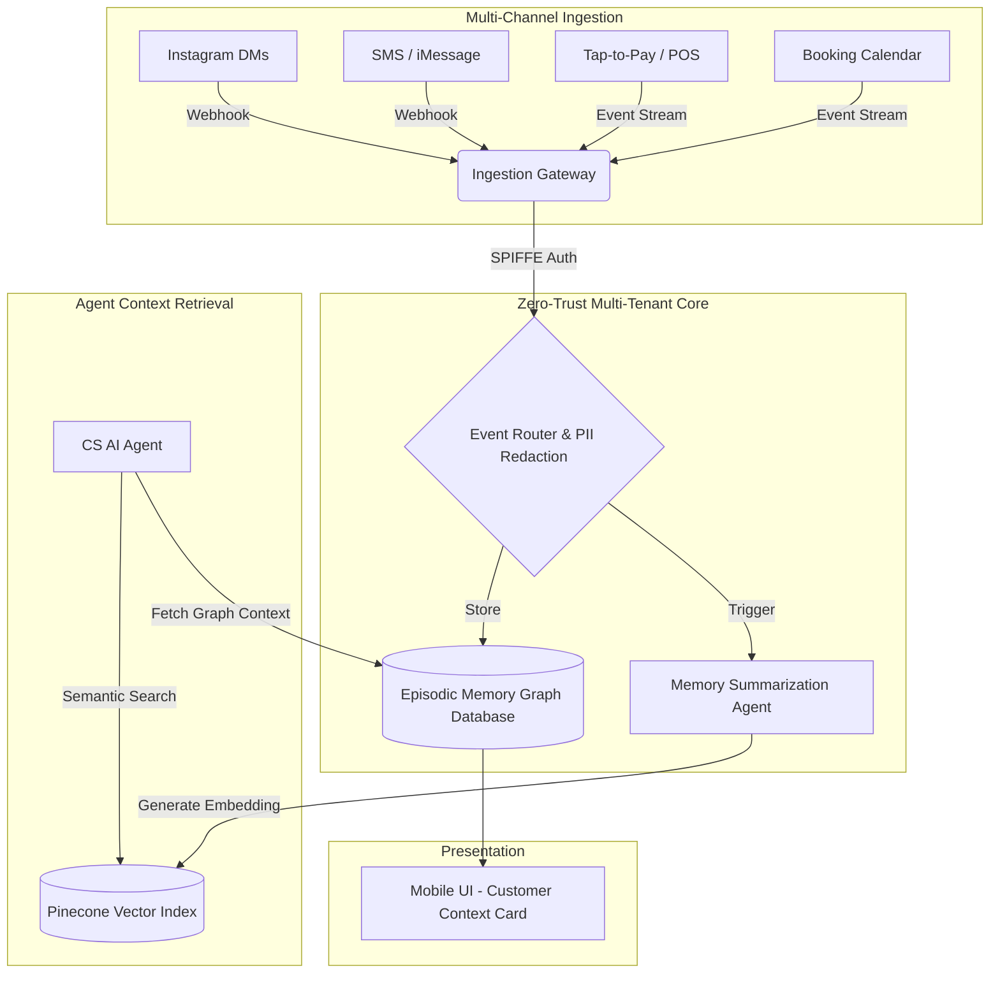
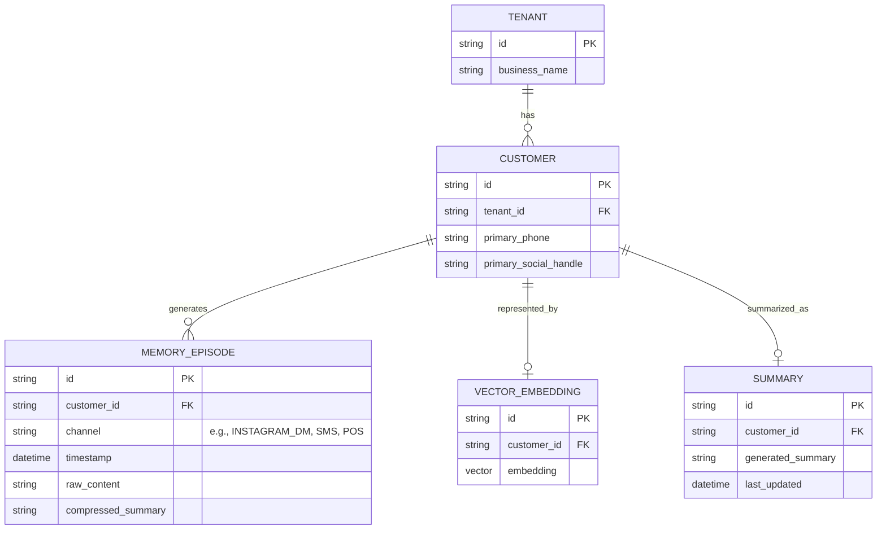
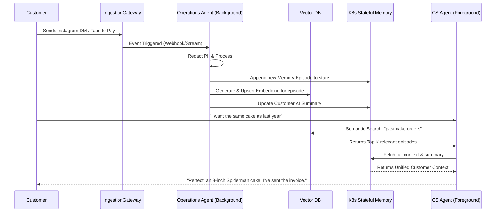

# Universal AI Customer Context & Episodic Memory Graph

## Problem Statement
For non-technical small business owners like **Maya (baker, 28)** and **Carlos (handyman, 42)**, managing customer relationships is a nightmare. Maya chats with clients via Instagram DMs ("do you do vegan cakes?"), takes deposits via a payment link, and sends SMS updates. Carlos gives quotes via phone, gets text messages for bookings, and takes Tap-to-Pay in person.

The pain points are severe:
- **Fragmented Context**: Because communications and transactions happen across different apps, they have no unified memory of a customer. When a customer says "I'd like the same cake as last year," Maya has to manually scroll through months of Instagram DMs to find out what cake they ordered.
- **Manual Data Entry**: Existing CRM tools (like Shopify's customer list or Wix's contacts) require the business owner to manually input data, which they never have time to do.
- **Lack of Proactive AI Assistance**: Without a centralized memory graph, AI agents cannot proactively assist in customer service or sales context, rendering them useless for personalized interactions.

Small business owners need a system that builds a comprehensive customer memory invisibly, linking every interaction, payment, and preference into a single context without any manual data entry.

---

## Research Report

Our market analysis across traditional SMB platforms (Shopify, Wix, Squarespace) and modern CRM tools reveals a significant gap in automated, multi-channel customer context:

- **Shopify / Wix**: Treat CRM as a flat list of names and emails attached to orders. Social media interactions (DMs) and SMS conversations are entirely disconnected. Business owners must piece together context manually.
- **HubSpot / Salesforce**: Powerful but extremely complex and require manual data hygiene. They fail the "grandmother test" and are totally unsuitable for a solo mobile-first operator.
- **The OHC Opportunity**: True differentiation lies in **Zero-Touch Memory**. By leveraging K8s/LangGraph Native Agent Memory (as identified in our architectural blueprints), OHC can autonomously construct an Episodic Memory Graph. Every event (a payment, an Instagram DM, a tapped review) is a node in this graph, automatically summarized and embedded for instant AI retrieval.

This allows our AI agents to provide "white-glove" customer service, instantly recalling a customer's history, preferences, and previous interactions without any human input.

---

## Design Doc

### Architecture Diagram

### Mobile-First UX (375px) & UI Wireframes

The UI embraces the macOS-style Translucent Glass materials and clean modular dashboard cards.

**Customer Profile Card (Glassmorphism UI)**
- **Header**: Customer Name, Avatar, Total Lifetime Value (LTV), "Last seen 2 days ago".
- **Quick Actions**: [Message] [Invoice] [Book]
- **The "Memory Timeline" (Core Component)**:
    - A vertical timeline combining all interactions seamlessly.
    - *Example Node*: 🛍️ "Purchased: Vegan Chocolate Cake ($45)" (Tap to view receipt).
    - *Example Node*: 💬 "Insta DM: Asked about peanut allergies." (Tap to view thread).
    - *Example Node*: 📅 "Booked: 2hr Handyman Consultation."
- **AI Summary Block**: A sticky, auto-generated card at the top: *"Prefers gluten-free. Usually orders in mid-December. Has 2 dogs."*

### Mobile UX Flow (The "1-Tap Recall")

1. **Trigger**: Maya receives a new Instagram DM: "Hey, can I get the usual for my son's birthday?"
2. **Action**: The OHC unified inbox shows the message. Maya taps the customer's avatar.
3. **Recall**: A translucent glass card slides up instantly. It displays the AI summary ("The usual: 8-inch Spiderman cake, peanut-free") and the complete multi-channel history.
4. **Resolution**: Maya (or the AI CS Agent) replies instantly with perfect context.

### AI Agent Integration Points

- **The Summarization Agent (Background)**: Listens to the ingestion gateway. After every interaction (chat thread resolved, order completed), it generates a compressed summary and updates the customer's vector embedding.
- **The Customer Service (CS) Agent (Foreground)**: When a customer sends a message, the CS Agent performs a semantic search against the Pinecone Vector Index to pull the `k` most relevant past episodes, injecting them into its prompt context to formulate a highly personalized reply.

### Key Design Decisions
- **Zero-Touch Ingestion**: The system must build the graph automatically via integrations (Stripe, Meta Graph API, Calendar). Zero manual entry is the strict baseline.
- **K8s/LangGraph Native Memory**: Utilizing our identified `#1 Priority` architectural hook, ensuring low-latency, durable memory mapped to K8s StatefulSet pods.
- **Multi-Tenant Isolation (Zero Trust)**: Customer memory graphs must be strictly isolated per tenant using SPIFFE/SPIRE identity attestation to guarantee data privacy.
- **Token Efficiency**: The CS Agent only retrieves the *summarized* episodes or specifically requested graph nodes, preventing explosive token costs during context window hydration.

---

## Implementation Prompt

**To the Implementer Agent:**

Your task is to build the foundational backend and UI components for the **Universal AI Customer Context & Episodic Memory Graph**.

**Core User Journey (CUJ):**
A business owner (like Maya) needs to instantly view a synthesized history of a customer across all touchpoints (social DMs, payments, bookings) without ever having manually entered this data.

**Acceptance Criteria:**
1. **Ingestion & Storage**: Implement a unified event ingestion pipeline that securely accepts events from different sources (Communication, Sales, Bookings) and associates them with a unified customer identity.
2. **AI Summarization Loop**: Implement a background worker (LangGraph node) that automatically processes new events for a customer, generates a concise AI summary of their preferences/history, and updates their profile context.
3. **Mobile-First UI**: Build the "Customer Context Card" using the designated design tokens (translucent glass materials, modular layouts). It must display the AI-generated summary and a unified timeline of events perfectly on a 375px viewport.
4. **Security**: Ensure strict multi-tenant data isolation. A tenant must never be able to query another tenant's customer graph.
5. **Simplicity**: Do not introduce any manual configuration screens for the business owner. The memory graph must populate invisibly.

*Note: You are responsible for the detailed technical design of the database schemas, API endpoints, and function signatures. Ensure adherence to the established OHC mobile-first and high-performance paradigms.*

---
**Priority**: P0 (Critical)
**Estimated Scope**: Large

### Entity-Relationship (ER) Diagram

### AI Department Sequence Diagram

