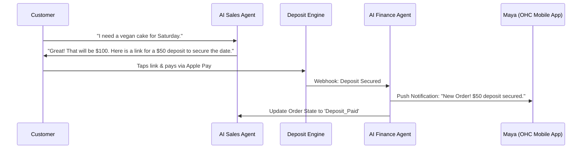

# Architecture Brief: Universal Deposit & Escrow Engine

## Title
Universal Deposit & Escrow Engine for Services and Custom Orders

## Problem Statement
Small business owners like Maya (custom cakes) and Carlos (handyman) require upfront deposits to secure materials and lock in calendar dates. Currently, OHC lacks a unified architecture to handle partial payments, milestone billing, and escrow-like holds. Without this, Maya risks baking a custom cake that never gets picked up, and Carlos risks driving to a fake address. The platform needs an automated, frictionless deposit engine that works natively via mobile, generating instantly payable deposit links via AI agents and reconciling the final payment automatically.

## Research Report
- **Competitor Analysis**: Shopify supports partial payments but is heavily tailored to physical goods rather than service bookings. Wix Bookings handles deposits but lacks AI-driven dynamic quoting (e.g., "The job is complex, require a 50% deposit instead of 20%").
- **User Personas**:
  - **Maya (Baker)**: Needs to collect a 50% non-refundable deposit before starting a custom vegan cake order via Instagram DM.
  - **Carlos (Handyman)**: Needs to send an AI-generated quote that requires a $50 calendar reservation fee which applies to the final invoice.
- **Industry Standard**: Stripe PaymentIntents allow for partial captures and future billing, but the complexity must be abstracted away from the business owner.

## Design Doc

### Key Design Decisions
1. **Deposit Rules**: Strict invariants enforcing that deposit_amount <= total_amount.
2. **Multi-Tenant Isolation**: Payment ledgers are strictly partitioned by organization_id using RLS.
3. **AI Department Coordination**: The Finance Agent handles payment tracking and reconciliation. The Sales Agent generates the quote and links. The Operations Agent updates the calendar/inventory.

### Architecture Diagram (Mermaid.js)

### Mobile UX Flow (375px)
- **Screen 1 (Quote Builder)**: Carlos sees a clean, translucent glass card with a slider for "Deposit Required: 20% | 50% | Custom".
- **Screen 2 (Customer Payment)**: A mobile-optimized checkout page with single-tap Apple Pay / Google Pay. No account creation required.
- **Screen 3 (Business Dashboard)**: An indicator on the order card showing a half-filled green circle: "Deposit Paid - $50 Due".
- **Zero Trust & Security**: SPIFFE/SPIRE secures internal RPCs between the AI Agents and the Deposit Engine. Multi-tenant isolation ensures Maya cannot query Carlos's ledgers.

## Implementation Prompt
**Role**: Principal Software Engineer & Canvas (L7)
**Task**: Implement the Universal Deposit Engine UI and backend orchestration logic.
**Outcome**: The user can configure a product or service to require a percentage or fixed-amount deposit. The generated checkout link must securely process the partial payment and update the order state.
**CUJ**: Carlos creates a new quote for a roof repair, sets a $100 deposit requirement, and sends it. The customer pays the deposit, and Carlos's mobile app shows the order as "Action Required: Start Job".
**Acceptance Criteria**:
- Support fixed and percentage deposit configurations.
- Ensure the mobile UI passes the "grandmother test" (slider or simple input).
- Update the Order State natively upon payment.
- 100% E2E test coverage in Playwright.

## Priority
P1

## Estimated Scope
Medium
