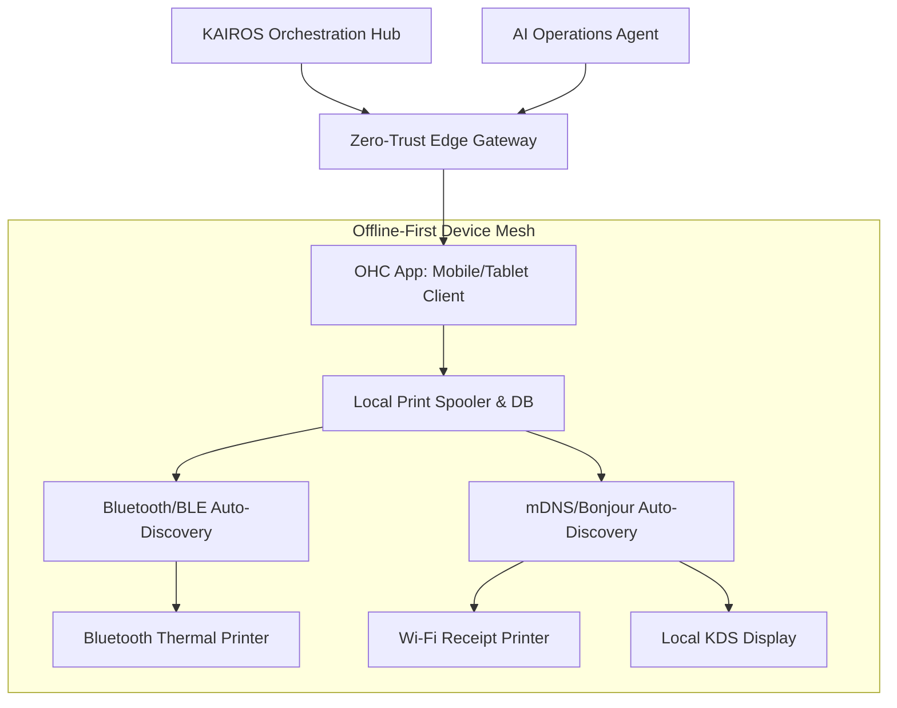
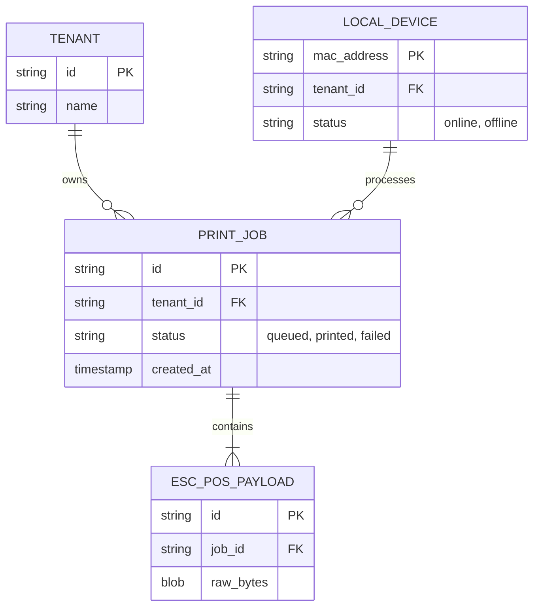
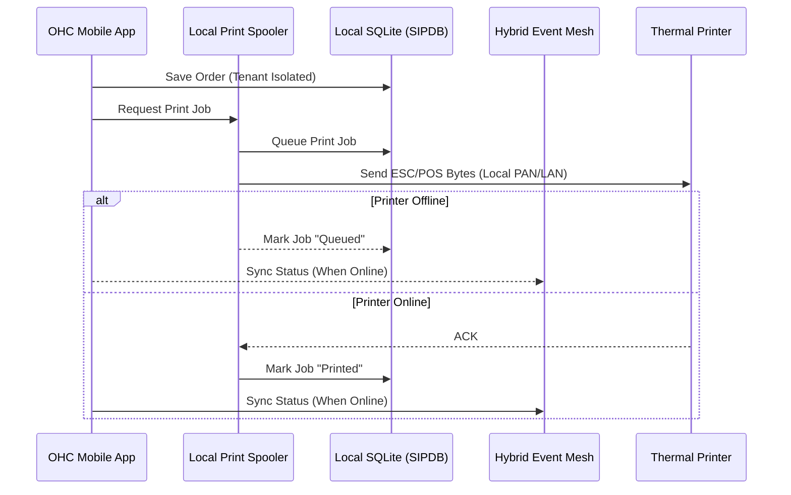

# Title: Universal Offline-First Hardware & Thermal Print Mesh

## Problem Statement
Fatima (Food Cart, 50) and Priya (Boutique Owner, 35) require physical outputs to run their businesses efficiently: Fatima needs a printed daily prep list and individual order tickets to tape to halal cart boxes, and Priya needs to hand customers physical receipts after an in-store tap-to-pay transaction. Existing cloud POS systems treat printers and hardware as an afterthought, often requiring complex network configuration, manual IP address entry, or constant internet access. When the network drops, printing fails, halting their operations. A non-technical small business owner cannot be expected to troubleshoot Bluetooth pairing drops, ESC/POS byte sequences, or IP subnets. They need an invisible layer that just prints, every time, even offline.

## Research Report
*   **Competitor Analysis**:
    *   **Square POS**: Requires specific, proprietary, or certified hardware models. Fails completely if the tablet loses its connection, and setup involves manual Bluetooth pairing.
    *   **Shopify POS**: Similar hardware lock-in; relies heavily on the iPad’s native network stack. Printing customized physical kitchen tickets often requires third-party paid apps.
    *   **Toast (Restaurant POS)**: Very robust kitchen printing but requires professional installation of hardwired network infrastructure, completely failing the "launch in 10 minutes from a phone" mandate.
*   **The OHC Differentiator**: OHC must introduce an autonomous, zero-config device mesh. The mobile app automatically discovers Bluetooth, USB, or local Wi-Fi thermal printers and KDS screens, forming a resilient local p2p mesh. If the primary cloud connection drops, the app caches the print jobs locally and immediately spools them to the discovered hardware using embedded, generic ESC/POS drivers.

## Design Doc

### High-Level Architecture

### Data Model & Invariants

### Execution Sequence

### Key Design Decisions & Invariants
*   **Zero-Config Auto-Discovery**: The app constantly scans via BLE and mDNS for ESC/POS-compatible devices. When a new device is found, the user is prompted with a single "Connect to Printer?" dialog. No IP entry required.
*   **Offline-First & Local Print Spooling**: Print jobs are never sent to the cloud to be processed. The local SQLite (SIPDB) database queues the job, formats it into ESC/POS bytes locally, and transmits it directly to the hardware.
*   **Hardware Agnosticism**: Standardize on the universally supported ESC/POS protocol for thermal printers, avoiding vendor lock-in.
*   **AI Agent Coordination**: The Operations Agent monitors printer health (e.g., paper out, disconnected). If a printer goes offline during a busy period, the AI agent sends a conversational push notification: "Your main printer is disconnected! Should I route kitchen tickets to your phone screen instead?"

### Zero Trust, Security & Multi-Tenancy
*   **SPIFFE/SPIRE Identity**: Every local device (Fatima's phone) acts as a secure node authenticated via SPIFFE/SPIRE certificates. The local print spooler only processes jobs originating from the authenticated tenant session.
*   **Tenant Isolation**: The local SQLite database enforces strict tenant boundaries at the schema level. Even if multiple businesses operate on the same local network, print jobs are cryptographically segregated. A print job must carry a valid `tenant_id` that matches the authenticated session before it is translated into ESC/POS bytes.

### Mobile UX Flow (375px First)
1.  **Hardware Tab**: Clean, minimalist card layout showing connected devices with a green dot (Online) or red dot (Offline).
2.  **Auto-Discovery Prompt**: A sleek, bottom-sheet slides up automatically when a compatible printer is powered on nearby: "Found a Star Micronics Printer. Tap to use for Receipts."
3.  **Advanced Settings (Hidden)**: Detailed ESC/POS settings, character encoding (crucial for Fatima's Arabic tickets), and manual IP fallback are hidden behind an "Advanced Configuration" toggle to pass the grandmother test.
4.  **Error Handling**: If printing fails (e.g., out of paper), a large, non-technical alert appears: "Printer needs paper! Tap here when refilled to print the 3 pending orders."

### Performance & Offline Targets
*   **Discovery Speed**: mDNS and BLE discovery must surface devices in < 3.0s.
*   **Print Latency**: Time from tapping "Print" (or an order arriving) to the printer engaging must be < 500ms.
*   **Offline Capability**: 100% of printing functionality must work without a WAN connection, relying purely on LAN/PAN.

## Implementation Prompt
**Objective**: Implement the Universal Offline-First Hardware & Thermal Print Mesh to enable zero-config, offline-capable ESC/POS printing from the OHC mobile client.

**User Journey (CUJ) & Acceptance Criteria**:
1.  **Zero-Config Discovery**: The app must automatically discover local network (mDNS) and Bluetooth ESC/POS printers and present them in a unified UI.
2.  **Offline Spooling**: When an order is placed locally (e.g., tap-to-pay) or synced via the Hybrid Event Mesh, the print job must be formatted and dispatched to the printer directly from the mobile device, without requiring a cloud round-trip.
3.  **Resilience**: If the printer is unreachable, jobs must queue locally. Upon reconnection, queued jobs must process sequentially.
4.  **Multilingual Support**: The formatting engine must correctly encode UTF-8 (specifically Arabic for Fatima) into the appropriate ESC/POS codepages or image buffers for printing.

**Constraints**:
Do not hardcode vendor-specific SDKs; rely on generic ESC/POS protocol implementation over generic Bluetooth/TCP sockets. Ensure all complex configuration is hidden from the primary UI.

## Priority
`P1`

## Estimated Scope
Large
