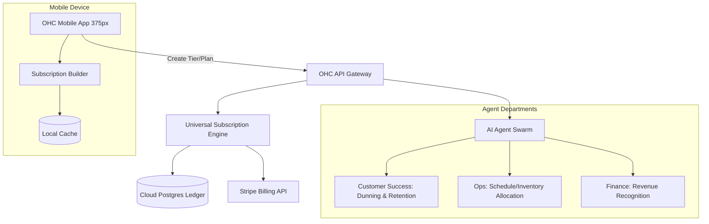

# [Architecture] Universal Subscription & Recurring Billing Engine

## Problem Statement
Small business owners like Leo (a music tutor) and Maya (a baker) need reliable ways to generate predictable, recurring revenue. Currently, if Leo wants to offer a "4 lessons per month" package or if Maya wants to offer a "Cake of the Month" club, they must either cobble together external tools (like Patreon or a raw Stripe integration) or manually track who has paid and when to deliver the service. They need a zero-configuration, mobile-first engine that natively handles recurring billing, entitlement tracking (e.g., number of lessons remaining), and automated follow-ups for failed payments, entirely from their OHC app.

## Research Report
**Competitor Systems Audit:**
- **Stripe Billing:** The gold standard for developers, supporting complex proration, tiered pricing, and metered billing. However, its dashboard is highly technical and exposes concepts like "Customer Portals", "Prices", and "Products" that confuse non-technical users.
- **Patreon / Substack:** Excellent for pure digital memberships, but they operate as walled gardens. They do not integrate with physical inventory (Maya's cakes) or service bookings (Leo's lessons).
- **Shopify Subscriptions:** Usually requires third-party apps (like Recharge) which add significant monthly fees and complexity.

**Gaps Identified:**
OHC currently lacks a unified data model and user experience for recurring revenue that works identically across physical products, digital goods, and services/bookings. We need a "Universal Subscription Engine" that abstracts Stripe Billing's complexity into a simple "Create Membership" mobile flow, deeply integrated with our omnichannel ledger and scheduling system.

## Design Doc

### Architecture Diagram

### Mobile UX Flow (375px First)
1. **Creation:** Leo opens the app, taps "New Product/Service," and selects "Subscription."
2. **Configuration:** A clean, Glassmorphism-styled form asks for the Name ("Monthly Guitar Pro"), Price ("$200/mo"), and Entitlements ("4 hours of bookings"). No technical jargon.
3. **Customer View:** A buyer sees a beautiful, simple checkout page. They enter their card once.
4. **Active Management:** Leo has a "Members" tab on his dashboard showing active subscribers, churn rate, and upcoming renewals in simple, friendly metrics.
5. **Dunning:** If a customer's card fails, the Customer Success AI Agent automatically sends a polite, personalized SMS with a secure link to update their payment method.

### AI Agent Integration Points
- **Customer Success Agent:** Handles "dunning" (failed payment recovery). Sends personalized texts/emails to customers to update expired cards, and answers basic subscriber questions ("How many lessons do I have left this month?").
- **Operations Agent:** Automatically allocates inventory (reserving 4 cake slots for Maya) or updates booking availability (giving a subscriber priority booking for Leo).
- **Finance Agent:** Tracks Monthly Recurring Revenue (MRR) and reconciles subscription payments against the unified ledger.

### Key Design Decisions & Security
- **Abstracted Billing Engine:** The backend heavily utilizes Stripe Billing for compliance and vaulting, but the OHC database maintains the source of truth for *entitlements*. This prevents vendor lock-in and allows future integrations with local payment gateways (e.g., PIX recurring).
- **Unified Entitlement Model:** A subscription grants an "entitlement" which can be consumed by a booking, a digital download, or a physical shipment. This unifies the logic across all business types.
- **Zero-Trust Multi-Tenancy:** Subscription data and customer PII are strictly isolated per tenant using SPIFFE SVIDs.

## Implementation Prompt
Implement the Universal Subscription & Recurring Billing Engine.
- **User-Facing Outcome:** Users can create and manage recurring subscriptions, memberships, or service packages directly from the mobile app, without dealing with complex billing terminology.
- **CUJ:** User creates a "Monthly Package" product. Customer subscribes via the web storefront. The system automatically bills the customer monthly and grants the associated entitlements (e.g., 4 bookings). If a payment fails, the AI agent attempts recovery.
- **Acceptance Criteria:** Ensure the subscription builder UI is mobile-first (375px baseline) and adheres to the OHC design system. The backend must orchestrate the subscription lifecycle (active, past_due, canceled) and correctly issue entitlements. Integrate with the Customer Success agent for automated failed payment recovery (dunning). Ensure strict multi-tenant isolation.

## Priority
P1

## Estimated Scope
Large