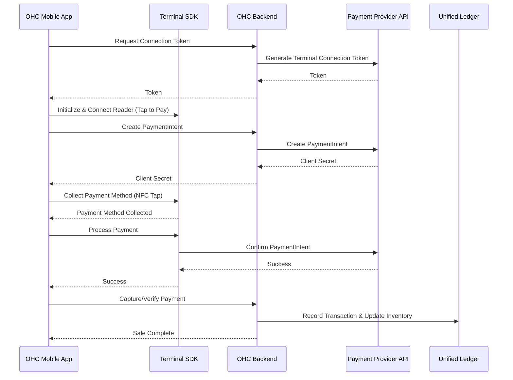

# [architecture] Universal Tap-to-Pay POS System

## Title
Universal Tap-to-Pay POS System

## Problem Statement
Small business owners with physical presences (like Priya, the boutique owner, or Fatima, the food cart operator) struggle to unify their in-person sales with their online storefronts. They often rely on separate, disjointed systems (e.g., a Square terminal for in-person sales and a Shopify site for online sales), leading to fragmented inventory, disconnected customer data, and accounting headaches. They need a simple, unified way to accept in-person payments directly on their mobile devices (Tap-to-Pay) that instantly syncs with their OHC platform inventory, customer profiles, and financial ledgers.

## Research Report
Current solutions force users into hardware lock-in or disjointed software ecosystems:
*   **Square:** Excellent hardware, but locks users into the Square ecosystem, making it hard to integrate deeply with other best-in-class online platforms without complex integrations.
*   **Shopify POS:** Powerful, but can be complex to set up and often requires purchasing specific hardware or using a clunky app interface.
*   **Stripe Terminal (Tap to Pay on iPhone/Android):** Offers the raw capability to use a smartphone as a POS terminal without extra hardware.
*   **OHC's Opportunity:** By integrating Tap to Pay SDK capabilities directly into the OHC mobile app, OHC can turn any smartphone into a fully integrated POS terminal. This ensures that an in-person sale immediately updates inventory, triggers AI customer success workflows (like sending a digital receipt), and updates the unified financial ledger—all without extra hardware.

## Design Doc

### Business Journey Mapping (Priya the Boutique Owner)
1.  **In-Person Sale:** A customer walks into Priya's boutique and wants to buy a dress.
2.  **Mobile POS:** Priya opens the OHC app on her phone, selects the dress from her synced inventory, and taps "Charge."
3.  **Tap to Pay:** The OHC app activates the phone's NFC reader. The prompt "Hold card near reader" appears.
4.  **Transaction & Sync:** The customer taps their card. The payment is processed. The Operations Agent instantly deducts the dress from inventory.
5.  **Customer Success:** The Customer Success Agent recognizes the card or prompts Priya to enter the customer's email/phone for a digital receipt, linking the in-person sale to their online profile.

### Architecture Diagram

### Mobile UX Flow
*   **Cart View (375px):** A simple interface to add items from inventory or enter a custom amount.
*   **Payment Modal:** A clear, full-screen takeover utilizing native OS UI for Tap to Pay.
*   **Post-Sale:** A quick success screen with options to "Email Receipt," "Text Receipt," or "New Sale."

## Implementation Prompt
Implement the backend infrastructure to support Terminal Tap-to-Pay integration.
1.  Create internal APIs to generate Terminal Connection Tokens securely per tenant.
2.  Implement the endpoint to create a PaymentIntent specifically flagged for Terminal capture.
3.  Develop the webhook handler to listen for Terminal payment success events to ensure robust capture and ledger updates even if the mobile app loses connection.
4.  Ensure strict tenant isolation when interacting with the Payment API.
5.  Write comprehensive unit tests for the token generation and payment intent creation logic.
**Priority:** P1
**Estimated Scope:** Large
