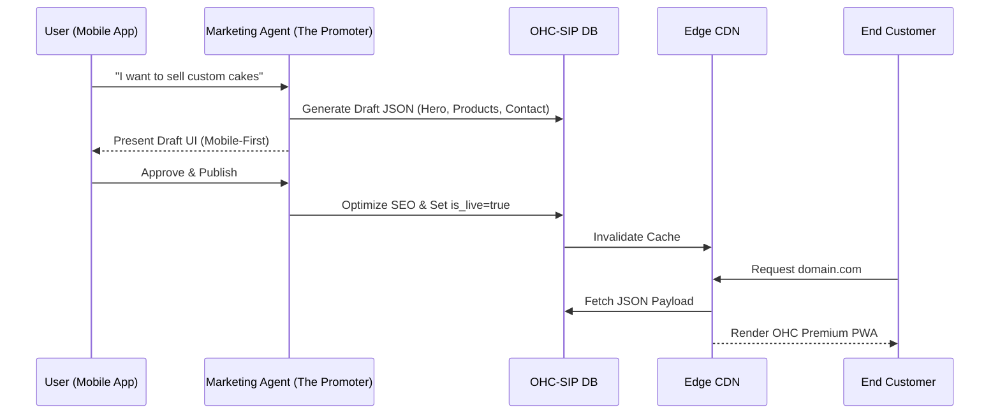

# OHC Website & Storefront Builder Architecture

## 1. Problem Statement
Non-technical small business owners (like Maya the Baker or Carlos the Handyman) need a beautiful, functional website and storefront to acquire customers and process transactions. Existing tools like Shopify or Wix are too complex, require significant time investment, and assume a baseline level of technical knowledge. The OHC Website Builder must abstract all technical details, allowing a user to generate, customize, and publish a premium, mobile-first website in under 10 minutes from their phone, primarily driven by AI.

## 2. Research Report
### 2.1 Market Analysis
- **Shopify:** Powerful but overwhelming. Setup takes 30-60 minutes for a basic store. Mobile management app is complex.
- **Wix:** Highly customizable, but "blank canvas syndrome" paralyzes non-technical users.
- **Squarespace:** Aesthetic focus, but rigid templates.
- **GoDaddy (Airo):** Basic AI generation, but limited functionality post-generation.

### 2.2 Key Differentiators for OHC
- **AI-First Generation:** Marketing Agent ("The Promoter") drafts the entire site based on business type and brief description.
- **Mobile-First Editing:** True drag-and-drop and block customization via a 375px mobile interface. No desktop required.
- **Opinionated Blocks:** Content blocks (hero, product grid, calendar) are pre-configured with OHC Premium Tokens (Glassmorphism, 20px blur).
- **Invisible Infrastructure:** SEO, SSL, CDN, and custom domain routing are handled completely invisibly.

## 3. Design Doc

### 3.1 Content Block Architecture
The builder uses a block-based JSON abstraction, not raw HTML/CSS.
- **Hero Block:** Headline, subheadline, primary CTA, background image (auto-compressed to WebP).
- **Product Grid Block:** Dynamically syncs with the OHC-SIP DB inventory.
- **Booking Calendar Block:** Connects to the Operations Agent's scheduling system.
- **Testimonial Block:** Curated by the Customer Success Agent.
- **Contact Form Block:** Routes inquiries to the Sales Agent.

### 3.2 Publishing & Hosting Flow
- **Draft State:** Changes saved to JSON payload in `tenant_pages` table.
- **Publish Action:** Marketing Agent reviews, optimizes for SEO (auto-generates meta tags), and flags `is_live=true`.
- **Serving:** Edge CDN (Cloudflare/CloudFront) pulls the JSON payload and renders the PWA using the OHC Flutter/Web engine.

### 3.3 Architecture Diagram

### 3.4 Key Invariants
- **Mobile-First Rendering:** The core renderer must prioritize 375px breakpoints. Desktop view is an extension.
- **Design System Enforcement:** Users can select themes, but cannot break the underlying design tokens (Glassmorphism, Outfit/Inter typography, minimum 44x44px touch targets).

## 4. Implementation Prompt
**Task:** Implement the core JSON block parser and renderer for the Website Builder in the Flutter Web application.
**Outcome:** A Flutter widget that can accept a JSON payload defining a page layout (Hero, Text, Product Grid) and render it accurately according to the OHC Premium Design System.
**Acceptance Criteria:**
- The widget must render correctly on a 375px mobile screen.
- The `ProductGrid` block must dynamically request mock data via the `BACKEND_URL` API.
- Typography and spacing must strictly adhere to the Outfit/Inter and OHC token specifications.
- Must include a full Playwright E2E test starting from a mock "Publish" action to viewing the live rendered page.

## 5. Metadata
- **Priority:** P1 (High)
- **Estimated Scope:** Large
