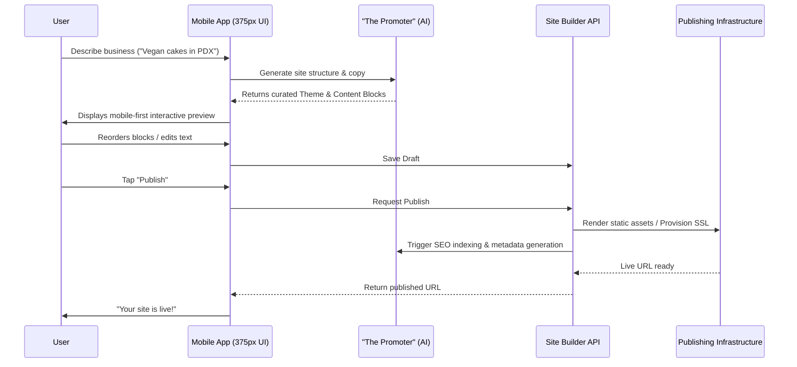

# [architecture] Website & Storefront Builder Architecture

## Title
Design the Mobile-First AI-Assisted Website & Storefront Builder

## Problem Statement
Small business owners (like Carlos the handyman or Fatima the food cart operator) need a professional, reliable website to establish their online presence, sell products/services, and capture leads. However, existing website builders (Shopify, Wix, Squarespace) require significant time, technical knowledge, or design skills to set up. These platforms are often complex, Desktop-first, and rely heavily on manual content creation and block-level styling, causing non-technical users to abandon the process or settle for suboptimal sites. OHC needs a radically simple, mobile-first website builder where the AI ("The Promoter") handles the heavy lifting of design, layout, content generation, and publishing, allowing a business owner to go from idea to live site from their 375px phone screen in under 10 minutes.

## Research Report
The current market standard for website builders forces users into complex interfaces:
- **Shopify/Wix/Squarespace:** Offer deep customization but demand a steep learning curve. Users must understand padding, margins, responsive behavior, and DNS configurations.
- **GoDaddy/Zyro:** Simpler, but lack deep integrated e-commerce and AI capabilities; usually feel rigid.
- **OHC's Differentiation:** OHC treats AI as the primary design engine, not a secondary "text generation" tool. The user simply provides their business intent, and the "Promoter" agent generates a complete, aesthetically excellent (Glassmorphism, premium tokens) website instantly. Customization is restricted to high-level blocks and themes rather than pixel-level adjustments to ensure the site remains beautiful and responsive by default.

Key Findings for Non-Technical Users:
1. **Decision Fatigue:** Presenting too many options (fonts, colors, layouts) paralyzes users. We must offer curated "Theme Tokens".
2. **Mobile Management:** Users want to edit their site while on the go. The builder must be 100% functional on a 375px screen without horizontal scroll.
3. **Invisible Infrastructure:** Users do not want to configure SSL, CDN, or DNS records. This must happen automatically.

## Design Doc

### 1. High-Level AI Builder Flow (Mobile UX)
The site creation process starts with a natural language prompt or a quick wizard:
- **Input:** User describes their business (e.g., "I'm Maya, I sell custom vegan cakes in Portland").
- **Generation:** "The Promoter" agent automatically selects the optimal layout, generates initial copy, curates placeholder imagery, and assembles the content blocks.
- **Preview:** User views the 375px mobile preview directly in the app.
- **Customization:** User can tap a block to swap it, edit text, or ask the AI to "make it sound more professional."
- **Publish:** One-tap publish to `maya-cakes.ohc.app` (or a custom domain).

### 2. Architecture Diagram

### 3. Content Blocks Definition
To prevent users from breaking the layout, the builder uses strict, pre-designed content blocks:
- **Hero:** Main headline, subheadline, background image/video, and primary Call-To-Action (CTA).
- **Product Grid:** Automatically syncs with the user's Inventory. Displays photos, titles, and prices.
- **Service & Booking:** Integrates with the calendar system. Shows available time slots and "Book Now" buttons.
- **Text & Media:** Standard text sections with side-by-side or stacked images.
- **Testimonials:** Pulls verified reviews from the Customer Success module.
- **Contact Form:** Simple form that routes submissions directly to the OHC Mobile Inbox.
- **Footer:** Auto-generated links to Legal/Policies (Terms of Service, Privacy).

### 4. Customization & Templates
- **Themes over Pixels:** Instead of manually choosing hex codes, users select a "Vibe" (e.g., Minimalist, Bold, Elegant). The system applies the OHC Premium Token library (Outfit/Inter typography, Glassmorphism, coordinated color palettes).
- **Block Swapping:** Users can tap a block and hit "Regenerate" or swipe to swap its layout variation (e.g., changing a 2-column product grid to a carousel).

### 5. Publishing (Draft → Live)
- **Draft Mode:** All edits auto-save as drafts. The live site remains unchanged until explicit publication.
- **One-Tap Publishing:** Compiles the block configuration into a highly optimized, static, or edge-rendered web application.
- **Invisible Infrastructure:** SSL certificates are provisioned automatically. Custom domains are handled via a guided "connect domain" wizard that verifies DNS records in the background without exposing raw CNAME/A record jargon.

### 6. Automated SEO
- "The Promoter" agent automatically generates semantic HTML, meta titles, descriptions, and Open Graph tags based on the site's content and the user's business context.
- Sitemaps (`sitemap.xml`) and `robots.txt` are auto-generated and submitted to search engines upon publishing.
- Images are automatically compressed to WebP and assigned AI-generated `alt` text for accessibility and image search optimization.

### 7. AI Integration Points
- **The Promoter (Marketing & Advertising):** Generates initial layouts, copy, SEO metadata, and suggests optimal block arrangements based on the business type.
- **The Protector (Legal & Compliance):** Automatically generates and attaches Terms of Service and Privacy Policy pages linked in the footer.
- **The Salesperson (Sales & Acquisition):** Optimizes the placement of CTAs and Lead Capture forms to maximize conversion rates.

## Implementation Prompt
**Target:** Develop the Website & Storefront Builder orchestration and UI.
**Outcome:** A mobile-first (375px) drag-and-drop/tap-to-edit builder interface that allows a user to generate, customize, and publish a website using strict content blocks and pre-defined theme tokens.
**Acceptance Criteria:**
1. A user can generate a complete draft site by providing a simple text prompt.
2. The UI provides a scrollable, interactive preview of the site on a 375px layout.
3. Users can add, remove, and reorder standard Content Blocks (Hero, Product Grid, Testimonials).
4. The system seamlessly handles saving to Draft state and transitioning to Live state upon publication.
5. All UI elements adhere to the OHC Premium design system (Glassmorphism, correct typography).
6. Provide an E2E test starting from login to the dashboard, generating a site, modifying a block, and successfully publishing it.

## Priority
P0

## Estimated Scope
Large

