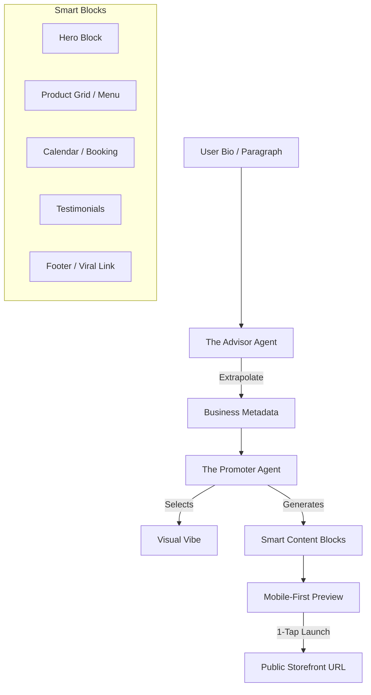

# Title
OHC "Smart Builder": AI-Driven 30-Second Storefront Architecture

## Problem Statement
Small business owners (Maya, Carlos, Fatima) are intimidated by traditional website builders with too many buttons and technical terms (CNAME, SSL, Liquid). They need a professional storefront that is "born live" with zero setup. If a user cannot go from a paragraph of text to a live, payment-ready URL in under 60 seconds, the platform fails the fundamental "Grandmother Test," hindering acquisition and activation.

## Research Report
- **Competitive Benchmark**: Durable.co and Wix ADI have set the bar at < 60 seconds for initial generation. Shopify and Squarespace rely heavily on complex block and section paradigms that require technical literacy.
- **Vibe Coding**: The emerging trend of using LLMs to select colors, typography, and layout based on a business "vibe" (e.g., "Cozy, organic bakery" vs. "High-speed, modern plumbing").
- **Block System**: Shopify and Squarespace use "Sections" that are too complex for mobile editing. OHC uses "Smart Blocks" that auto-configure based on the business type (e.g., a "Menu Block" for Fatima, a "Booking Block" for Carlos).

## Design Doc

### Architecture Diagram

### UI Wireframes or Screen Flow Description (375px first)
1. **Bio Input Screen**: A single text area or microphone input for the user to describe their business.
2. **Generation Screen**: A skeleton shimmer view indicating the AI is building the site.
3. **Live Preview Screen**: The generated storefront composed of Smart Blocks.
4. **Publish Modal**: 1-tap button to launch the site on an OHC subdomain instantly.

### Mobile UX Flow
The UI transition from "Bio Input" to "Live Preview" is seamless, with background agents handling the "heavy lifting" (image generation, copy drafting). All editing interactions (e.g., toggling "Sold Out") are designed as 1-tap actions on 375px screens.

### AI Agent Integration Points
- **The Advisor**: Extrapolates structured business metadata from unstructured user input.
- **The Promoter**: Generates copy, selects color palettes, and arranges Smart Blocks.

### Key Design Decisions and Why
- **Smart Blocks**: Restrict manual drag-and-drop complexity in favor of AI-arranged semantic blocks (Hero, Menu, Booking).
- **Vibe Coding & Visual Excellence**: AI automatically applies OHC Premium tokens (Outfit/Inter fonts, Glassmorphism).
- **Draft -> Live**: The site is born as a `DRAFT` and becomes `LIVE` upon 1-tap approval, handling SSL and Subdomains in the background invisibly.

## Implementation Prompt
Implement the "Smart Builder" engine. Create a registry of `SmartBlocks` (Hero, Catalog, Booking) that are 100% responsive and usable at 375px. Build the "Vibe Coding" logic where "The Promoter" agent receives business metadata and outputs a configuration for the storefront layout. Implement the publishing lifecycle: when a user clicks "Launch," the system must move the site from `DRAFT` to `LIVE`. Ensure the UI transition from "Bio Input" to "Live Preview" is seamless. Focus on the user-facing outcome and interaction flows, and include E2E test coverage verifying storefront generation from initial input to final display. Do not prescribe specific backend routing mechanics.

## Priority
P0

## Estimated Scope
Large
