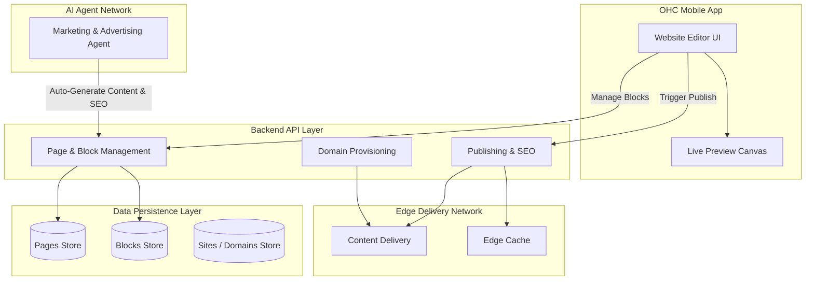

# [Architecture] Website & Storefront Builder

## Title
Website & Storefront Builder Architecture

## Problem Statement
Small business owners (like Maya the baker or Carlos the handyman) need a professional, beautiful online presence to showcase their products or services and capture leads or sales. However, they lack technical expertise, design skills, and the time required to navigate complex website builders like WordPress, Wix, or even Shopify. They need a system that builds a premium, mobile-first website for them instantly, with the ability to intuitively tweak content via simple drag-and-drop mechanics, all managed from their smartphone.

## Research Report
### Competitor Analysis
*   **Shopify**: Extremely powerful for e-commerce, but overwhelming for basic service businesses or beginners. Its theme editor is desktop-centric and requires understanding concepts like "sections", "blocks", and "liquid". Setup time is typically 30-60 minutes minimum.
*   **Wix**: Highly customizable drag-and-drop, but creates a paradox of choice. Non-designers often create visually inconsistent or broken mobile layouts because elements are absolute-positioned. Not true mobile-first management.
*   **Squarespace**: Beautiful templates, but rigid. Best for creatives. The mobile editing experience is secondary to the desktop experience.
*   **GoDaddy / Zyro**: Simple and fast, but output feels generic and cheap. Lacks deep integration with the actual business operations (booking, inventory).

### Opportunity
OHC has a unique advantage: **AI as infrastructure**. We can eliminate the "blank canvas" problem by having the AI Marketing & Advertising agent auto-generate a complete, tailored website based on 3-4 inputs during onboarding. The user only needs to tweak the pre-generated blocks using a highly constrained, idiot-proof block editor. By enforcing our premium design system (Glassmorphism, Outfit/Inter typography, fixed spacing scales), it's impossible for the user to make an "ugly" site. Everything is edited in a mobile-first interface.

## Design Doc

### Architecture Diagram

### Mobile UX Flow (375px First)
1.  **Dashboard**: User taps "My Website" on the home tab.
2.  **Site Overview**: Shows current site status, traffic stats, and quick actions ("Edit Site", "Change Domain").
3.  **Editor Canvas**: The user sees their actual website exactly as it appears on mobile.
4.  **Block Selection**: Tapping any section (e.g., Hero, Testimonials) highlights it with a floating action bar: [Edit Content] [Move Up] [Move Down] [Delete].
5.  **Add New Block**: Tapping a `+` between sections opens a bottom sheet with pre-designed block categories (Products, Booking Calendar, Text, Image Gallery, Form).
6.  **Edit Content Sheet**: Tapping "Edit Content" slides up a form over the canvas. Users change text, swap images (from their phone or OHC stock library), or toggle settings (e.g., "Show Pricing"). The canvas updates in real-time.
7.  **Publishing**: User taps "Publish" in the top right. A success modal confirms the site is live.
8.  **Custom Domains & SSL**: From the "Site Overview" screen, users can purchase a new domain directly within the app or link an existing one. Once a custom domain is selected, the system invisibly provisions all necessary routing and secures it with SSL immediately. The user never sees DNS settings, CNAME records, or certificate warnings.

### AI Agent Integration
*   **Marketing & Advertising Agent ("The Promoter")**:
    *   **Initial Generation**: Upon signup, generates the entire site structure, copy, and selects relevant stock images based on the business type.
    *   **SEO Auto-Pilot**: When the user publishes, the agent automatically generates `<title>`, `<meta description>`, and alt text for all images based on the block content. It updates the `sitemap.xml`.
    *   **Content Suggestions**: If the user is editing a text block, an "AI Write" button is available to rewrite or expand the copy.

### Key Design Decisions
1.  **Strict Component Constraints**: Pages are strictly arrays of standardized blocks (e.g., Hero, Product Grid). We do not allow arbitrary HTML input. This ensures the design system is rigidly enforced and makes it trivial for the AI to generate or safely modify the site structure.
2.  **No Absolute Positioning**: Unlike Wix, elements are governed by a rigid grid system. Users cannot arbitrarily drag a button 5 pixels to the left. This prevents layout breaks on different screen sizes and guarantees mobile parity.
3.  **Separation of Data and Presentation**: A Product Grid only stores references to the underlying product entity, not the product data itself. At render time, it dynamically fetches the latest pricing and availability directly from the Operations department's source of truth.
4.  **High-Performance Delivery**: Publishing must result in instant, edge-ready delivery. The final rendered site must load blazingly fast for the end consumer, regardless of their location or network speed.
5.  **Invisible Domain Security**: Securing custom domains must require zero user interaction. The platform automatically handles certificate generation, renewal, and attachment when a domain is connected, entirely abstracting the concept of SSL from the user.

## Implementation Prompt
**Task for Implementer**: Build the foundational systems allowing users to create, edit, and publish their website content.

1.  **Core Capabilities**: Implement the backend systems to store, organize, and retrieve site configurations, pages, and the individual design blocks that make up a page.
2.  **Content Management**: Provide the necessary logic and validation so that a mobile client can request the page structure, append new blocks, reorder existing ones, and modify a block's content safely.
3.  **Publishing Workflow**: Build the publishing mechanism that takes the current draft state of a site and makes it live and publicly accessible.
4.  **Domain Routing**: Establish the infrastructure to link a tenant's site configuration to their custom domain, ensuring all traffic to that domain resolves correctly to their generated storefront and is automatically secured.
5.  **Acceptance Criteria**:
    *   A mobile client can successfully retrieve the structured layout for a user's home page.
    *   A user can seamlessly add a new "Testimonial" block, update its text, and reorder it to the top of their page.
    *   The Marketing AI Agent can automatically generate and save a complete, structured page with pre-filled blocks upon user onboarding.
    *   The user's published site reflects the exact block configuration they saved.
    *   A user can attach a custom domain, and the system automatically routes traffic to their site over a secure connection.
    *   All operations strictly adhere to tenant isolation rules.

## Priority
P0

## Estimated Scope
Medium
