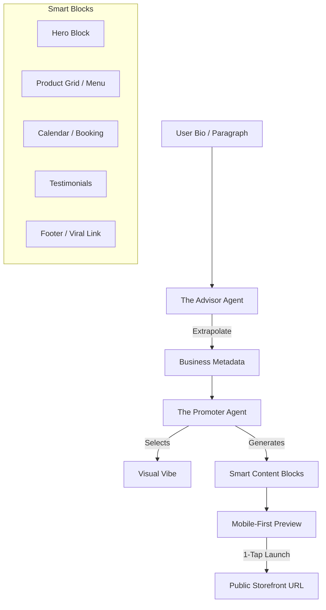

# Architecture Brief: Website & Storefront Builder

## Title
OHC "Smart Builder": AI-Driven 30-Second Storefront Architecture

## Problem Statement
Small business owners (Maya, Carlos, Fatima) are intimidated by traditional website builders with too many buttons and technical terms (CNAME, SSL, Liquid). They need a professional storefront that is "born live" with zero setup. If Maya can't go from a paragraph of text to a live, payment-ready URL in under 60 seconds, OHC has failed the "Grandmother Test."

## Research Report
- **Competitive Benchmark**: Durable.co and Wix ADI have set the bar at < 60 seconds for initial generation.
- **Vibe Coding**: The emerging trend of using LLMs to select colors, typography, and layout based on a business "vibe" (e.g., "Cozy, organic bakery" vs. "High-speed, modern plumbing").
- **Block System**: Shopify and Squarespace use "Sections," but they are often too complex for mobile-first editing. OHC needs "Smart Blocks" that auto-configure based on the business type (e.g., a "Menu Block" for Fatima, a "Booking Block" for Carlos).

## Design Doc

### High-Level Architecture (Mermaid.js)

### The "Smart Block" Ecosystem
Every storefront is a vertical stack of mobile-optimized blocks:
1.  **Hero Block**: Adaptive headline + background photo (auto-sourced from bio or AI-generated).
2.  **Product/Menu Block**: Intelligent grid that handles variants (size/color) or "Sold Out" toggles with 1-tap.
3.  **Booking/Calendar Block**: Real-time availability sync for services (Carlos/Leo).
4.  **Contact/Lead Block**: Integrated "The Ambassador" draft-and-approve inbox.
5.  **Viral Footer**: "Built with OneHumanCorp — Launch Your Shop" referral loop.

### visual Excellence & Vibe Coding
- **Design Tokens**: Every site uses OHC Premium tokens (Outfit/Inter fonts, Glassmorphism).
- **Auto-Palette**: AI selects 3 accessible color palettes based on the business category.
- **Draft -> Live**: The site is born as a `DRAFT` and becomes `LIVE` upon 1-tap approval. SSL and Subdomains are provisioned instantly in the background.

## Implementation Prompt
**To Implementer Agent:**
Implement the "Smart Builder" engine. Create a registry of `SmartBlocks` (Hero, Catalog, Booking) that are 100% responsive and usable at 375px. Build the "Vibe Coding" logic where "The Promoter" agent receives business metadata and outputs a JSON configuration for the storefront layout. Implement the publishing lifecycle: when a user clicks "Launch," the system must provision a subdomain (e.g., `maya.ohc.app`) and move the site from `DRAFT` to `LIVE`. Ensure the UI transition from "Bio Input" to "Live Preview" is seamless, with background agents handling the "heavy lifting" (image generation, copy drafting).

## Priority
P0

## Estimated Scope
Large

### Template Engine and Customization
- The Smart Builder relies on a highly flexible, data-driven template engine.
- Instead of raw HTML/CSS, the templates define layout structures and styling tokens that can be dynamically populated by the AI.
- Users can override AI choices (e.g., manually changing the primary color), but the system ensures the overall design remains coherent and accessible.

### Performance and SEO
- The generated storefronts must score 90+ on Google Lighthouse out-of-the-box.
- This requires aggressive optimization: image compression, lazy loading, minimizing JavaScript payloads, and efficient CSS delivery.
- Semantic HTML and auto-generated meta tags ensure strong organic search visibility.
- "The Promoter" agent can periodically review the site's SEO performance and suggest improvements.

### Extensibility and Third-Party Integrations
- While OHC provides core functionality, users may need to integrate specialized tools (e.g., a specific review widget or analytics tracking code).
- The Smart Builder must securely support these integrations without compromising the site's performance or security.
- This is handled via a controlled "App Market" or predefined integration points, rather than allowing arbitrary code injection.

### Preview and Publishing Workflow
- The transition from "Draft" to "Live" must be instantaneous from the user's perspective.
- Behind the scenes, the system handles the complexities of CDN cache invalidation, DNS updates (if using a custom domain), and asset deployment.
- The user can preview changes safely in a sandbox environment before committing them to the live site.
- A robust version history allows the user to easily revert to a previous state if they make a mistake.
