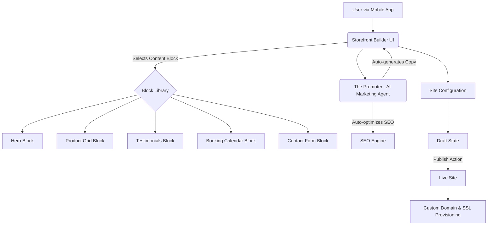

# Issue Brief: Website & Storefront Builder Architecture

## Title
Drag-and-Drop Website & Storefront Builder Architecture for OHC

## Problem Statement
Building a website is often the biggest hurdle for a non-technical small business owner. Current solutions require too much decision-making (e.g., choosing themes, configuring layouts, manually adding SEO tags). Maya, the baker, needs a beautiful storefront out of the box, optimized for mobile (375px), without needing to understand what a "Hero section" or "Meta tag" is. The platform must provide an effortless, AI-assisted drag-and-drop builder that generates premium (Glassmorphism, beautiful typography) websites instantly while allowing easy customization from a phone.

## Research Report
*   **Shopify:** Offers powerful themes but customization on mobile is extremely difficult. Users often resort to buying third-party themes or hiring developers.
*   **Wix:** Very flexible drag-and-drop, but overwhelming for mobile users. Often results in broken mobile layouts if not carefully adjusted by the user.
*   **Squarespace:** Beautiful templates, restrictive layout engine (Fluid Engine), which is good for design consistency but still complex to edit from a phone.
*   **GoDaddy:** Simple, rigid blocks. Easy to use but results often look generic and cheap.
*   **OHC Objective:** Combine the simplicity of rigid blocks (GoDaddy) with the aesthetic excellence of Squarespace and the AI power of Wix, but built *mobile-first* so a user can build and manage their entire site from their iPhone while lying in bed.

## Design Doc

### Architecture Diagram

### Content Blocks & Functionality
*   **Hero Block:** The main banner with an AI-generated headline, subheadline, and a prominent CTA (e.g., "Order Now" or "Book a Call"). Uses high-quality WebP compressed background images.
*   **Product Grid:** Auto-syncs with the Operations department's inventory. Displays product cards with Glassmorphism effects. Handles variant selection.
*   **Text/Image Blocks:** For "About Us" or story sections. The Promoter AI can draft the business story based on the user's initial onboarding profile.
*   **Testimonials:** Auto-pulls from the Customer Success department's review requests.
*   **Booking Calendar:** Syncs directly with the Operations schedule for services (e.g., Carlos the Handyman).
*   **Contact Form:** Submissions are routed to the Customer Success department (The Ambassador) for auto-drafted replies.

### Templates & Customization
*   Templates are not rigid HTML files but rather "Design Themes" (color palettes, font pairings from Outfit/Inter, and motion presets).
*   Users select a Vibe (e.g., "Elegant Bakery", "Professional Service") and the AI applies the Design Theme globally.
*   Customization is constraint-based to prevent users from making the site ugly (e.g., color pickers only offer complementary colors).

### Publishing & SEO
*   **Draft → Live:** Changes are saved instantly to a Draft state. A single "Publish" button pushes the configuration to the Live state. No loading bars, optimistic UI.
*   **SEO:** Handled entirely by "The Promoter". The AI automatically generates meta titles, descriptions, and alt-text for images based on the content blocks. It also generates a sitemap invisibly.

### Custom Domains & SSL
*   Users get an OHC subdomain by default.
*   Premium users can search for and buy a custom domain directly in the app.
*   SSL is provisioned automatically behind the scenes when a custom domain is linked. The user sees a simple "Securing your site..." checklist item that turns green.

### Mobile UX Flow
1.  **Entry:** User taps "Edit Website" on the mobile dashboard.
2.  **Preview:** Sees a live preview of the site exactly as it looks to customers (375px width).
3.  **Edit Mode:** Tapping any section opens a bottom sheet to edit that specific block (e.g., tap the Hero, the sheet lets you change the image or ask AI to rewrite the text).
4.  **Add Block:** A floating action button (+) opens a visual list of available blocks. Tapping one inserts it below the currently focused section.
5.  **Publish:** A sticky "Publish" button at the top right of the screen.

### AI Agent Integration Points
*   **The Promoter:** Generates initial layout, writes copy for all blocks, handles all SEO metadata.
*   **Operations:** Feeds real-time data to Product Grids and Booking Calendars.
*   **Customer Success:** Feeds verified reviews into the Testimonial block.

### Key Design Decisions
*   **Mobile-First Editing:** The editor must be fully functional on a 375px screen. Desktop is an additive experience.
*   **Constraint-Based Design:** Users cannot break the layout. They assemble blocks, they don't draw boxes.
*   **AI-First Content:** No more "Lorem Ipsum". The moment a user adds a text block, the AI drafts relevant content based on their business profile.

## Implementation Prompt
Implement the data model and API endpoints for the new constraint-based Storefront Builder. The system needs to support a draft and live state for a tenant's website. It should define the schema for various content blocks (Hero, ProductGrid, Testimonial, etc.) and global design themes (fonts, colors). Integrate with "The Promoter" agent to automatically generate SEO metadata when the site is published. Ensure the API supports partial updates from a mobile client.

## Priority
P0

## Estimated Scope
Large
