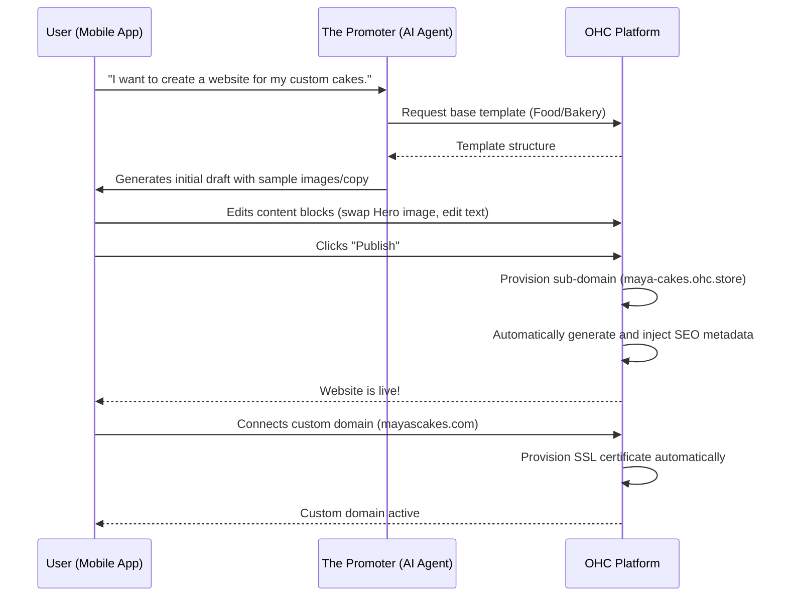

# Issue Brief: Website & Storefront Builder Architecture

## Title
Build the OHC Drag-and-Drop Mobile-First Website & Storefront Builder

## Problem Statement
Small business owners like Maya (the baker) and Carlos (the handyman) need a professional online presence, but building a website is too complicated, time-consuming, and expensive. They are overwhelmed by the endless options in Shopify or Wix, don't understand what "hosting" or "DNS" means, and often give up or settle for an Instagram page. They need a system that feels less like coding and more like arranging building blocks on their phone screen, with an AI that does all the heavy lifting of design, SEO, and publishing. The result must be beautiful by default and instantly ready for customers.

## Research Report
The current website builder market is saturated but primarily serves users who are at least semi-technical or willing to spend hours learning a tool:

*   **Shopify:** Powerful, but requires choosing from complex themes, understanding liquid templates (or complex customizers), and often paying for third-party apps just to get basic functionality like a booking calendar. The mobile management app is mostly for viewing orders, not designing the store.
*   **Wix:** Offers a massive drag-and-drop canvas, which is overwhelming for mobile users. Too much freedom leads to broken layouts on different screen sizes. The AI generation often produces generic results that still need heavy manual tweaking.
*   **Squarespace:** Beautiful templates, but rigid. Changing the core structure is difficult, and the mobile editing experience is secondary to the desktop experience.
*   **GoDaddy:** Very basic and easy to start, but highly limited in functionality (e.g., combining a store with a service booking system is clunky).

**OHC Opportunity:**
OHC will differentiate by offering a *strictly mobile-first* builder. Users don't get an infinite canvas; they get a curated list of high-converting, beautiful "blocks" (Hero, Product Grid, Booking Calendar). The AI "Promoter" agent handles the initial layout based on the business type, and the user simply tweaks it by swapping or reordering blocks.

## Design Doc

### Architecture Diagram

### UI Wireframes / Screen Flow (375px)

1.  **Onboarding (The Promoter Agent):** Chat interface. "What kind of business are you starting?" -> "Custom cakes." -> "Great! Let me build a draft website for you. Give me 10 seconds..."
2.  **The Builder (Draft Mode):**
    *   A vertically scrolling view of the website as it will look to customers.
    *   **Edit Overlay:** Tapping any section highlights it with a glassmorphic border.
    *   **Floating Action Button (+):** Tap to "Add Block".
    *   **Bottom Bar:** "Preview", "AI Assist", "Publish".
3.  **Add Block Menu:** A clean list of available blocks with visual icons:
    *   *Hero Image* (Big photo + Headline + Button)
    *   *Product Grid* (Auto-syncs with inventory)
    *   *Text & Image* (About me, story)
    *   *Testimonials* (Customer reviews)
    *   *Booking Calendar* (For services/lessons)
    *   *Contact Form*
4.  **Publishing Flow:**
    *   Tap "Publish".
    *   Celebration animation.
    *   "Your site is live at `maya.ohc.store`."
    *   "Want a custom name? [Connect a Domain]" -> Simple input field for `mayascakes.com`. No DNS jargon. OHC handles the rest invisibly.

### Mobile UX Flow
The core principle is "stacked blocks." Users cannot drag elements freely (which breaks responsiveness). They can only reorder vertical blocks, change the content inside them, or ask the AI to redesign a specific block. Everything is touch-friendly with large tap targets (>= 44x44px).

### AI Agent Integration Points
*   **The Promoter (Marketing & Advertising):**
    *   **Initial Generation:** Reads the business profile and generates a complete, multi-block website draft.
    *   **Copywriting:** If a user adds a "Text Block", they can tap "AI Assist" and say "Write a friendly paragraph about how I use organic ingredients."
    *   **SEO:** The agent automatically generates `<title>`, `<meta description>`, and alt tags for all images based on the content of the blocks when the site is published.
    *   **Image Sourcing:** Can suggest high-quality royalty-free images if the user doesn't have their own.

### Key Design Decisions
1.  **Block-Based, Not Free-Form:** To guarantee the 375px mobile-first promise and aesthetic excellence (Glassmorphism, correct spacing), users cannot place elements arbitrarily. They configure predefined, beautiful blocks.
2.  **Draft vs. Live:** Changes are made in a Draft state. The public site only updates when "Publish" is tapped, preventing accidental breaks to a live storefront.
3.  **Invisible SEO:** The user never sees an "SEO Settings" page unless they explicitly seek it out. The AI guarantees best-practice SEO by default.
4.  **Zero-Config Custom Domains:** The user enters the domain they own. The platform handles verification, DNS prompting (or automatic configuration where possible), and SSL provisioning entirely in the background.

## Implementation Prompt

**Role:** Frontend & Backend Implementer

**Task:** Build the core drag-and-drop Website & Storefront Builder for OHC.

**User-Facing Outcome:** A mobile-first (375px) UI where a user can view a draft of their website, reorder predefined content blocks, edit the content of those blocks, and publish the site.

**Critical User Journeys (CUJs) to Implement:**
1.  **View Draft:** User can see the current state of their website, composed of stacked blocks.
2.  **Add/Remove/Reorder Blocks:** User can add a new block (e.g., Hero, Product Grid), remove an existing block, and change the vertical order of blocks.
3.  **Edit Content:** User can tap a block to change its specific data (e.g., change the headline of a Hero block).
4.  **Publish:** User taps a button to transition the Draft state to Live state. The platform must automatically trigger the AI agent to generate SEO metadata as part of this process.

**Acceptance Criteria:**
*   The UI must be strictly mobile-first and look flawless on a 375px width.
*   Implement at least 3 block types: Hero, Product Grid, and Text.
*   The publishing action must persist the Live state to the backend.
*   The AI agent must be integrated to automatically generate SEO metadata upon publishing.
*   Custom domain connection flow must be mocked or implemented (user enters domain, system acknowledges and provisions SSL in the background).
*   Add at least 5 E2E Playwright tests covering the CUJs (login, add block, edit block, publish, view live site).
*   Unit test coverage must be 100% for new code.

## Priority
P0 (Critical)

## Estimated Scope
Large
