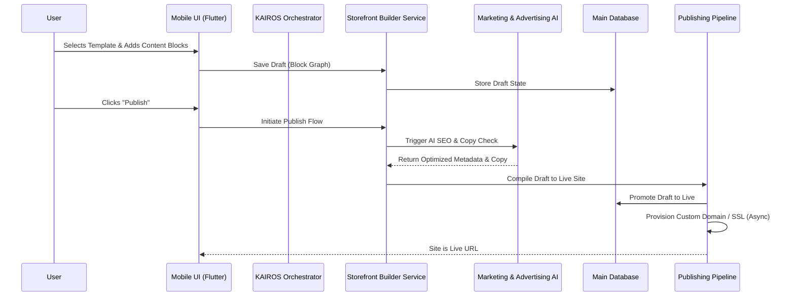

### Title
[architecture] Implement Website & Storefront Builder Core Engine

### Problem Statement
Small business owners like Maya (the baker) and Carlos (the handyman) need a professional online presence to attract customers, accept bookings, and process payments. However, existing website builders like Shopify, Wix, and Squarespace overwhelm them with complex configuration options, hidden menus, technical jargon (DNS, SEO, CDN), and desktop-first editing interfaces. They need a simple, intuitive, mobile-first builder where they can drag-and-drop content blocks, customize a template in minutes, and rely on AI to handle the complex parts (SEO, copywriting, and layout optimization) without ever needing to touch code or complex settings.

### Research Report
A competitive analysis of existing website builders highlights a critical gap in the market for non-technical users:

| Feature | OHC | Shopify | Wix | Squarespace | GoDaddy |
|---|---|---|---|---|---|
| **Setup Time** | < 10 mins | 30-60 mins | 20-40 mins | 30-60 mins | 20-40 mins |
| **Mobile-First Editing** | **Yes (100%)** | Partial (Clunky) | Partial | No (Desktop focus) | No |
| **Content Blocks** | Pre-configured, AI-assisted | Manual setup | Manual setup | Rigid templates | Basic |
| **AI SEO & Copy** | **Invisible & Auto** | Sidekick (Manual) | Wix AI | Limited | Basic |
| **Complexity Level** | **Zero Jargon** | High (Themes/Apps) | Medium | Medium | Low |

**Key Findings:**
1. **Mobile Experience:** Competitors treat mobile website editing as an afterthought. Users often have to switch to a desktop to finalize their site design or fix layout issues. OHC must be fully functional and delightful on a 375px mobile screen.
2. **Decision Fatigue:** Platforms like Wix offer too many granular styling options (margins, padding, pixel nudging), leading to broken layouts and user frustration. OHC should restrict customization to high-level templates and pre-defined content blocks to ensure "aesthetic excellence" by default.
3. **Technical Friction:** Custom domains, SSL certificates, and SEO metadata are massive hurdles. 70% of non-technical users abandon website creation during domain setup. OHC must abstract this away entirely.

### Design Doc

#### Architecture Diagram

#### Content Blocks
The builder relies on a constrained set of high-impact content blocks:
- **Hero Block:** Large image/video, headline, and primary Call-To-Action (CTA).
- **Product Grid:** Dynamically syncs with inventory, showing item photos, prices, and "Add to Cart" buttons.
- **Service & Booking Calendar:** Integrates with the operations scheduling system for time-slot booking.
- **Text & Media:** Rich text alongside images (e.g., "About Us").
- **Testimonials:** Carousel of customer reviews (auto-collected by Customer Success AI).
- **Contact Form:** Simple form routing messages to the central inbox.
- **Social Proof / Link-in-Bio:** Grid of social media links for easy sharing on TikTok/Instagram.

#### Template System
Templates define the overall layout, color palette (OHC Premium Tokens), and typography. Users cannot break the design by moving elements pixel-by-pixel. Instead, they swap blocks in and out, and the template auto-adjusts padding, responsiveness, and contrast to maintain visual excellence.

#### Publishing (Draft to Live)
- **Draft Mode:** All edits happen in a draft state. The UI shows a real-time preview of how the site will look.
- **Publish Action:** Clicking "Publish" commits the draft to the live state.
- **Versioning:** Every publish action creates a distinct version, allowing easy rollback if needed.

#### AI SEO Automation
- The "Marketing & Advertising" AI department automatically analyzes the site content during the publish flow.
- It generates optimized `<title>`, `<meta description>`, and open graph tags based on the business type and target audience.
- It automatically creates an `xml` sitemap and registers updates with search engines seamlessly.

#### Domain and SSL Provisioning
- **Free Tier:** Users instantly get an OHC subdomain (e.g., `maya-cakes.ohc.com`).
- **Custom Domains:** When a user upgrades or connects a domain, the platform automatically provisions SSL certificates and handles DNS propagation checks in the background. The user simply enters their domain name and follows a visual step-by-step connection wizard.

#### Mobile UX Flow (375px First)
1. **Dashboard:** Tap "Edit Website" CTA.
2. **Builder View:** A full-screen preview of the site with a floating action button (FAB) "Add Block".
3. **Block Selection:** A bottom sheet slides up showing available blocks (Hero, Product Grid, etc.).
4. **Block Editing:** Tapping a block opens a full-screen editor overlay specific to that block (e.g., selecting products for the grid, editing the hero headline).
5. **Publish:** A sticky "Publish" button at the top right of the builder view.

### Implementation Prompt
**Objective:** Design and implement the core architecture for the OHC Website & Storefront Builder.

**User Journey (CUJ):**
As a small business owner (like Maya), I want to easily build and customize my online storefront from my mobile phone using pre-defined content blocks so that I can start selling my cakes online without needing to learn web design or SEO.

**Acceptance Criteria:**
1. Implement the data structures and backend services to support saving and retrieving website drafts using the defined content blocks.
2. Implement the "Publish" pipeline that transitions a draft to a live state.
3. Integrate the Marketing & Advertising AI department to automatically generate SEO metadata (title, description) when publishing.
4. Ensure the draft and live states are strictly isolated, and the live site is accessible via the correct tenant domain routing.
5. Create comprehensive unit tests for the block validation and publishing logic, achieving 100% coverage.
6. Write Playwright E2E tests simulating a user adding a block, saving a draft, and publishing the site to verify the full flow.

**Constraints:**
- Do not prescribe the explicit database schema; design the most appropriate structure for block storage and versioning.
- Follow the mobile-first and zero-noise principles.

### Priority
P0

### Estimated Scope
Large
