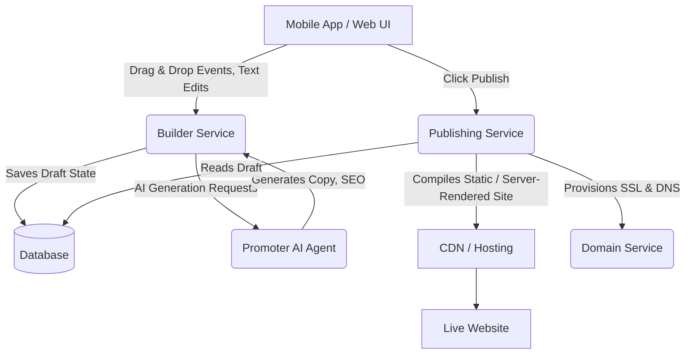

# [Architecture] Website & Storefront Builder

## Title
Website & Storefront Builder Architecture

## Problem Statement
Small business owners (like Maya the baker or Carlos the handyman) need an extremely simple way to create, customize, and publish a beautiful website or storefront without coding. Existing tools like Shopify or Wix overwhelm them with too many options, complex terminology (e.g., "themes", "liquid", "DNS"), and desktop-first editing experiences. They need a mobile-first, block-based builder where it is impossible to make an ugly site, SEO is handled automatically by AI, and publishing is a single tap.

## Research Report
- **Competitor Analysis**:
  - *Shopify/Wix*: Desktop-centric editors. Hundreds of themes, but deep customization requires a steep learning curve. Prone to user error (e.g., breaking mobile layouts).
  - *Squarespace*: Beautiful templates, but section editing can still be confusing on mobile.
  - *Link-in-bio (Linktree)*: Too simple. Cannot support full storefronts or booking flows seamlessly.
- **OHC Opportunity**:
  - **Mobile-First Editing**: The entire builder must work flawlessly on a 375px screen.
  - **Constrained Customization**: Provide pre-designed, premium blocks (Glassmorphism, Outfit/Inter typography) that always look good together.
  - **Invisible Complexity**: Custom domains, SSL, and SEO must be provisioned and managed without user intervention.

## Design Doc

### Key Design Decisions
1. **Block-Based Architecture**: The site is a vertical stack of functional blocks (Hero, Product Grid, Service List, Testimonials, Contact). No free-form positioning to ensure mobile responsiveness.
2. **AI-Driven Content**: Users describe their business, and the "Promoter" AI agent generates the initial layout, text, and selects relevant blocks.
3. **Draft to Live Flow**: A single "Publish" button. All edits are saved as drafts auto-magically. Publishing swaps the active version.
4. **Zero-Config Domains & SSL**: Users just type their desired domain or use an OHC subdomain. AI/Platform handles DNS verification flows invisibly.

### AI Agent Integration Points
- **The Promoter (Marketing & Advertising)**:
  - Auto-generates initial site copy and selects block templates based on business type.
  - Automatically writes SEO meta titles, descriptions, and image alt text.
  - Suggests layout improvements based on performance.
- **The Manager (Operations)**:
  - Hooks into "Product Grid" and "Booking Calendar" blocks to ensure real-time inventory and availability are displayed.

### Mobile UX Flow (375px)
1. **Onboarding**: "What kind of business do you run?" -> AI generates V1 of the site.
2. **Editor View**: A full-screen preview of the site. A floating "Edit" FAB at the bottom.
3. **Adding Blocks**: Tapping "+" opens a bottom sheet with block categories (e.g., "Add Gallery", "Add Reviews").
4. **Editing a Block**: Tapping a block opens a modal to edit its specific content (text, images, items). Layout remains constrained.
5. **Publishing**: A sticky "Publish" banner appears when there are unpublished changes.

### Architecture Diagram

## Implementation Prompt
**To the Implementer Agent:**
Implement the backend and frontend for the Website & Storefront Builder.
- **User-Facing Outcome**: The user can open the builder on their phone, see a generated site, add/remove blocks (Hero, Product Grid, Testimonials, Contact), and tap "Publish" to make it live.
- **CUJ**:
  1. User opens the Website Builder.
  2. User taps "Add Block" and selects "Testimonials".
  3. User enters a testimonial and saves.
  4. User taps "Publish".
  5. The live site updates with the new block.
- **Acceptance Criteria**:
  - Must include at least 4 block types (Hero, Text, Grid, Contact).
  - Must support draft vs. live state.
  - Must be fully functional on a 375px mobile layout.
  - Do not prescribe specific database schemas or CDN APIs—design the most robust, scalable implementation to support the UX described.

## Priority
P0

## Estimated Scope
Large
