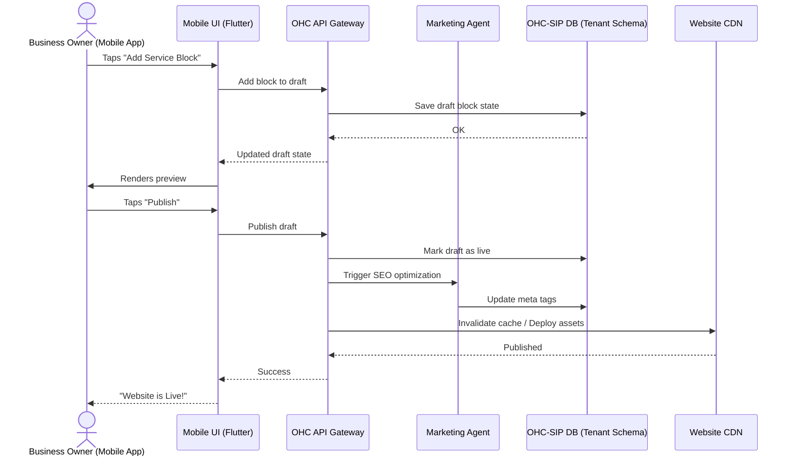

# Issue Brief: Website & Storefront Builder Architecture

## Problem Statement
Small business owners, especially those without technical expertise like Carlos the Handyman or Maya the Baker, find building a website overwhelming. Existing solutions like Shopify or Wix still require a degree of design sense, an understanding of complex menus, and time spent on desktop interfaces tweaking layouts. They need a system where they can input their business details (or have an AI infer them) and get a live, functional, and aesthetically pleasing site instantly. The management of this site needs to be entirely possible from a mobile phone (375px), including layout changes, publishing, and domain setup.

## Research Report
*   **Wix/Squarespace:** Offer powerful drag-and-drop, but the interfaces are complex, heavily desktop-focused for initial setup, and the mobile editing experience is often a clunky afterthought.
*   **Shopify:** Focuses strongly on e-commerce. The theme editor is robust but has a learning curve. "AI" features are mostly limited to text generation (product descriptions), not structural design.
*   **GoDaddy:** Fast setup, but templates are rigid and often look dated.
*   **User Pain Points:** Getting stuck on layout decisions, struggling with responsive design (looks good on desktop, broken on mobile), and difficulty managing custom domains/SSL.
*   **Opportunity:** OHC can provide an AI-driven, mobile-first builder where the "Marketing & Advertising" agent handles the heavy lifting of design, layout, and SEO, allowing the user to simply approve changes or swap predefined content blocks.

## Design Doc

### Content Blocks
The builder is composed of opinionated, premium-designed content blocks (Glassmorphism, 20px blur, Outfit + Inter typography). Users do not edit raw HTML/CSS; they configure blocks.
*   **Hero Block:** Headline, subheadline, primary CTA (e.g., "Book Now"), background image/video.
*   **Product/Service Grid:** Connects to the tenant's inventory/service catalog. Auto-populates images and prices.
*   **Booking Calendar:** Embeds the availability calendar for services.
*   **Text/About Block:** Simple rich text with image alignment options.
*   **Testimonial/Review Block:** Displays customer reviews.
*   **Contact Form:** Captures inquiries directly into the OHC inbox.

### Publishing & Infrastructure
*   **Draft to Live:** Changes are saved in a draft state and pushed live via a single "Publish" action.
*   **SEO:** Handled automatically by the Marketing agent (meta tags, structured data, image alt texts).
*   **Domains/SSL:** Free tier uses a subdomain. Paid tiers feature automated SSL provisioning and custom domains.

### Mobile UX Flow (375px First)
1.  **Dashboard:** Tap "Edit Website".
2.  **Visual Editor:** A live preview of the site scaled for mobile. A floating action button (FAB) allows adding blocks.
3.  **Block Editing:** Tapping a block opens a bottom sheet with configuration options (e.g., change image, edit text, toggle visibility). Native mobile keyboards are used for input.
4.  **AI Assistant:** A prominent button allows the user to tell the AI: "Make it look more modern" or "Add a section for my new vegan cakes." The AI generates a new draft for review.

### Architecture Diagram

## Implementation Prompt
Implement the backend architecture for the Website & Storefront Builder. This includes the database schema (using PostgreSQL with row-level security per `tenant_id`) to store site configurations, pages, and content blocks. Implement the backend functionality for managing draft and live states. Design the block schema to be extensible but rigidly structured to enforce the OHC design system. Ensure the "Marketing & Advertising" AI agent can autonomously suggest block additions or content updates based on changes to the user's inventory or business profile. The frontend team will consume the backend integration to build the 375px-first mobile editor.

## Priority
P0

## Estimated Scope
Large
