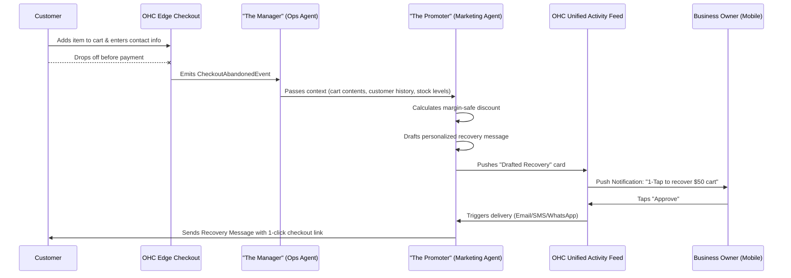
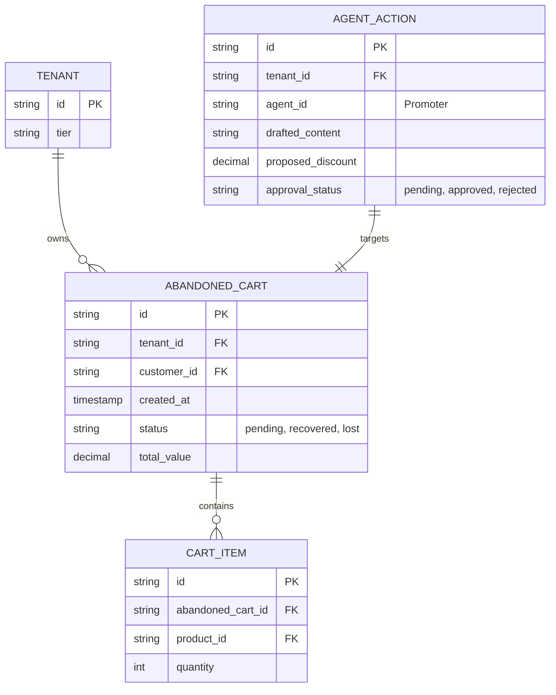

# Zero-Click Abandoned Cart Recovery Engine

## Problem Statement
Small business owners (like Maya the baker and Carlos the handyman) know they lose revenue when customers drop out during checkout, but implementing a solution on platforms like Shopify or Wix requires navigating complex app stores, configuring email templates, setting up trigger delays, and managing discount codes manually. The process is overwhelming and usually requires a desktop. This results in "Integration Hell" and high abandonment rates simply because the setup is too technical and time-consuming for non-technical users running their businesses from their phones.

## Research Report
**Market Analysis:**
- 70% of online carts are abandoned across e-commerce.
- Small businesses disproportionately suffer as they lack dedicated marketing teams to set up and optimize recovery flows.

**Competitor Audit:**
- **Shopify:** Offers built-in cart recovery, but modifying the default template or setting up intelligent, dynamic discounting based on inventory levels requires paid third-party apps (e.g., Klaviyo) and significant manual configuration.
- **Wix:** Basic recovery exists, but it's a static system. It lacks AI-driven personalization and proactive margin protection.
- **Squarespace:** Requires users to manually activate the feature and write their own copy. No intelligent agent oversight.

**OHC Advantage:**
OneHumanCorp will implement a "Zero-Click" approach. The system will autonomously detect abandoned checkouts and allow the AI "Promoter" agent to proactively generate personalized, context-aware follow-ups with dynamic, margin-safe discounts—presenting the owner with a simple "1-Tap Approve" notification on their mobile activity feed.

## Design Doc

### Architecture Diagram

### Data Model & Invariants

**Invariants:**
- Strict multi-tenant isolation: All queries for abandoned carts and agent actions MUST filter by the active `tenant_id`.
- Zero Trust (SPIFFE/SPIRE): The `Promoter` agent must present a valid, short-lived identity token when requesting the `Manager` agent for inventory status or when dispatching messages via the unified inbox.
- Margin Protection: The `Promoter` must never propose a discount that causes the cart's total value to drop below the cost of goods sold (COGS) threshold configured for the tenant.

### UI/UX & Mobile-First Flow
**Aesthetics:**
- Adhere to macOS-style Translucent Glass materials.
- Use Ubiquiti UniFi modular dashboard card layouts.

**The "Grandmother Test" Mobile Flow (375px viewport):**
1. **The Notification:** The owner receives a push notification: *"✨ Maya, Sarah left a $45 custom cake in her cart. Tap to send her a 10% discount to finish checking out."*
2. **The Activity Card:** Tapping opens the OHC Unified Activity Feed to a sleek glassmorphism card.
    - **Header:** "Abandoned Cart Detected"
    - **Body:** Shows Sarah's name, the cake image, and the AI's drafted message: *"Hi Sarah, noticed you left the Vegan Chocolate Cake in your cart! Here's 10% off to sweeten the deal if you finish your order today."*
    - **Actions:** A primary, glowing button: "Approve & Send" and a secondary, subtle button: "Edit Message".
3. **The Action:** The owner taps "Approve & Send". The card gracefully animates away with a success checkmark. Zero configuration, zero forms, zero "integration hell."

## Implementation Prompt

**Objective:** Implement the backend event processing and AI agent orchestration for the Zero-Click Abandoned Cart Recovery Engine.

**User-Facing Outcome:**
When a customer abandons a cart after providing contact info, the system should automatically generate a personalized recovery message (email/SMS/WhatsApp) complete with a contextually appropriate, margin-safe discount. The business owner must receive this drafted message as a card in their Unified Activity Feed, allowing them to send it with a single tap.

**Acceptance Criteria:**
1.  **Event Capture:** The system must reliably detect and emit events for abandoned checkout sessions.
2.  **Agent Orchestration:** "The Manager" agent must gather context (inventory, COGS, customer history) and securely pass it to "The Promoter" agent.
3.  **Content Generation:** "The Promoter" must draft a personalized message and calculate a discount that strictly respects the tenant's profitability thresholds.
4.  **Activity Feed Integration:** The proposed action must be securely published to the tenant's Unified Activity Feed, awaiting approval.
5.  **Multi-Tenancy & Security:** The entire flow must guarantee strict multi-tenant data isolation and utilize secure service-to-service communication principles (Zero Trust).
6.  **Action Execution:** Upon user approval, the system must dispatch the message through the appropriate omnichannel route and track the recovery outcome.

**Note to Implementers:** Do not prescribe specific database tables, API routes, or lower-level library dependencies. Design the services to fulfill the acceptance criteria while adhering to the platform's overall multi-tenant architecture and event mesh.

## Priority
P0

## Estimated Scope
Medium